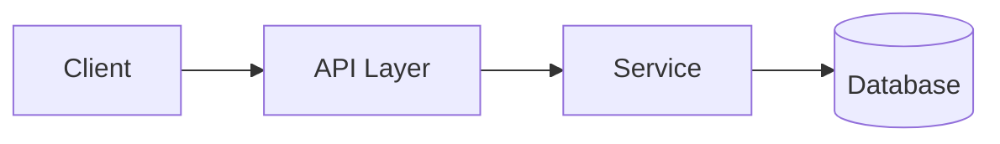
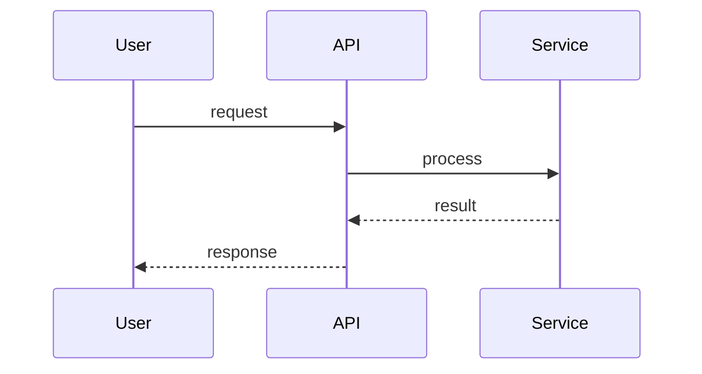

# Design: <Feature Name>

**Status:** Draft | Approved
**Last updated:** <date>
**Requirements:** [requirements.md](./requirements.md)

## Overview

A few sentences on the approach at a high level, and how it satisfies the requirements.

## Architecture

Describe the components involved and how they fit into the existing system. Use a mermaid diagram if the relationships aren't obvious from prose alone:

## Data model

Any new or changed data structures, schemas, or database tables. Show the shape, not just a description — a code block with the type/schema definition is more useful than a paragraph.

## Interfaces / contracts

For each new or changed API, function signature, or module boundary:

### <Interface name>

- **Input:** shape/type, validation rules
- **Output:** shape/type
- **Errors:** what can go wrong and how it's surfaced

## Key flows

For any flow that isn't a straight line (multi-step, async, involves error handling, involves more than two components), walk through it — a sequence diagram helps here too:

## Trade-offs and alternatives considered

This is the section that makes the design reviewable rather than just descriptive — name what you didn't pick and why.

| Option | Pros | Cons | Chosen? |
|---|---|---|---|
| <Option A — the chosen approach> | | | Yes |
| <Option B> | | | No — <reason> |

## Requirement traceability

Confirm every acceptance criterion in requirements.md is addressed somewhere above. If one isn't, that's a gap — fix it before asking for approval, not during implementation.

## Open questions / risks

- Anything uncertain enough to flag before implementation starts.
