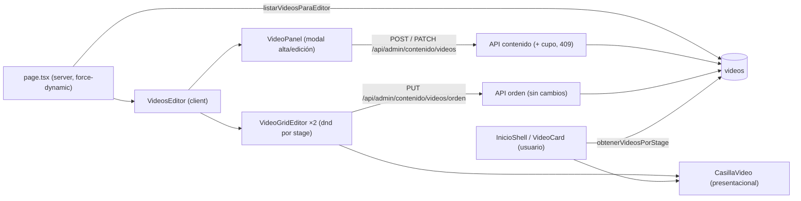
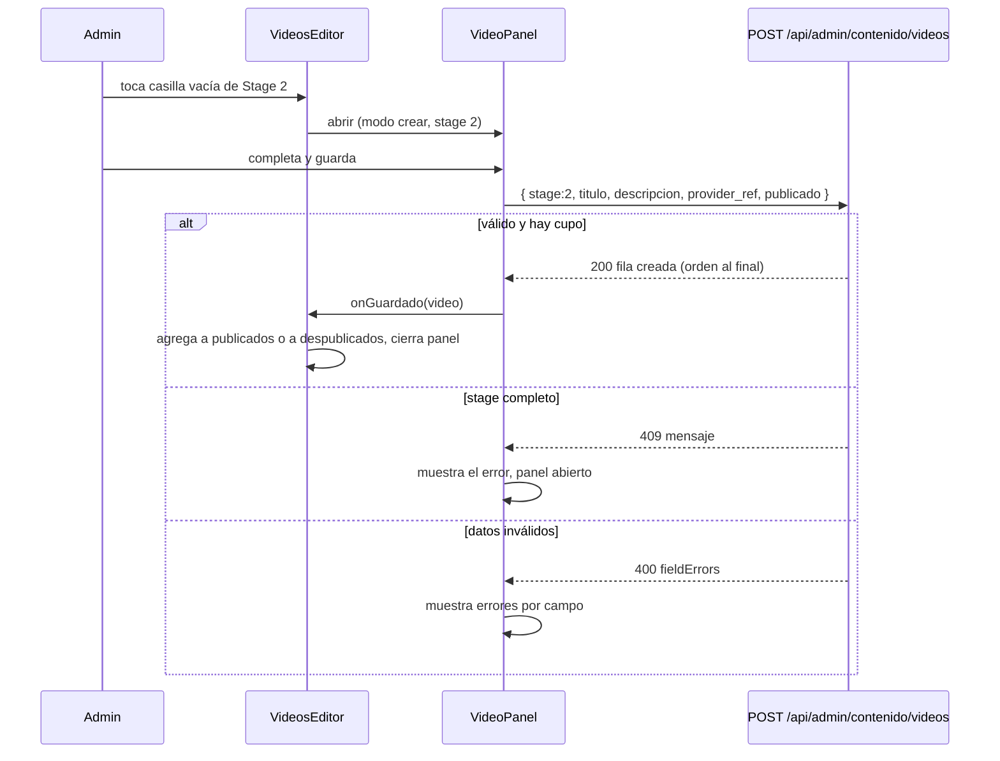

# Design: Editor de videos del admin (réplica del Inicio)

**Status:** Approved (2026-10-08)
**Last updated:** 2026-10-08
**Requirements:** [requirements.md](./requirements.md)

## Overview

`/admin/contenido/videos` pasa a renderizar un editor cliente que reutiliza las piezas visuales del Inicio (título de sección, casilla, línea del camino) y les agrega interacción de admin: tocar una casilla abre un panel (modal) de alta o edición, y arrastrar reordena dentro del stage. No hay migraciones ni endpoints nuevos: se usan `POST` / `PATCH` de contenido y `PUT .../videos/orden`. Los cambios de lógica son dos: (1) los videos despublicados dejan de ocupar casilla, tanto en la lectura del usuario como en el editor, y (2) el servidor hace cumplir el cupo de cada stage al publicar.

## Architecture



Piezas y responsabilidades:

| Pieza | Archivo | Qué hace |
|---|---|---|
| Config de cupos | `lib/data/videos-config.ts` (nuevo) | `CANTIDAD_STAGE` y `TOTAL_VIDEOS`, sin imports. Se re-exportan desde `lib/data/videos.ts` para no romper a nadie. |
| Textos de sección | `components/inicio/secciones-formacion.ts` (nuevo) | Eyebrow, título y descripción de Stage 1 y 2. Los usan `InicioShell` y el editor, así no pueden divergir. |
| Casilla presentacional | `components/video/CasillaVideo.tsx` (nuevo, extraído de `VideoCard`) | Nodo numerado, línea y contenedor del camino. Sin estado ni contexto de progreso. |
| Casilla del usuario | `components/video/VideoCard.tsx` | Sigue igual de cara al usuario; ahora compone `CasillaVideo`. |
| Grilla reordenable | `components/video/VideoGridReordenable.tsx` | Gana la prop `renderCard`: el Inicio le pasa `VideoCard`, el editor le pasa la casilla de editor. |
| Editor | `app/admin/contenido/[entidad]/VideosEditor.tsx` (nuevo) | Estado por stage, abre/cierra el panel, aplica las respuestas de la API al estado local. |
| Panel | `app/admin/contenido/[entidad]/VideoPanel.tsx` (nuevo) | Modal con el formulario (título, descripción, link, publicado). |
| Lectura del editor | `lib/data/admin/contenido.ts` | `listarVideosParaEditor()` y la regla de cupo. |

Por qué `lib/data/videos-config.ts`: `lib/data/videos.ts` ya importa `TAG_POR_ENTIDAD` de `lib/data/admin/contenido.ts`. Si `contenido.ts` importara `CANTIDAD_STAGE` desde `videos.ts` habría un ciclo. Un módulo de constantes sin dependencias lo evita.

## Data model

Sin cambios de esquema. Reglas nuevas sobre la tabla `videos` existente (`id, stage, titulo, descripcion, provider_ref, publicado, orden`):

- Una grilla (`stage` 1 o 2) muestra, en orden por `orden`, los videos con `publicado = true`, hasta `CANTIDAD_STAGE[stage]`. Los demás se rellenan con casillas vacías.
- Un video con `publicado = false` no ocupa casilla y se lista en "Despublicados" (solo admin).
- Un video publicado sin `provider_ref` válido sigue ocupando casilla y se ve "Próximamente" con su título (US-1).

```ts
// lib/data/admin/contenido.ts
export interface VideoEditor {
  id: string;
  stage: 1 | 2 | 3;
  titulo: string;
  descripcion: string | null;
  providerRef: string | null; // id ya normalizado; el panel muestra el link
  publicado: boolean;
  orden: number;
  // miniatura ya resuelta en el server (misma función que el Inicio)
  thumbnailUrl: string | null;
}

export interface GrillaEditor {
  publicados: VideoEditor[]; // <= CANTIDAD_STAGE[stage], por orden asc
  despublicados: VideoEditor[]; // por orden asc
}

export type VideosParaEditor = { 1: GrillaEditor; 2: GrillaEditor };
```

## Interfaces / contracts

### `obtenerVideosPorStage` (lectura del usuario) — cambio

- Se agrega `.eq("publicado", true)` a la consulta **antes** de `slice(0, cantidad)`. Hoy filtra después, y por eso un despublicado ocupa casilla.
- Se mantiene la normalización del `provider_ref` y el relleno con casillas vacías.

### `listarVideosParaEditor(admin): Promise<VideosParaEditor>` — nuevo

- **Input:** cliente service role.
- **Output:** por stage 1 y 2, publicados (hasta el cupo, misma regla que el usuario) y despublicados.
- **Errors:** propaga el error de Supabase; la página lo trata como hoy (error boundary de Next).

### `crearContenido` / `actualizarContenido` para `videos` — cambio

- Antes de escribir, si el resultado queda `publicado = true`, se cuentan los publicados del stage excluyendo el propio id. Si `cuenta >= CANTIDAD_STAGE[stage]` lanza `StageCompleto`.
- En `actualizarContenido`, si el video pasa de `publicado = false` a `true`, se fuerza `orden = proximoOrdenVideo()` (queda al final).
- Crear sin `orden` ya queda al final (`proximoOrdenVideo`), sin cambios.
- **Errors:** `StageCompleto` → HTTP **409** `{ error: "El Stage N ya tiene sus M casillas ocupadas. Despublicá un video antes de publicar otro." }`, sin modificar nada. Se mapea en `POST /api/admin/contenido/[entidad]` y en `PATCH /api/admin/contenido/[entidad]/[id]`.
- **Respuesta OK:** ya devuelve la fila creada/actualizada; el editor la usa para actualizar su estado local.

### `PUT /api/admin/contenido/videos/orden` — sin cambios

El cliente manda solo los ids del stage reordenado; `asignarOrden` reparte los lugares entre ellos sin tocar al otro stage.

### `VideoPanel` (props)

```ts
{ modo: "crear"; stage: 1 | 2 } | { modo: "editar"; video: VideoEditor }
// + onGuardado(video: VideoEditor), onCerrar()
```

- Campos: título (requerido), descripción, link del video, publicado. En alta, `publicado` arranca **marcado** (implementación, 08/10/2026): US-2 pide que el video aparezca en la primera casilla libre al guardar; si el admin lo desmarca queda como borrador en "Despublicados". Antes de implementar este punto decía `false` (como el formulario viejo), lo que contradecía a US-2. **Sin selector de stage**: en alta va fijo en el body; en edición no se envía.
- Errores: `fieldErrors` del 400 y el mensaje del 409 se muestran dentro del panel, que se queda abierto con lo escrito (US-2, US-3).

### Rutas viejas

`/admin/contenido/videos/nuevo` y `/admin/contenido/videos/[id]` **se dejan funcionando** pero sin ningún enlace que lleve a ellas desde la pantalla nueva: Stage 3 queda fuera del editor (decidido con el usuario), y esas páginas son hoy la única forma de gestionar el video explicativo de Agentes. Cuando Stage 3 entre al editor, se redirigen o se eliminan. `ContenidoForm.tsx` no cambia. Se elimina solo el listado viejo (`VideosReordenables*.tsx`) y el botón "+ Crear nuevo" para videos.

## Key flows

### Alta desde una casilla vacía



### Reordenar

Cada stage tiene su propio `DndContext` + `SortableContext`: un video no puede soltarse en el otro stage porque no existe un destino. Las casillas vacías no son sortables. Al soltar: estado optimista, `PUT` con los ids del stage; si falla, vuelve al orden anterior y muestra el error (comportamiento actual de `VideoGridReordenable`).

### Despublicar y volver a publicar

Despublicar (`PATCH publicado:false`): sale de `publicados`, entra en `despublicados`, y los demás suben de lugar. Publicar de nuevo (`PATCH publicado:true`): el servidor verifica cupo y le asigna `orden` al final; el editor lo mueve de `despublicados` a `publicados` según la fila devuelta.

## Trade-offs and alternatives considered

| Option | Pros | Cons | Chosen? |
|---|---|---|---|
| Panel modal para alta/edición | El formulario (4 campos y errores) no entra bien en una casilla; mismo panel para crear y editar | Un clic más que editar en línea | Yes (decidido con el usuario) |
| Extraer `CasillaVideo` presentacional y componerla en las dos casillas | El aspecto queda compartido sin que la casilla del usuario cargue lógica de admin; sin proveedor de progreso en el editor | Un refactor de `VideoCard` que hay que verificar contra el Inicio | Yes |
| Agregar un "modo editor" a `VideoCard` | Menos archivos | `VideoCard` ya exige `ProgresoVideosProvider` (server action de progreso) y mezclaría lógica de usuario y de admin | No |
| Cupo hecho cumplir en el servidor | Imposible crear un video "oculto" por API o por dos admins | Un chequeo más en las dos escrituras | Yes |
| Cupo solo en la interfaz | Más simple | Se puede saltear con la API; el video sobrante queda oculto | No |
| Actualizar estado local con la respuesta de la API | Evita `router.refresh()`, que en este repo ya mostró un cuelgue intermitente (VGRP-86) | El editor mantiene su propio estado | Yes |
| Filtrar `publicado` en la consulta, antes de limitar | Una sola regla; los despublicados no ocupan lugar | Cambia lo que ve el usuario en un punto (pedido) | Yes |
| Despublicados visibles en una sección aparte | El admin los encuentra y los republica | Una sección más en pantalla | Yes (decidido con el usuario) |

## Requirement traceability

| Requisito | Dónde se cumple |
|---|---|
| US-1 grillas iguales al Inicio | `secciones-formacion.ts`, `CasillaVideo`, `VideoGridReordenable` con `renderCard` |
| US-1 despublicados fuera de la grilla y listados aparte | `obtenerVideosPorStage` y `listarVideosParaEditor`; sección "Despublicados" |
| US-1 vacías al final y tocables | `VideosEditor` calcula `cupo − publicados`; casillas vacías no sortables |
| US-1 no-admin sin acceso | Guards existentes de layout y API; sin cambios |
| US-2 alta fija stage y va al final | `VideoPanel` modo crear; `proximoOrdenVideo` |
| US-2 errores sin cerrar el panel | `VideoPanel` (400 por campo, 409 mensaje) |
| US-2 stage lleno | Servidor: `StageCompleto` / 409; interfaz: no hay casillas vacías |
| US-2 revalidar | Rutas existentes ya llaman `revalidateTag` |
| US-3 editar sin cambiar de página, stage inmutable | `VideoPanel` modo editar; no envía `stage` |
| US-3 despublicar, republicar al final, publicar con stage lleno | `actualizarContenido` (orden y cupo) |
| US-4 reordenar solo dentro del stage | `DndContext` por stage + `PUT orden` |
| US-4 sin tocar casillas vacías ni el otro stage | No sortables; `asignarOrden` por subconjunto |
| US-5 reemplazar pantallas | `page.tsx` y baja de `VideosReordenables*`; las páginas viejas de alta/edición quedan sin enlaces (Stage 3) |
| US-5 auditoría | Rutas existentes con `conAuditoria` |

## Testing

- `lib/data/videos.test.ts` (y el unitario de fallback): un despublicado no ocupa casilla; con más publicados que el cupo se muestran solo los primeros N.
- `lib/data/admin/contenido.test.ts`: cupo → `StageCompleto`; publicar mueve al final; despublicar libera lugar; `listarVideosParaEditor`.
- Tests de las rutas `POST` y `PATCH`: mapeo de `StageCompleto` a 409.
- `e2e/admin-edita-video-revalida.spec.ts`: hoy usa `/videos/nuevo` y `/videos/[id]`; se reescribe para crear tocando una casilla vacía y editar desde el panel.
- Verificación manual en pantalla (con sesión de admin) del editor y del Inicio, y `/design-critique` (CLAUDE.md) antes de abrir el PR.

## Open questions / risks

- _(Resuelta)_ **Stage 3 queda fuera por ahora.** Se conservan las páginas viejas de alta y edición de videos (sin enlaces desde la pantalla nueva) para poder seguir gestionando el video explicativo de Agentes hasta que se incorpore al editor. Ojo: esas páginas permiten elegir cualquier stage, y con la regla de cupo del servidor también quedan sujetas al 409.
- **Tests contra la base compartida.** Los tests de integración y e2e corren contra la base real. Con la regla de cupo, un test que cree un video publicado en un stage lleno de videos reales fallaría con 409. Los tests nuevos crean videos **sin publicar** por defecto, y los que necesiten publicar lo hacen en un stage con cupo y limpian al terminar.
- **Condición de carrera.** El conteo de cupo y la escritura no son atómicos: dos admins publicando a la vez en el último lugar podrían pasarse por uno. La lectura igual muestra solo las primeras N, así que no se rompe nada visible; se acepta para una herramienta con pocos administradores.
- **Refactor de `VideoCard`.** Extraer `CasillaVideo` toca la casilla del usuario. Se verifica con `e2e/camino-aprendizaje.spec.ts` y mirando el Inicio antes del PR.
- **Bloqueo de scroll del panel.** El panel usa un contador compartido para bloquear el scroll del `body` (`components/ui/useBodyScrollLock.ts`, nuevo), en lugar de copiar el patrón "guardar valor previo y restaurar" de `NavDrawer`, `CerrarSesionBoton` y `DatosModal`, que es frágil si se solapan. Migrar esos tres queda como seguimiento aparte, fuera de esta feature.
