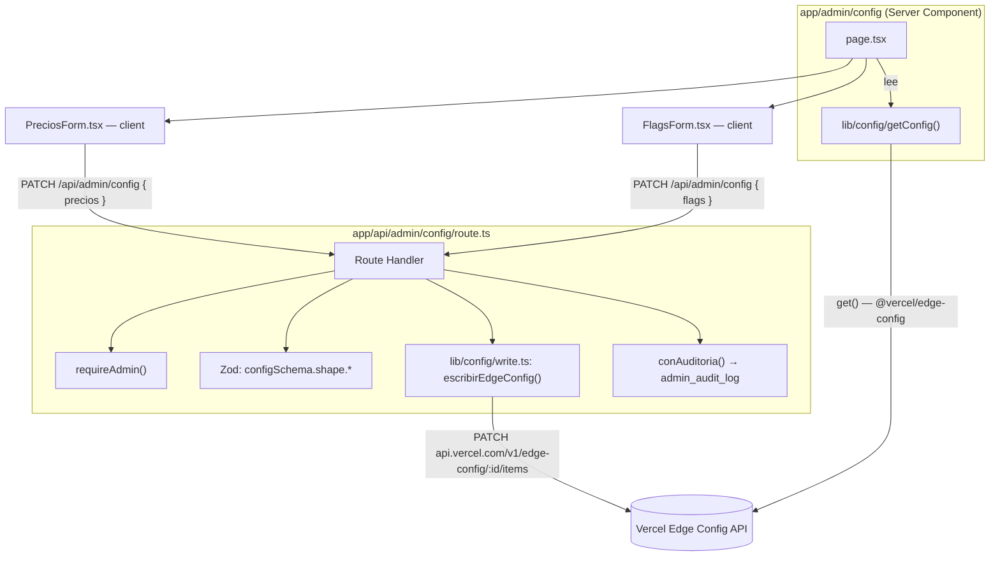
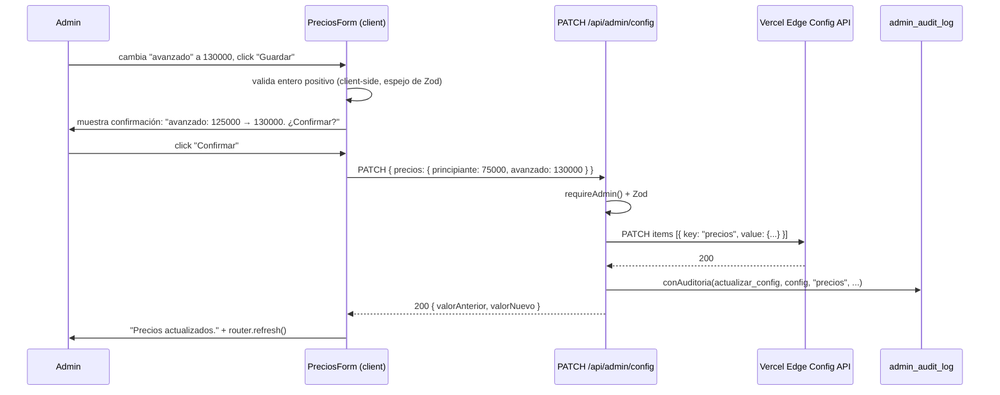
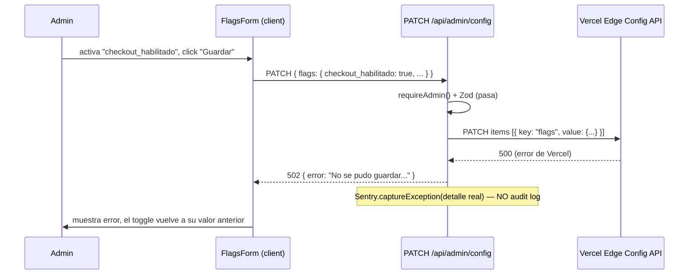

# Design: VGRP-40 — Panel admin: precios y flags de fase

**Status:** Approved
**Last updated:** 2026-09-15
**Requirements:** [requirements-vgrp40.md](./requirements-vgrp40.md)

## Overview

Una página `/admin/config` con **dos formularios independientes** — Precios y Flags de
fase — y un único Route Handler `app/api/admin/config/route.ts` (`GET` + `PATCH`) detrás
de los dos. La lectura reutiliza `lib/config/getConfig()` tal cual existe hoy. La
escritura es la pieza nueva: un módulo `lib/config/write.ts` que llama a la API REST de
Vercel Edge Config (PATCH atómico) y un `PATCH` handler que valida con Zod, escribe, y
audita vía `conAuditoria()` — mismo esqueleto que ya usan `usuarios/[id]/nivel` y
`pagos/[id]/reprocesar`.

Los dos formularios se separan (en vez de un único form combinado) porque tienen
contratos de UX distintos por requirements: **Precios exige un paso de confirmación
explícito con el valor anterior y el nuevo (US-4); Flags no.** Separarlos evita tener que
decidir "¿el modal de confirmación también tapa los flags si cambiaron junto con un
precio?" — cada formulario dispara su propio `PATCH` con una sola clave (`precios` o
`flags`), así que la respuesta a esa pregunta es simplemente "no aplica, son requests
distintos".

## Architecture



`lib/config/write.ts` es un módulo nuevo, hermano de `lib/config/index.ts`, con
`import "server-only"`. No toca `lib/config/index.ts` (que sigue siendo sólo lectura) —
mantiene la separación read/write que ya existe a nivel de paquete
(`@vercel/edge-config` es read-only por diseño de Vercel).

## Data model

No hay cambios de esquema de base de datos. `admin_audit_log` ya existe (VGRP-35) y
acepta cualquier `entidad`/`accion`/`entidad_id` de texto libre — no requiere migración.

El **schema de Edge Config** (`lib/config/schema.ts`, `configSchema`) no cambia: este
ticket escribe las claves `precios` y `flags` que ya están definidas ahí. Se reutiliza
`configSchema.shape.precios` y `configSchema.shape.flags` para validar tanto lectura como
escritura — una sola fuente de verdad para "qué es un precio/flag válido".

Nuevo tipo en `lib/config/write.ts`:

```typescript
export type EdgeConfigWriteResult =
  | { ok: true }
  | { ok: false; status: number; message: string };
```

## Interfaces / contracts

### `lib/config/write.ts::escribirEdgeConfig()`

Escribe una o más claves top-level de Edge Config en una sola request atómica a la API
de Vercel.

```typescript
import "server-only";

export async function escribirEdgeConfig(
  items: Array<{ key: "precios" | "flags"; value: unknown }>,
): Promise<EdgeConfigWriteResult>;
```

- **Input:** `items` — array de `{ key, value }`, `value` ya validado por el caller
  contra `configSchema` antes de llegar acá (este módulo no vuelve a validar forma de
  negocio, sólo hace la llamada HTTP).
- **Comportamiento:** `PATCH https://api.vercel.com/v1/edge-config/{EDGE_CONFIG_ID}/items`
  (+ `?teamId=...` si aplica), body `{ items: items.map(i => ({ operation: "update", key: i.key, value: i.value })) }`,
  header `Authorization: Bearer ${VERCEL_EDGE_CONFIG_WRITE_TOKEN}`.
- **Output:** `{ ok: true }` si la API responde `200`. La API de Vercel aplica todos los
  `items` de un mismo PATCH de forma atómica (todo o nada) — se confirma esto contra la
  documentación oficial al implementar; si no fuera atómica, este módulo pasa a hacer
  un solo `item` por llamada y el caller decide si aborta ante el primer fallo (ver Open
  questions/risks).
- **Errors:** cualquier respuesta no-`200`, o una excepción de red, se captura acá y se
  devuelve como `{ ok: false, status, message }` — **nunca propaga la excepción cruda**
  (mismo criterio fail-safe que `lib/config/index.ts::readKey()`). El caller decide si
  reporta a Sentry.
- **Nunca se llama con `NODE_ENV=test`** sin mockear `fetch` — no hay store de Edge
  Config de test aislado (ver Open questions/risks).

### `GET /api/admin/config`

- **Input:** ninguno (además del guard de sesión/rol).
- **Output `200`:** `{ precios: PreciosResult, flags: Config["flags"] }` — literalmente
  el resultado de `getConfig()` menos `links` (no es parte de este ticket).
- **Errors:** `401` sin sesión, `404` si `rol != 'admin'` (via `requireAdmin()` /
  `requireAdminPage()` en la página).
- Nota: en la práctica la página (`page.tsx`, Server Component) llama a
  `getConfig()` directo — este `GET` existe para que el form pueda refrescar sin
  recargar toda la página después de un error, y porque el ticket original lo pide
  explícitamente (`GET|PATCH /admin/config`).

### `PATCH /api/admin/config`

```typescript
const patchBodySchema = z.union([
  z.object({ precios: configSchema.shape.precios }),
  z.object({ flags: configSchema.shape.flags }),
]);
```

- **Input:** body con **exactamente una** de las dos claves (`precios` completo — los
  dos niveles — o `flags` completo — los tres campos). No se aceptan parches parciales
  dentro de `precios`/`flags` (evita un `PATCH { precios: { principiante: 1 } }` que
  borre `avanzado` de Edge Config sin querer — Edge Config no hace merge profundo, un
  `update` de la clave `precios` reemplaza el objeto entero).
- **Output `200`:** `{ valorAnterior: <precios o flags viejo>, valorNuevo: <nuevo> }`.
- **Errors:**
  - `401` / `404` — guard de admin (igual que el resto del panel).
  - `400` — body no matchea `patchBodySchema` (incluye precio ≤ 0, no-entero, o `fase`
    fuera del enum) → `fieldErrors` de Zod, **cero llamadas a Edge Config**.
  - `502` — `escribirEdgeConfig()` devolvió `{ ok: false }` → mensaje genérico
    (`"No se pudo guardar en Edge Config. Reintentá."`), el detalle real
    (`status`/`message` de Vercel) va a `Sentry.captureException`, nunca al cliente.
    **Cero fila de audit log** (US-6).
- **Flujo interno (pseudocódigo):**

  ```typescript
  const guard = await requireAdmin();
  if (!guard.ok) return guard.response;

  const parsed = patchBodySchema.safeParse(await req.json().catch(() => null));
  if (!parsed.success) return Response.json({ error: "...", fieldErrors: ... }, { status: 400 });

  const clave = "precios" in parsed.data ? "precios" : "flags";
  const valorNuevo = parsed.data[clave];
  const actual = await getConfig(); // valorAnterior real, leído justo antes de escribir
  const valorAnterior = clave === "precios" ? actual.precios : actual.flags;

  const escritura = await escribirEdgeConfig([{ key: clave, value: valorNuevo }]);
  if (!escritura.ok) {
    Sentry.captureException(new Error("escribirEdgeConfig falló"), { extra: escritura });
    return Response.json({ error: "No se pudo guardar en Edge Config. Reintentá." }, { status: 502 });
  }

  await conAuditoria(
    admin,
    { actorId: guard.actorId, accion: "actualizar_config", entidad: "config", entidadId: clave },
    async () => ({ resultado: { valorAnterior, valorNuevo }, valorAnterior, valorNuevo }),
  );

  return Response.json({ valorAnterior, valorNuevo });
  ```

  Nota sobre `valorAnterior` cuando `clave === "precios"` y `actual.precios.ok === false`
  (la lectura previa falló): se audita `valorAnterior: null` en vez de fallar el request
  — no bloquear un cambio de precio *porque* Edge Config no respondía bien es
  justamente el caso que este ticket viene a poder reparar manualmente.

## Key flows

### Editar un precio (con confirmación)



### Editar un flag (sin confirmación) y falla la escritura



## Trade-offs and alternatives considered

| Opción | Pros | Contras | Elegida |
|---|---|---|---|
| **Dos formularios independientes** (Precios / Flags), cada uno con su propio `PATCH` de una sola clave | Evita la ambigüedad de "¿el modal de confirmación también cubre flags?"; cada request es más simple de auditar (una clave, un valor anterior/nuevo) | Dos submits si el admin quiere cambiar precio y flag a la vez (aceptable: son cambios de naturaleza distinta) | **Sí** |
| Un formulario combinado con un único `PATCH { precios?, flags? }` | Un solo submit para todo | Hay que decidir si el modal de confirmación tapa también los flags cuando van junto a un precio; la auditoría de "qué cambió" se complica (¿una fila o dos?) | No — la separación resuelve dos preguntas abiertas de requirements de una vez |
| Confirmación como **modal accesible** (overlay + focus trap) | Patrón más "estándar" de confirmación | El repo no tiene ningún primitive de Dialog hoy (`components/ui/` no tiene uno); construirlo bien (focus trap, Escape, aria) es trabajo no trivial para un solo uso, y `NavDrawer.tsx` es un drawer, no un dialog genérico reusable sin refactor | No |
| Confirmación como **paso inline** (el mismo form cambia a una vista de revisión antes del submit real) | No requiere ningún componente nuevo de overlay; accesible por default (es el flujo normal del documento, no un layer aparte); mismo patrón simple que ya usa `CambiarNivelForm`/`ReprocesarButton` (fetch + estado local) | Menos "llamativo" visualmente que un modal | **Sí** |
| Guardar el token de escritura como env var (`VERCEL_EDGE_CONFIG_WRITE_TOKEN`) | Mismo patrón que `SUPABASE_SERVICE_ROLE_KEY`: secreto de servidor en `.env.local` + secret de despliegue, nunca en el cliente | Hay que generarlo a mano en el dashboard de Vercel antes de poder probar la escritura real | **Sí** — es el único patrón que ya usa el repo para secretos de servidor |
| Escribir Edge Config con la Vercel SDK/CLI invocada como subproceso desde el servidor | — | Ejecutar un proceso hijo desde un Route Handler de Next en Vercel (serverless) es fragil e inusual; la API REST es el camino soportado y documentado | No |

## Requirement traceability

| Requisito | Dónde se cubre |
|---|---|
| US-1 (ver config actual) | `page.tsx` Server Component llama `getConfig()`; sección "Interfaces" `GET` |
| US-2 (validar precios) | `configSchema.shape.precios` reusado en `patchBodySchema`; validación client-side espejo en `PreciosForm` |
| US-3 (validar flags) | `configSchema.shape.flags` reusado en `patchBodySchema` |
| US-4 (confirmación explícita en precios) | Flujo "Editar un precio" — paso de revisión inline antes del submit real; `FlagsForm` no lo tiene (por diseño) |
| US-5 (auditoría) | `conAuditoria()` en el `PATCH` handler, `entidad: "config"`, `entidadId: "precios" \| "flags"` |
| US-6 (manejo de error de la API de Vercel) | `escribirEdgeConfig()` nunca propaga crudo; `502` genérico al cliente; Sentry en servidor; sin audit log en fallo; flujo "falla la escritura" |
| US-7 (sólo admin) | `requireAdminPage()` en `page.tsx`, `requireAdmin()` en el Route Handler — mismo guard que el resto del panel |

## Open questions / risks

- **Token de escritura de Vercel todavía no existe.** Sin él, no se puede probar la
  escritura real contra el store `sistema-og-circle`. La implementación puede avanzar
  completa (incluidos los tests con `fetch` mockeado) y dejar la verificación end-to-end
  real como el último paso, una vez que el token esté en `.env.local`.
- **Atomicidad del PATCH de Vercel:** asumida (un PATCH con varios `items` es todo o
  nada) en base al comportamiento documentado de la API; a confirmar leyendo la
  documentación oficial al implementar `escribirEdgeConfig()`. Si no fuera atómica, no
  cambia el diseño (cada request de este ticket ya manda una sola clave), pero sí
  invalidaría la premisa de "no deja la config a medias" si en el futuro se agrega un
  form combinado.
- **Estrategia de test:** no hay store de Edge Config de test aislado (mismo
  criterio que Supabase, documentado en `docs/EDGE-CONFIG.md` y `docs/TESTING.md`).
  `escribirEdgeConfig()` se testea con `fetch` mockeado (unit), nunca contra la API real
  de Vercel en CI. Un test de integración del `PATCH` handler mockea el módulo
  `lib/config/write.ts` completo (patrón ya usado en el repo para módulos externos,
  p. ej. cómo `webhook-mercadopago.test.ts` mockea la API de Mercado Pago).
  La corrección de `getConfig()` (lectura) ya está cubierta por tests existentes de
  `lib/config/index.test.ts` — no se retestea acá.
  La verificación manual final (que un cambio real se refleje en Edge Config) queda
  para cuando el token esté disponible, fuera de la suite automatizada.
- **`teamId` en la URL de la API de Vercel:** a confirmar si el store `sistema-og-circle`
  vive bajo un team o una cuenta personal al generar el token — determina si
  `escribirEdgeConfig()` necesita agregar `?teamId=...` a la URL.
