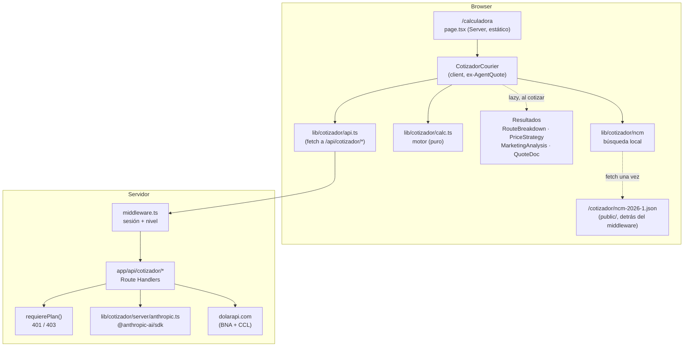
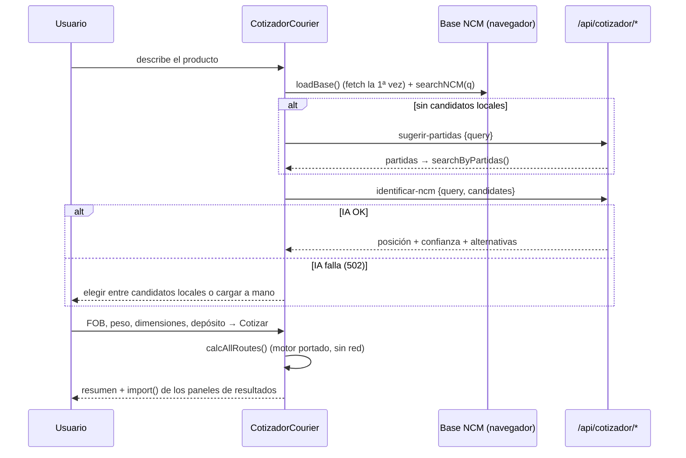

# Design: VGRP-57 — Calculadora de importación (courier) embebida en la app

**Status:** Approved (2026-09-26)
**Last updated:** 2026-09-26
**Requirements:** [requirements-vgrp57.md](./requirements-vgrp57.md)

## Overview

Se porta el cotizador de `emilianoverabusiness-blip/vegroup@b550803`
(Vite + React 18 + funciones de Vercel) a esta app (Next 15 App Router,
TypeScript strict). Hay dos capas y se tratan distinto:

| Capa | Criterio |
|---|---|
| **Números**: `calc.js`, constantes, `ncmSearch.js`, `ncm.json` | Copia literal traducida a TS, **sin cambiar ni una fórmula ni una constante**. Tests de paridad contra el original con casos fijos. |
| **Todo lo demás**: UI, endpoints, auth, estilos | Se reescribe con los patrones de la app: Route Handlers con `getVerifiedClaims()`, gating en `middleware.ts`, CSS Modules que componen las primitivas Liquid Glass. |

El flujo del usuario y el contenido (textos, pasos, secciones, orden de las
líneas del desglose) quedan iguales al original. Cambia el cómo se ve, no el
qué muestra.

Decisiones tomadas con el equipo el 2026-09-26 que este diseño aplica:

| Tema | Decisión |
|---|---|
| Usuario sin plan en `/calculadora` | Redirect a `/comprar` desde `middleware.ts`. |
| Dónde se busca en la base NCM | En el navegador, como el original. La base se baja una vez y queda cacheada. |
| Modelos de IA | Los del original: `claude-sonnet-5` para identificar, sugerir y extraer; `claude-opus-4-8` para el análisis de marketing. Se pueden sobreescribir por env var. |
| Tamaño máximo de proforma | 3 MB, validado en el navegador y en el servidor. |

## Architecture



### Dónde vive cada cosa

```
app/(app)/calculadora/
  page.tsx                      Server Component estático: título + <CotizadorCourier/>
  calculadora.module.css        layout de la página
app/api/cotizador/
  identificar-ncm/route.ts      ex api/identify.js
  sugerir-partidas/route.ts     ex api/suggest.js
  extraer-documento/route.ts    ex api/extract.js
  analisis-marketing/route.ts   ex api/analyze.js
  dolar/route.ts                ex api/dolar.js
components/cotizador/           UI portada (client components)
  CotizadorCourier.tsx          ex AgentQuote.jsx
  RouteBreakdown.tsx  PriceStrategy.tsx  MarketingAnalysis.tsx
  ProformaUpload.tsx  QuoteDoc.tsx
  cotizador.module.css          estilos compartidos del cotizador (componen glass/type)
lib/cotizador/
  ORIGEN.md                     repo + commit de origen + cómo portar un cambio
  calc.ts                       ex src/lib/calc.js — literal
  ncm/base.ts                   ex src/data/ncm.js — loader (fetch en vez de import)
  ncm/search.ts                 ex src/lib/ncmSearch.js — literal
  api.ts                        ex src/lib/api.js — sin login ni token
  types.ts                      tipos del motor y de los contratos
  server/anthropic.ts           ex api/_anthropic.js, sobre el SDK — "server-only"
  server/guard.ts               requierePlan() — "server-only"
public/cotizador/ncm-2026-1.json  ex src/data/ncm.json, sin cambios de contenido
```

- **Nombres de componentes:** se mantienen los del original (`RouteBreakdown`,
  `PriceStrategy`…). La única excepción es `AgentQuote`, que pasa a llamarse
  `CotizadorCourier` para no chocar con el marítimo de VGRP-58. Mantener los
  nombres hace que portar a mano un cambio futuro del repo vegroup sea un diff
  archivo por archivo.
- **Por qué `cotizador` y no `calculadora` en `lib/` y `/api/`:** VGRP-58
  reutiliza la base NCM, `identificar-ncm`, `sugerir-partidas`,
  `extraer-documento` y el guard. Viven bajo un nombre que sirve para las dos
  calculadoras.

## Data model

No hay cambios de esquema. No se persiste nada: igual que el original, la
cotización vive en el estado del componente y se pierde al recargar.

Tipos principales (`lib/cotizador/types.ts`). Se escriben a partir del shape
real que devuelve el motor original, no se inventan:

```ts
export type Regimen = "general" | "pequeños" | "integral";

/** Registro SIM plano, como lo arma tupleToRecord() en data/ncm.js. */
export interface RegistroSim {
  sim: string; ncm: string; sufijo: string;
  descripcion: string; descripcionSufijo: string;
  die: number; te: number; iva: number; ivaAd: number;
  lic: string; antidumping: string; impInternos: number;
  score?: number;
}

/** Entrada del motor: la misma que calcAllRoutes(inp) recibe hoy. */
export interface EntradaCalculo { /* se copia del uso real en AgentQuote.handleQuote */ }
export interface ResultadoRuta { /* shape de calcRoute(): totalUSD, totalPesos, costoPorKg, costoPorUnidad, costoRealEfectivo, … */ }
```

Los campos exactos de `EntradaCalculo` y `ResultadoRuta` salen de leer
`calc.js` y `AgentQuote.jsx` en la tarea de port, no de este documento.
Tiparlos es parte de portar: si el tipo obliga a cambiar una fórmula, es
señal de que hay que parar y revisar.

## Interfaces / contracts

### Gating: `middleware.ts`

Se agrega una capa de **nivel por ruta de página**, después de la de sesión y
de la de admin:

```ts
// Rutas de página que exigen plan pago. VGRP-58 suma "/maritimo".
const RUTAS_CON_PLAN = ["/calculadora"] as const;

if (esRutaConPlan(pathname) && !hasNivel(claims, "principiante")) {
  return withRefreshedCookies(NextResponse.redirect(new URL("/comprar", request.url)), response);
}
```

- **Match:** ruta exacta o subruta (`/calculadora`, `/calculadora/…`), con el
  mismo criterio que `esActual()` del drawer.
- **Datos:** usa el `claims` que el middleware ya resolvió en ese request. No
  agrega queries.
- **Página:** queda estática (no lee cookies ni claims), igual que el resto de
  `(app)`.
- **Tests:** `middleware.test.ts` suma los casos `ninguno` → 307 a `/comprar`,
  `principiante`/`avanzado` → pasa, y sin sesión → login con `next=/calculadora`.

### Guard de los endpoints: `requierePlan()`

```ts
// lib/cotizador/server/guard.ts — "server-only"
export async function requierePlan(): Promise<NextResponse | null>
```

- Llama a `getVerifiedClaims()`.
- Sin claims → `401 { error: "No autenticado." }`. El middleware ya corta
  antes; esto es defensa en profundidad.
- `!hasNivel(claims, "principiante")` → `403 { error: "Necesitás un plan para usar la calculadora." }`.
- Si devuelve una respuesta, el handler la retorna **antes** de leer el body o
  llamar a Anthropic o a dolarapi.

### Endpoints `POST /api/cotizador/*`

Todos siguen estas reglas:

- JSON de entrada y de salida, `Cache-Control: private, no-store` (se suma el
  patrón a `next.config.ts headers()`).
- Validación de entrada con `zod`, que ya es dependencia y se usa sólo en el
  servidor.
- Errores internos → `Sentry.captureException` + mensaje genérico. El error
  crudo de Anthropic nunca llega al cliente, igual que en `/api/agentes`.
- `export const maxDuration = 60`, como el `vercel.json` del original.

| Endpoint | Entrada | Salida | Errores |
|---|---|---|---|
| `identificar-ncm` | `{ query: string, candidates: RegistroSim[] }` (≤ 60 candidatos) | lo mismo que `api/identify.js`: posición elegida, confianza, razonamiento, alternativas | 400 si falta `query`; 502 si la IA no responde. El cliente degrada a elegir a mano. |
| `sugerir-partidas` | `{ query: string }` | `{ partidas: string[], interpretacion: string }` | 400; 502 "no pudo sugerir partidas" |
| `extraer-documento` | `{ fileBase64, mediaType, filename }` | lo mismo que `api/extract.js` | 400 si el tipo no es JPG, PNG, WebP, GIF o PDF; **413 si `fileBase64` decodificado supera 3 MB**; 502 |
| `analisis-marketing` | lo mismo que `api/analyze.js` | lo mismo | 400; 502 |
| `dolar` | `{}` | `{ venta, compra, fecha, fuente, ccl }` | 502 "Cargala a mano" |

- **Contenido de los endpoints:** los prompts, los schemas de tool use, el
  número de reintentos y los modelos se copian textuales del original.
- **Modelos:** default del original, sobreescribibles con
  `ANTHROPIC_MODEL_IDENTIFY` y `ANTHROPIC_MODEL_ANALYZE` (los mismos nombres
  del original). `ANTHROPIC_MODEL_EXTRACT` también existe en el original y se
  mantiene.

### Cliente de Anthropic: `lib/cotizador/server/anthropic.ts`

- Reemplaza el `fetch` crudo del original por `@anthropic-ai/sdk`.
- `STACK.md` ya lo nombra ("El SDK de Anthropic… no entran cómodos en Edge"),
  así que no es una librería fuera del stack. Entra como dependencia nueva de
  runtime, sólo del servidor.
- Expone `llamarJSON({ model, max_tokens, system, content, schema })`, que
  hace lo mismo que `callAnthropicJSON`:
  - una tool `emitir_resultado` con `tool_choice` forzado a esa tool (los
    modelos del original lo soportan);
  - lee el bloque `tool_use`;
  - reintenta igual que el original.
- Los errores se tipan con las clases del SDK (`Anthropic.RateLimitError`,
  `APIError`) en vez de comparar strings.
- `ANTHROPIC_API_KEY` se lee con `getEnv()` de `lib/env.ts`, que la suma a su
  lista de variables de servidor, y se agrega a `.env.example`. El archivo es
  `import "server-only"`: el test estructural de VGRP-56 lo cubre.

### Base NCM en el navegador

- **Dónde está:** `public/cotizador/ncm-2026-1.json`, el mismo contenido que
  `src/data/ncm.json`. El nombre lleva la versión de la base (MAESTRO 2026-1).
- **Cómo se baja:** `lib/cotizador/ncm/base.ts` hace `fetch` la primera vez
  que se necesita, en lugar del `import()` del original, y memoiza como
  `loadBase()`.
- **Por qué `fetch` y no `import()`:**
  - con `import()`, webpack envuelve 5,5 MB de JSON en un módulo JS: build más
    lento y más costoso de parsear que un `JSON.parse`;
  - con `fetch`, el archivo queda fuera de cualquier chunk y del cálculo de
    First Load JS.
- **Quién lo puede bajar:** el `matcher` del middleware no excluye `.json`,
  así que el archivo **exige sesión**, igual que la página.
- **Caché:** `Cache-Control: public, max-age=31536000, immutable` para
  `/cotizador/:path*.json`, en `next.config.ts headers()`. El nombre versionado
  es lo que permite `immutable`: una base nueva es un archivo nuevo.

### Navegación

- `components/nav/destinos.ts`: `href: "/calculadora"`. `NavDrawer` ya marca
  el activo con `esActual()` y muestra `chevron` en vez de `externo` para
  hrefs internos. No hay que tocarlo.
- `components/inicio/InicioShell.tsx`: el `<a target="_blank">` pasa a
  `<NextLink href="/calculadora">`, sin `Icon name="externo"`. Deja de leer
  `links.calculadora`, pero `getLinks()` sigue ahí por los otros links.

## UI: port a Liquid Glass

Cada pieza visual del original se mapea a una primitiva de la app. Nada del
CSS original entra al repo. `cotizador.module.css` compone y ajusta
**sólo** con `--g-*`, `--rim`, `--t-*` o selectores más específicos (regla
dura de `CLAUDE.md`).

| Original (`index.css`) | En la app |
|---|---|
| `.card` + `.card__title` + `.section-num` | `composes: surface from glass` + `type.cardTitle`, con el número de paso como `chip` |
| `.regime-selector` / `.regime-option` | radio group accesible (`<fieldset>` + `<input type="radio">`), cada opción `surface` y la elegida con `accent` |
| `.field`, inputs | `TextField` de `components/ui` |
| `.btn-gold` / `.btn` / `.btn-ghost` | `Button variant="primary"` / `"ghost"` |
| `.ncm-hit`, `.confidence-bar` | `inset` + `type.data` para el código SIM; barra de confianza con tokens de la app |
| `.chip` verde / rojo (alícuotas) | `chip` / `chipAccent` con los tokens de estado de `tokens.css` |
| `.alert.info` / `.alert.error` | `FormError` para errores; `inset` + `type.footnote` para info |
| `.route-card` (depósitos) | radio group de `surface` con estado `accent`, igual que los regímenes |
| `.total-box` | `raised` + `type.display` para el total |
| `.breakdown .line` | lista con `type.data` alineado a la derecha; separa no recuperable de recuperable, como el original |
| emojis en botones (📄 📲 💡) | `Icon`: `documento`, `mensaje` y los que falten. Si hay que sumar íconos a `Icon.tsx` (compartido), se corre `/design-system` |
| `.spinner` | `Button loading` |

- **Layout:** la columna de la página sigue el ancho y los gutters de las
  otras páginas de `(app)` (se toma de `perfil.module.css`). En mobile, las
  grillas de 3 y 2 columnas del original pasan a 1 columna.
- **Estilos inline:** los ~30 `style={{…}}` del original se pasan a clases del
  módulo.

### Impresión (PDF)

- Se mantiene `window.print()` + `QuoteDoc` montado con `createPortal` en
  `document.body`, como el original.
- `QuoteDoc.module.css` define un `@media print` que oculta todo menos la
  hoja: `:global(body):has(> .hoja) > :not(.hoja)` en `display: none`.
  - **Corregido en la implementación.** El selector que proponía antes este
    documento, `:global(body > *:not([data-quote-doc]))`, rompe el build:
    Next compila los CSS Modules en modo *pure* y rechaza un selector sin
    clase local.
  - El `:has()` además hace que la app se oculte sólo cuando la hoja está
    montada, así imprimir cualquier otra pantalla sigue funcionando.
- La hoja usa tipografía y colores de impresión (negro sobre blanco), no el
  vidrio. El vidrio no tiene sentido en papel.

## Key flows

### Cotizar en régimen general



El dólar se pide a `dolar` al montar, en paralelo con todo lo anterior. Si
falla, el campo queda editable a mano. El motor nunca arranca con un valor
inventado.

## Rendimiento y presupuesto de bundle

`scripts/check-bundle-budget.mjs` tiene un default de **200 kB** por ruta
sobre un chunk compartido de ~186 kB. A `/calculadora` le quedan ~14 kB
propios. El cotizador portado tiene ~3.000 líneas de UI más el motor.

**Estrategia:**

1. **Carga inicial:** la página trae sólo lo que se usa antes de cotizar:
   `CotizadorCourier` (formulario), `calc.ts` y `api.ts` (`ncm/search.ts`
   pasó a diferido, ver "Medición real" abajo).
2. **Carga diferida:** `RouteBreakdown`, `PriceStrategy` (766 líneas),
   `MarketingAnalysis` y `QuoteDoc` se cargan con `next/dynamic` recién cuando
   hay un resultado. Es un split legítimo, no maquillar el número: ninguno de
   esos paneles se muestra antes de tocar "Cotizar".
3. **La base NCM** ya queda fuera por el `fetch`.
4. **Medición:** se mide con `next build` y el reporte se anota en el ticket.
5. **Si con todo eso `/calculadora` pasa de 200 kB, no se sube el
   presupuesto en silencio.** Se para y se lleva el número al equipo para
   decidir: override justificado en `BUDGET_OVERRIDES_KB`, como
   `/comprar/pendiente`, o un split más agresivo.

**Medición real.** Con la estrategia de arriba, `next build` dio
`/calculadora` en **203 kB** de First Load (16,1 kB propios + 187 kB
compartidos): 3 kB arriba del default. Por decisión del equipo del
2026-09-28 no se subió el presupuesto: se difieren también la búsqueda NCM
(`ncm/search.ts` y `ncm/base.ts`, con `import()` en la primera detección) y
`ProformaUpload` (`next/dynamic`, recién al abrir "Subir proforma"). Después:
**200 kB** (13 kB propios + 187 kB), dentro del presupuesto pero sin margen;
cualquier import estático nuevo en `CotizadorCourier` lo vuelve a pasar.

## Tests

| Qué | Cómo |
|---|---|
| **Paridad del motor** | Un script `scripts/cotizador/generar-fixtures.mjs` corre el `calc.js` **original** (ruta al clon pasada por argumento) sobre una matriz de casos: 3 regímenes × 3 rutas, casos borde (tope de pequeños envíos, FOB 0, peso volumétrico > real, umbral integral) y un par de TC. Escribe `test/fixtures/cotizador/courier.json`, que se commitea. `lib/cotizador/calc.test.ts` corre el motor portado con las mismas entradas y exige `toEqual`: igualdad exacta, sin tolerancia. |
| **Paridad de la búsqueda** | Mismo mecanismo con ~20 consultas reales ("zapas", "auriculares bluetooth", "8518.30"): mismos SIM en el mismo orden. |
| **Gating** | `middleware.test.ts` (ver arriba) + `route.test.ts` por endpoint: 401 sin sesión, 403 con `ninguno` **y el mock de Anthropic/dolarapi sin llamar**, 200 con plan. |
| **Endpoints** | Mock del SDK: el prompt y el schema llegan como en el original; errores de la IA → 502 genérico; `extraer-documento` → 413 con más de 3 MB. |
| **E2E** | Playwright: un usuario `principiante` entra desde el menú, cotiza en courier integral (sin IA, determinístico) y ve el total; un usuario `ninguno` termina en `/comprar`. |
| **Estructural** | Sigue en verde el test de `server-only`: `anthropic.ts` y `guard.ts` no se pueden importar desde el cliente. |

## Trade-offs and alternatives considered

| Opción | Pros | Contras | ¿Elegida? |
|---|---|---|---|
| Portar a TS con las reglas del repo | Tipado, patrones de la app, tests | Más trabajo que copiar | **Sí** |
| Habilitar `allowJs` y pegar el JSX | Rápido | Rompe TS strict del repo; el CSS original igual no sirve | No — lo descartan los requirements |
| `iframe` a `vegroup.vercel.app/calculadora` | Casi cero trabajo | Otro login, otro estilo; no cumple "embebida" | No |
| Base NCM por `fetch` a `public/` | Fuera del bundle, `JSON.parse` rápido, caché inmutable, detrás de sesión | Un archivo de 5,5 MB en `public/` | **Sí** |
| Base NCM por `import()` dinámico | Idéntico al original | Chunk JS de 5,5 MB, build más lento, público en `/_next/static` sin sesión | No |
| Búsqueda NCM en el servidor | El celular no baja la base | Una llamada por búsqueda | No — decisión del equipo |
| `@anthropic-ai/sdk` | Tipos, errores tipados, reintentos del SDK | Dependencia nueva de servidor | **Sí** |
| `fetch` crudo como el original | Cero dependencias | Hay que reimplementar reintentos y tipos | No |
| Redirect a `/comprar` en middleware | Un solo lugar; la página sigue estática | El usuario no ve qué se pierde | **Sí** — decisión del equipo |
| Límite de proforma en 3 MB | Dice la verdad sobre lo que funciona | Diferencia con el original (8 MB anunciados) | **Sí** — decisión del equipo |
| Proforma vía Supabase Storage | Permite los 8 MB | Bucket, policies, limpieza | No |

## Requirement traceability

| Requirement | Dónde se cumple |
|---|---|
| US-1 (entrar desde menú e Inicio, sin otra clave, sin `links.calculadora`) | Navegación; `app/(app)/calculadora/page.tsx` |
| US-2 (gating y redirect) | Gating en `middleware.ts`; `requierePlan()`; tests de gating |
| US-3 (cotizar, paridad, NCM, dólar) | `lib/cotizador/calc.ts`, `ncm/*`, `CotizadorCourier`; endpoints `identificar-ncm`, `sugerir-partidas`, `dolar`; tests de paridad |
| US-4 (proforma, 3 MB) | `ProformaUpload` + `extraer-documento` (413) |
| US-5 (imprimir) | Impresión (PDF) |
| US-6 (marketing sin lead) | `analisis-marketing` + `MarketingAnalysis` sin `LeadGate` |
| US-7 (estrategia de venta) | `PriceStrategy` (lazy) |
| US-8 (Liquid Glass) | UI: port a Liquid Glass; `/design-critique` |
| Constraint de bundle | Rendimiento y presupuesto de bundle |
| Constraint de secretos | Cliente de Anthropic + test de `server-only` |
