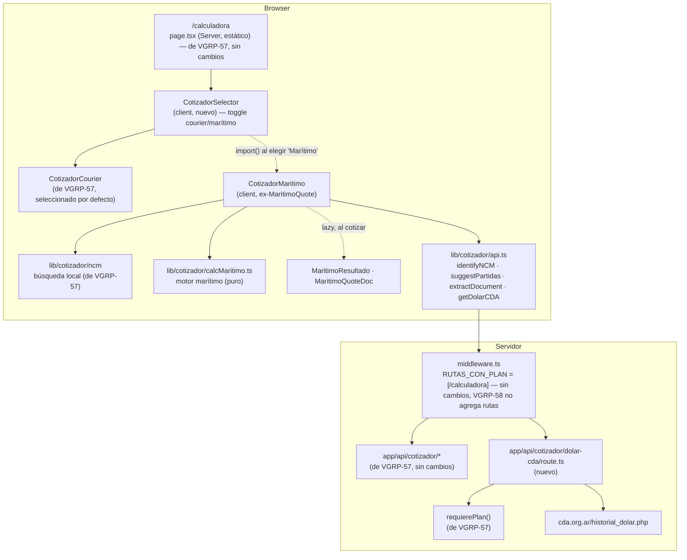
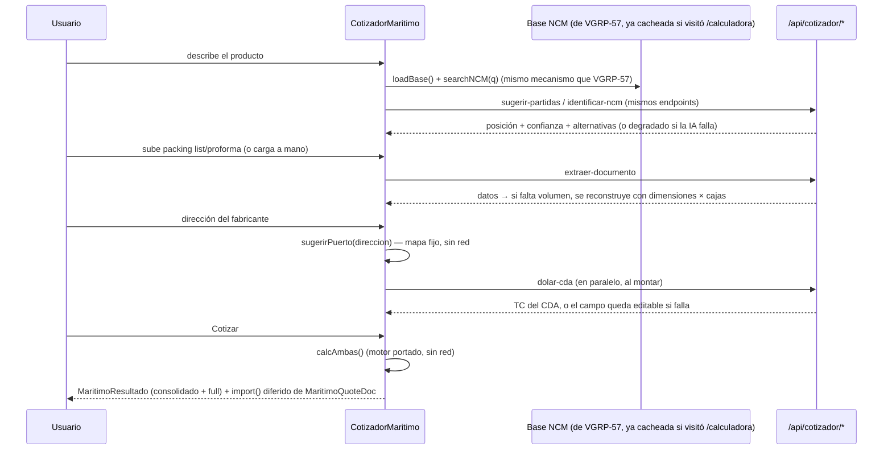

# Design: VGRP-58 — Cotizador marítimo embebido en la app

**Status:** Approved (2026-09-28)
**Last updated:** 2026-09-28
**Requirements:** [requirements-vgrp58.md](./requirements-vgrp58.md)
**Depende de:** [design-vgrp57.md](./design-vgrp57.md) (ya implementado)

## Overview

Se porta el cotizador marítimo de `emilianoverabusiness-blip/vegroup@b550803`
(mismo commit que VGRP-57) **adentro de `/calculadora`**, como una segunda
modalidad que el usuario elige con un selector arriba de todo — decisión del
equipo (2026-09-28), en vez de la ruta propia `/maritimo` de los requirements
originales. No hay ruta nueva, ni entrada de menú nueva, ni banner nuevo en
Inicio: el entry point sigue siendo el único "Calculadora" que ya dejó
VGRP-57, con el ícono `calculadora` ya existente. Es el segundo cotizador del
Bloque 12 y **reutiliza toda la infraestructura de VGRP-57** en vez de
duplicarla:

| Capa | Origen |
|---|---|
| Base NCM, búsqueda (`lib/cotizador/ncm/*`) | VGRP-57, sin cambios |
| `identificar-ncm`, `sugerir-partidas`, `extraer-documento` | VGRP-57, sin cambios — el marítimo llama a los mismos endpoints |
| Cliente de Anthropic, guard, gating por nivel | VGRP-57, sin cambios |
| `lib/cotizador/api.ts` | Se **agregan** `identifyNCM`/`suggestPartidas`/`extractDocument` ya exportados (reutiliza) + `getDolarCDA` nuevo |
| **Números**: `calcMaritimo.js`, `tarifasMaritimo.js` | Copia literal a TS, **sin cambiar ni una fórmula ni una constante** — mismo criterio que VGRP-57 con `calc.ts` |
| UI: `MaritimoQuote`, `MaritimoResultado`, `MaritimoQuoteDoc` | Se reescribe en Liquid Glass, mismo criterio que `CotizadorCourier` |
| Endpoint `dolar-cda` | Nuevo Route Handler — es el único endpoint que VGRP-58 agrega |

El flujo (4 pasos: Producto → Carga → Origen → Cotización) y el contenido
quedan iguales al original. Cambia el cómo se ve y de dónde sale el TC.

Decisiones que este diseño aplica (heredadas de VGRP-57 o del propio ticket):

| Tema | Decisión |
|---|---|
| Ruta / entry point | **Ninguna ruta nueva.** Marítimo es una variante dentro de `/calculadora`, con un selector — decisión del equipo (2026-09-28), reemplaza la ruta propia `/maritimo` de los requirements originales |
| Ícono | Se reusa `calculadora` (ya existente); no se agrega un ícono nuevo a `Icon.tsx` |
| Usuario sin plan en `/calculadora` | Ya resuelto por el gating de VGRP-57 — no hace falta gating nuevo, porque no hay ruta nueva |
| Reuso de infraestructura | Total: NCM, `identify`/`suggest`/`extract`, cliente de Anthropic, guard — nada se duplica |
| Fuente del TC | Centro Despachantes de Aduana (CDA), **no** BNA/CCL — falla explícito si el CDA no responde, nunca inventa un valor |
| Tarifa de contenedor completo | No hay tarifa real: se estima con la misma tarifa por m³ que el consolidado, con aviso y WhatsApp al despachante — non-goal explícito, no es un bug |
| Número de WhatsApp del despachante | Se porta `WHATSAPP_DESPACHANTE` del commit base, sin cambios |
| Al cambiar de modo (courier ↔ marítimo) | Se descarta la cotización en curso del otro modo — nada se persiste, mismo criterio que el original |

## Architecture



### Dónde vive cada cosa

```
app/(app)/calculadora/
  page.tsx                      De VGRP-57, sin cambios de fondo: pasa a montar <CotizadorSelector/>
                                 en vez de <CotizadorCourier/> directo
  calculadora.module.css        De VGRP-57, sin cambios
app/api/cotizador/
  dolar-cda/route.ts            NUEVO — ex api/dolar-cda.js
components/cotizador/           se agrega a lo que ya existe de VGRP-57
  CotizadorSelector.tsx          NUEVO — toggle + import() diferido de CotizadorMaritimo
  CotizadorMaritimo.tsx          ex MaritimoQuote.jsx
  MaritimoResultado.tsx          ex MaritimoResultado.jsx
  MaritimoQuoteDoc.tsx           ex MaritimoQuoteDoc.jsx (impresión)
  maritimo.module.css            estilos propios del marítimo (compone glass/type)
lib/cotizador/
  calcMaritimo.ts                ex src/lib/calcMaritimo.js — literal
  tarifasMaritimo.ts             ex src/lib/tarifasMaritimo.js — literal (constantes + sugerirPuerto + fmt*)
  api.ts                         se agrega getDolarCDA() e interfaz CotizacionCda
  types.ts                       se agregan los tipos del motor marítimo
```

- **`CotizadorSelector` es el único componente nuevo de "cableado":** monta el
  toggle (`fieldset` + `input type="radio"`, mismo patrón que el selector de
  régimen de `CotizadorCourier`) y decide qué formulario mostrar. `Courier`
  se importa estático (es el que ya paga el presupuesto de `/calculadora`
  hoy); `Marítimo` se importa con `next/dynamic` recién cuando el usuario lo
  elige — ver "Rendimiento y presupuesto de bundle".
- **Nombres:** igual criterio que VGRP-57 — se mantienen los del original
  (`MaritimoResultado`, `MaritimoQuoteDoc`) salvo `MaritimoQuote`, que pasa a
  `CotizadorMaritimo` por el mismo motivo que `AgentQuote` → `CotizadorCourier`
  (consistencia de nombres entre los dos cotizadores).
- **`fmtUSD`/`fmtARS`/`fmtPct`/`fmtNum` duplicados:** el original los define
  en `tarifasMaritimo.js` con el mismo cuerpo que en `calc.js`/`ncmSearch.js`.
  Se portan tal cual están en `tarifasMaritimo.ts` (no se factoriza a un
  helper compartido nuevo — no es parte de este ticket tocar `calc.ts`, que ya
  está aprobado e implementado en VGRP-57).

## Data model

Sin persistencia, igual que VGRP-57: la cotización vive en el estado del
componente. Tipos nuevos en `lib/cotizador/types.ts` (se agregan a los ya
existentes de VGRP-57, no reemplazan nada):

```ts
export interface EntradaMaritimo {
  volumenM3: number | string; pesoKg: number | string;
  fob: number | string; unidades: number | string;
  die: number; te: number; iva: number; tc: number;
  fleteUsd?: number | string; // override de flete cerrado por el despachante
}

export interface ResultadoMaritimo {
  medidas: { m3: number; kg: number; ton: number; wm: number; porVolumen: boolean };
  tc: number; unidades: number;
  flete: number; fletePagado: number; fleteDeclarado: number; fleteTarifa: number;
  fleteDeclaradoPct: number; fleteEsOverride: boolean; seguro: number;
  despacho: { /* fob, flete, fletePagado, seguro, cif, gravámenes, baseIva, totalGravamenes, pct */ };
  operativos: { lineas: Array<{ key: string; label: string; usd: number; iva: boolean }>; sumaFijos: number; ivaGastos: number; ivaPct: number; total: number };
  totales: { aPagar: number; aPagarArs: number; recuperable: number; recuperableArs: number; costos: number; costosArs: number; aumentoCostos: number; aumentoAPagar: number; costoPorUnidad: number; costoPorM3: number; costoPorKg: number };
}

export interface ResultadoAmbas {
  consolidado: ResultadoMaritimo; full: ResultadoMaritimo;
  contenedor: { id: string; label: string; cbm: number; pesoMax: number; ocupacion: number; cantidad: number; limita: "peso" | "volumen" };
  fullEsEstimado: boolean;
}
```

Los campos exactos salen de leer `calcMaritimo.js` en la tarea de port (igual
regla que VGRP-57: si tipar obliga a cambiar una fórmula, se para y se
revisa).

## Interfaces / contracts

### Gating: `middleware.ts`

**Sin cambios.** `RUTAS_CON_PLAN = ["/calculadora"]` ya protege todo lo que
vive en esa página, marítimo incluido — no hay ruta nueva que gatear.
`middleware.test.ts` de VGRP-57 sigue cubriendo el caso completo sin agregar
casos nuevos.

### Guard de los endpoints

Los cuatro endpoints reusados (`identificar-ncm`, `sugerir-partidas`,
`extraer-documento`) ya usan `requierePlan()` — no se tocan. El endpoint
nuevo (`dolar-cda`) lo usa igual que los demás.

### Endpoint nuevo: `POST /api/cotizador/dolar-cda`

| Campo | Valor |
|---|---|
| Entrada | `{}` |
| Salida | `{ fecha: string, compra: number, venta: number, fuente: string }` (sin `historial`: el front sólo usa el último valor, igual que `MaritimoQuote.jsx`) |
| Caché | in-memory 30 min, igual que el original (`TTL_MS`), más `Cache-Control: private, no-store` en la respuesta HTTP como los demás endpoints de `/api/cotizador/*` |
| Errores | 502 `"No se pudo leer la cotización del CDA. Cargala a mano."` si el fetch falla; 502 `"El CDA respondió pero no se pudo leer la tabla (¿cambió el sitio?). Cargá la cotización a mano."` si el parseo no encuentra filas |
| Parseo | `parseHistorial(html)` se porta literal (regex sobre la tabla HTML de `cda.org.ar/historial_dolar.php`), con su propio test: HTML de muestra real + HTML "cambió el markup" → 0 filas → error explícito |
| Auth | `requierePlan()`, igual que los demás — **no** llama al CDA si no hay plan |

- **Por qué no reusar `dolar/route.ts`:** ese endpoint devuelve BNA + CCL, una
  fuente completamente distinta (`dolarapi.com`) con otro shape. Mezclarlos
  en un solo endpoint condicional sería más frágil que dos endpoints chicos y
  explícitos — mismo criterio que separó `identificar-ncm` de
  `sugerir-partidas` en VGRP-57.
- **Fragilidad del CDA (constraint de los requirements):** el test del
  endpoint cubre el caso "la tabla cambió de formato" con un fixture de HTML
  sin filas parseables, y verifica que responde 502 con el mensaje de cargar
  a mano — nunca un valor inventado ni un 200 con `venta: 0`.

### `lib/cotizador/api.ts`: función nueva

```ts
export interface CotizacionCda {
  fecha: string;
  compra: number;
  venta: number;
  fuente: string;
}

export function getDolarCDA(): Promise<CotizacionCda> {
  return post("/api/cotizador/dolar-cda", {});
}
```

Usa el mismo `post()` privado que ya maneja 401/403 → redirect a
`DESTINO_SIN_SESION`/`DESTINO_SIN_PLAN` de VGRP-57
(`/login?next=/calculadora`, `/comprar`). **Sin ajuste:** como marítimo vive
en la misma `/calculadora`, el destino fijo ya es el correcto — no hace falta
parametrizarlo por ruta. Era una pregunta abierta sólo bajo el diseño de ruta
propia; queda resuelta por el cambio de alcance.

## UI: port a Liquid Glass

Mismo mapeo de primitivas que VGRP-57 (`design-vgrp57.md` → "UI: port a
Liquid Glass"), reutilizado sin reinventar. Lo específico del marítimo:

| Original (`index.css`) | En la app |
|---|---|
| Selector courier/marítimo (nuevo, no existía en el original) | radio group `<fieldset>` de 2 opciones, mismo patrón visual que el selector de régimen (`surface`, la elegida con `accent`) — vive en `CotizadorSelector` |
| `.mar-dos` (las dos opciones lado a lado) | grid de 2 `surface`, la activa con `accent` — mismo patrón que `.route-card` de VGRP-57 |
| `.mar-opt` / `.mar-opt.activa` | `surface` clickeable con `composes` de `accent` cuando está seleccionada; `<em>estimado</em>` → `chip` |
| `.mar-scroll` (tabla con scroll horizontal en mobile) | misma tabla de VGRP-57 (`RouteBreakdown` ya resuelve esto con `type.data` + overflow del contenedor) |
| `.mar-section` (encabezado de sub-bloque) | `type.cardTitle` chico + `inset` fino, igual criterio que los separadores de `PriceStrategy` |
| `.mar-table` / `Fila` (verde = recuperable, total = subtotal) | misma tabla que `RouteBreakdown`: `chipAccent` para las filas verdes, fila de total en `raised` |
| `.total-box.mar-box` (3 columnas de cierre) | `raised` + `type.display`, mismo patrón que el `.total-box` de VGRP-57 |
| `.alert warn` (aviso de estimado + link WhatsApp) | `inset` ámbar + `FormError`-like, mismo componente que el aviso de peso volumétrico de `RouteBreakdown` (icono de alerta: si B12-08 ya está resuelto para esa fecha, se reusa; si no, este aviso también lo necesita) |
| `<select>` de puerto | **Decisión del equipo (2026-09-28):** radio group `<fieldset>` de 3 opciones (Qingdao/Shanghái/Shenzhen), mismo patrón `surface`/`accent` que el selector de régimen y el de courier/marítimo — no se crea un `Select` nuevo en `components/ui` |
| Sección 3 "Origen" (dirección + puerto sugerido) | mismo patrón de `card` + `chip` que el resto; el aviso "no pude ubicar esa dirección" usa el mismo `inset` que los avisos informativos |
| Emojis (📄) | `Icon name="documento"`, ya existe de VGRP-57 |

- **Layout:** igual ancho/gutters que `/calculadora`, tomado del mismo lugar
  (`perfil.module.css`). Las grillas de 4 y 2 columnas del original pasan a 1
  columna en mobile, igual criterio que VGRP-57.
- **`MaritimoQuoteDoc` (impresión):** mismo mecanismo que `QuoteDoc` de
  VGRP-57 — `window.print()` + `createPortal` a `document.body` +
  `@media print` con el selector `:has()` ya corregido en VGRP-57
  (`:global(body):has(> .hoja) > :not(.hoja)`). La marca VEGROUP en el
  encabezado es la misma decisión pendiente que B12-07 en `bugs.md`: **se
  porta igual que está** hasta que el equipo decida sobre las dos hojas
  juntas.

### Navegación

**Sin cambios.** `components/nav/destinos.ts` y
`components/inicio/InicioShell.tsx` quedan exactamente como los dejó VGRP-57:
un solo destino "Calculadora" con el ícono `calculadora`, un solo banner en
Inicio. El selector de courier/marítimo vive adentro de la página, no en la
navegación.

## Key flows

### Cotizar



Diferencias con el flujo de courier: el paso 3 no llama a la IA (mapa fijo
por texto), y el TC sale del CDA en vez de dolarapi.com/BNA.

## Rendimiento y presupuesto de bundle

**Esto es lo más sensible del cambio de alcance.** `/calculadora` ya está en
**200 kB exactos, sin margen** (B12-14, medido al cerrar VGRP-57). Con la ruta
propia `/maritimo` original, marítimo tenía su propio presupuesto de 200 kB.
Al mudarse adentro de `/calculadora`, **si `CotizadorMaritimo` se importara
estático, la ruta pasaría el presupuesto con certeza** — son ~3.000 líneas
más de UI y motor, el mismo orden de magnitud que ya obligó a diferir NCM y
proforma en VGRP-57.

- **`CotizadorSelector` importa `CotizadorCourier` estático** (es el
  comportamiento por defecto, lo que ya paga el presupuesto actual) **y
  `CotizadorMaritimo` con `next/dynamic({ ssr: false })`, recién cuando el
  usuario elige "Marítimo"**. Es el mismo patrón que ya usa VGRP-57 para
  `ProformaUpload` y los paneles de resultado — un split legítimo, porque
  nada de marítimo se muestra antes de elegirlo.
- Dentro de `CotizadorMaritimo`, misma estrategia interna que courier:
  - `ncm/search.ts` y `ncm/base.ts` ya están diferidos por VGRP-57 y se
    reusan tal cual (si el usuario ya cotizó en courier, el módulo ya está
    en memoria).
  - `ProformaUpload` se reusa, ya diferido.
  - `MaritimoResultado` y `MaritimoQuoteDoc` con `next/dynamic`, recién al
    cotizar — mismo criterio que `RouteBreakdown`/`QuoteDoc`.
  - `calcMaritimo.ts`/`tarifasMaritimo.ts` viajan dentro del mismo chunk
    diferido que `CotizadorMaritimo` (no hay motivo para separarlos más).
- **Medición:** se corre `next build` + `check-bundle-budget.mjs` al cerrar el
  tramo C y se anota acá el número real de `/calculadora` (courier solo,
  primera carga) y el peso del chunk diferido de marítimo. Si `/calculadora`
  pasa de 200 kB con el selector puesto, **se para y se consulta** — no se
  sube el presupuesto en silencio. Es la misma regla que ya aplicó VGRP-57.

## Tests

| Qué | Cómo |
|---|---|
| **Paridad del motor** | `scripts/cotizador/generar-fixtures-maritimo.mjs` corre el `calcMaritimo.js` **original** (mismo mecanismo que `generar-fixtures.mjs`) sobre los casos de `calcMaritimo.test.mjs` (40 comprobaciones: bloque fijo, TN/m³, caso "set de herramientas", `contenedorSugerido`, `sugerirPuerto`). Escribe `test/fixtures/cotizador/maritimo.json`. `lib/cotizador/calcMaritimo.test.ts` exige igualdad exacta contra el motor portado. |
| **`sugerirPuerto`** | Mismo fixture: casos de provincia y de ciudad para las tres cuencas (Qingdao/Shanghái/Shenzhen) + un caso sin match (`null`). |
| **`dolar-cda`** | Mock de `fetch`: HTML de muestra real → filas parseadas correctamente; HTML sin filas (markup cambiado) → 502 explícito; fetch que tira → 502; 401 sin sesión; 403 con `ninguno` **sin llamar al CDA**. |
| **Gating** | Sin casos nuevos: `middleware.test.ts` de VGRP-57 ya cubre `/calculadora` completa. |
| **E2E** | Playwright: un usuario `principiante` entra a `/calculadora`, elige "Marítimo" en el selector, cotiza con datos manuales (sin IA, determinístico) y ve las dos opciones (consolidado + full); se reusa el mismo usuario `ninguno` → `/comprar` que ya prueba VGRP-57 (no hay ruta nueva que probar). |
| **Estructural** | El test de `server-only` ya cubierto por VGRP-57 sigue en verde (no se agregan archivos server-only nuevos aparte de `dolar-cda/route.ts`, que sigue el mismo patrón que los demás). |
| **Bundle** | `check-bundle-budget.mjs` sobre `/calculadora` con el selector puesto — courier debe seguir en ≤200 kB en la carga inicial; ver "Rendimiento y presupuesto de bundle". |

## Trade-offs and alternatives considered

| Opción | Pros | Contras | ¿Elegida? |
|---|---|---|---|
| Reusar NCM/identify/suggest/extract de VGRP-57 | Cero duplicación, un solo lugar para portar cambios futuros | El marítimo depende de que VGRP-57 esté implementado primero | **Sí** — es lo que pide el requirement ("Orden: va después de VGRP-57") |
| Endpoint `dolar-cda` separado de `dolar` | Simple, explícito, mismo criterio que separar `identify`/`suggest` | Un endpoint más | **Sí** |
| Endpoint `dolar` con un parámetro `fuente` | Un endpoint menos | Mezcla dos integraciones externas distintas (dolarapi.com vs. scraping de cda.org.ar) con shapes y fallos distintos en un solo handler | No |
| Variante dentro de `/calculadora` con `CotizadorMaritimo` diferido (`next/dynamic`) | Un solo entry point, como pidió el equipo; el presupuesto de `/calculadora` en carga inicial no se toca | El chunk de marítimo se descarga recién al elegirlo (un salto perceptible la primera vez que se toca el toggle) | **Sí** — decisión del equipo (2026-09-28) |
| Ruta propia `/maritimo` (diseño original de este documento) | Cada cotizador con su propio presupuesto de 200 kB, sin compartir carga inicial | Entrada de menú y banner propios, dos lugares para "la calculadora" | No — descartada por el equipo |
| `CotizadorMaritimo` importado estático dentro del selector | Sin salto al elegir marítimo | Rompe con certeza el presupuesto de `/calculadora` (ya está en 200 kB exactos, B12-14) | No |

## Requirement traceability

| Requirement | Dónde se cumple |
|---|---|
| US-1 (selector courier/marítimo dentro de `/calculadora`, sin ruta ni menú propios) | `CotizadorSelector`; Navegación (sin cambios) |
| US-2 (gating) | Ya cubierto por el gating de `/calculadora` de VGRP-57; sin cambios |
| US-3 (cotizar, paridad, 4 pasos, contenedor sugerido) | `lib/cotizador/calcMaritimo.ts`, `tarifasMaritimo.ts`, `CotizadorMaritimo`; endpoints reusados; tests de paridad |
| US-4 (TC del CDA, falla explícito) | Endpoint `dolar-cda`; test de "cambió el markup" |
| US-5 (imprimir) | `MaritimoQuoteDoc`, mismo mecanismo que `QuoteDoc` |
| US-6 (Liquid Glass) | UI: port a Liquid Glass; `/design-critique` |
| Constraint de fragilidad del CDA | Test de `dolar-cda` con HTML sin filas |
| Constraint de paridad verificable | Fixtures generados desde `calcMaritimo.js` original |
| Constraint de orden (después de VGRP-57) | Architecture: toda la infraestructura reusada ya existe |
| Constraint de bundle (heredada de VGRP-57 + agravada por el cambio de alcance) | Rendimiento y presupuesto de bundle: `CotizadorMaritimo` diferido |

## Open questions

Ninguna pendiente. Resueltas por decisión del equipo (2026-09-28):
- ~~Ícono del destino "Marítimo" en el menú~~ — no aplica, no hay destino de
  menú nuevo; se reusa el ícono `calculadora` en el único selector.
- ~~`DESTINO_SIN_SESION` parametrizado por ruta~~ — no aplica, marítimo vive
  en `/calculadora`, el destino fijo ya es correcto.
- ~~¿Existe `Select` en `components/ui`?~~ — no existe. Se resuelve con un
  radio group `<fieldset>` para el puerto de carga, mismo patrón que el
  selector de régimen y el de courier/marítimo. No se crea un componente
  `Select` compartido nuevo.
