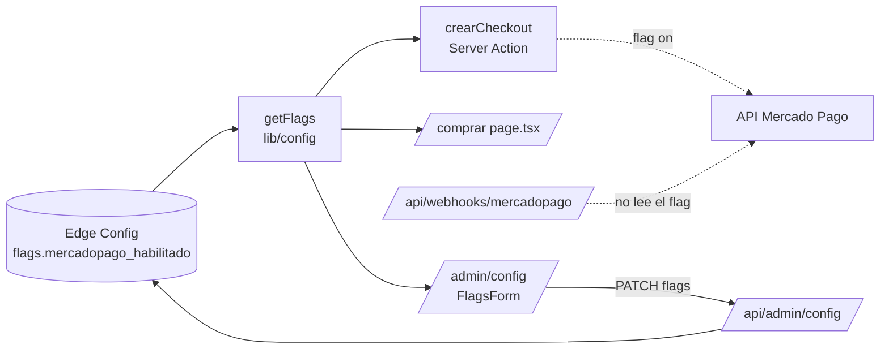
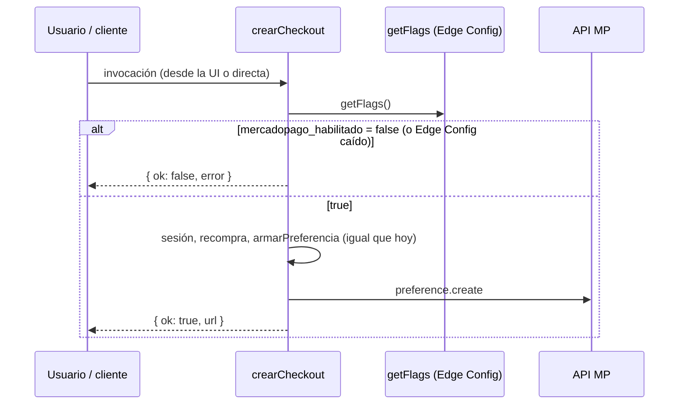

# Design: Desactivar Mercado Pago sin borrar la integración (VGRP-61)

**Status:** Approved (2026-10-02)
**Last updated:** 2026-10-02
**Requirements:** [requirements-vgrp61.md](./requirements-vgrp61.md)

## Overview

Se agrega un flag `flags.mercadopago_habilitado` al schema de Edge Config. Si la clave falta, vale `false`. Dos lugares lo leen con el `getFlags()` que ya existe:

1. **`crearCheckout()`** (servidor): es la barrera de verdad. Con el flag apagado corta antes de cualquier otra cosa.
2. **`/comprar`** (UI): con el flag apagado no renderiza `ComprarButton` ni la frase que nombra a MP.

El webhook **no se toca**; solo se le agrega un comentario. El panel admin suma un checkbox. El resto son docs. No hay tablas, rutas ni componentes nuevos, y ningún archivo de MP se borra (restricción de "cambio mínimo").

## Architecture



## Data model

`lib/config/schema.ts`, dentro de `flags`:

```ts
flags: z.object({
  checkout_habilitado: z.boolean(),
  registro_habilitado: z.boolean(),
  fase: z.enum(FASES),
  // VGRP-61: `.default(false)` y no `z.boolean()` a secas. El valor que hoy
  // está en producción no trae esta clave, y un campo requerido haría fallar
  // el safeParse de TODO `flags`. getFlags() caería entonces a DEFAULT_FLAGS
  // y apagaría también el registro.
  mercadopago_habilitado: z.boolean().default(false),
}),
```

- En zod 4, `.default()` hace la clave **opcional en la entrada** y **siempre presente en la salida**, así que `Config["flags"]` tipa `mercadopago_habilitado: boolean` (requerido). Consecuencia: los fixtures de test que arman un `Config["flags"]` completo necesitan sumar la clave. Es un cambio solo de tests.
- `DEFAULT_FLAGS` (`lib/config/index.ts`) suma `mercadopago_habilitado: false`. Edge Config caído equivale a MP apagado (fail-closed).
- No hay migración ni cambio en Edge Config. La clave se carga sola la primera vez que un admin guarda los flags desde el panel.

## Interfaces / contracts

### `crearCheckout(nivel)` (`app/(app)/comprar/_actions.ts`)

- **Firma:** sin cambios.
- **Nuevo primer paso:** `const flags = await getFlags(); if (!flags.mercadopago_habilitado) return { ok: false, error: "El pago con Mercado Pago no está disponible." };`
- Va **antes** del chequeo de sesión: es lo más barato, no depende del usuario y garantiza que no se llegue a `armarPreferencia`, `getPreferenceClient` ni `track`.
- **Errores:** ninguno nuevo. `getFlags()` nunca lanza (fail-closed a `DEFAULT_FLAGS`).

### `/comprar` (`app/(app)/comprar/page.tsx`)

- Suma `getFlags()` al `Promise.all` que ya existe. No agrega latencia en serie.
- `const mpHabilitado = flags.mercadopago_habilitado;`
- Card del plan (nombre y precio sin cambios):
  - Ya tiene el plan: igual que hoy ("Ya tenés este plan").
  - No tiene el plan y `mpHabilitado`: igual que hoy (frase de MP y `ComprarButton`).
  - No tiene el plan y `!mpHabilitado`: copy "Acceso completo a la plataforma." sin la frase de MP, y sin botón.
- No se toca CSS ni se crea ningún componente.

### `FlagsForm` (`app/admin/config/FlagsForm.tsx`)

- Nuevo `Checkbox` "Mercado Pago habilitado" con `useState(flagsIniciales.mercadopago_habilitado)`, enviado en el mismo `submit({ flags })`.
- Aclaraciones con la clase que ya existe, `styles.formAyuda` (`admin.module.css`):
  - Bajo "Mercado Pago habilitado": "Hoy el cobro es por transferencia. Prenderlo vuelve a mostrar el botón de Mercado Pago en /comprar."
  - Bajo "Checkout habilitado": "Hoy no controla nada en la app."
- `/api/admin/config` **no cambia**: valida con `configSchema.shape.flags`, así que acepta y persiste la clave nueva con la misma auditoría y el mismo `requireAdmin()` de siempre.

### Webhook (`app/api/webhooks/mercadopago/route.ts`)

- Sin cambios de código. Solo un comentario junto al handler que explica por qué no lee `mercadopago_habilitado`: solo procesa notificaciones firmadas de pagos reales y apagarlo perdería pagos tardíos legítimos.

### Docs y env

- `.env.example`: sobre `MERCADOPAGO_ACCESS_TOKEN` y `MERCADOPAGO_WEBHOOK_SECRET`, una nota que dice que son opcionales mientras el flag esté apagado. El build ya no depende de ellas: `getEnv()` se llama recién al usar el cliente (`lib/mercadopago/client.ts`), y lo confirmo con un `next build` sin esas variables.
- `STACK.md`, fila "Pagos": se aclara que MP está desactivado por flag desde el 02/10/2026, con link a EDGE-CONFIG.md.
- `docs/EDGE-CONFIG.md`:
  - Fila nueva `flags.mercadopago_habilitado` en la tabla de claves.
  - Nota en `checkout_habilitado`: hoy no controla nada.
  - Sección corta "Reactivar Mercado Pago": prender el flag en `/admin/config` y verificar que las variables de MP estén en Vercel.

## Key flows



## Trade-offs and alternatives considered

| Opción | Pros | Contras | ¿Elegida? |
|---|---|---|---|
| `z.boolean().default(false)` en el schema | No rompe el valor actual de prod; fail-closed | Hay que sumar la clave a fixtures de test | **Sí** |
| `z.boolean()` requerido + cargar la clave en Edge Config antes del deploy | Schema más estricto | Si alguien deploya sin cargarla, `flags` entero cae a defaults y se apaga el registro | No: frágil |
| `.optional()` y tratar `undefined` como `false` en cada lector | No toca fixtures | Cada lector tiene que acordarse del `?? false`; el tipo deja de decir la verdad | No |
| Chequeo del flag después del chequeo de sesión | Mensaje de sesión primero | Nada ganado: con MP apagado nadie compra, logueado o no | No |
| Apagar también el webhook | "Todo MP apagado" | Pierde pagos tardíos legítimos; lo descarta el ticket | No |
| Reusar `checkout_habilitado` | Un flag menos | Decisión del equipo del 02/10: flag nuevo | No |

## Tests

Todos unitarios o de route handler. Los E2E quedan para VGRP-66.

- **`_actions.test.ts`**:
  - Mockear `@/lib/config` → `getFlags`, con `mercadopago_habilitado: true` por default en `beforeEach`. Así los tests existentes siguen probando el flujo prendido sin cambios y sin `skip`.
  - Test nuevo: con el flag en `false`, devuelve `ok: false` y no llama a `armarPreferencia`, `getPreferenceClient`, `create` ni `track`.
- **`lib/config/schema.test.ts`**:
  - `flags` sin `mercadopago_habilitado` parsea y queda en `false`, sin tocar los otros flags.
  - Con un valor no booleano, falla.
- **`lib/config/index.test.ts`**: `DEFAULT_FLAGS` trae `mercadopago_habilitado: false`. Se ajustan los fixtures.
- **`app/api/admin/config/route.test.ts`**: un PATCH con `mercadopago_habilitado: true` se persiste. Se ajustan los fixtures.
- **`/comprar`**: no tiene test de página hoy, y no se crea un harness nuevo (cambio mínimo). Lo verifico a mano en el preview con el flag prendido y apagado. El E2E "MP apagado" ya está previsto en VGRP-66.
- **Tests del webhook**: sin cambios. Tienen que seguir en verde.

## Requirement traceability

| Criterio | Dónde |
|---|---|
| US-1: corte en `crearCheckout`, sin MP ni `track`, fail-closed, flujo prendido igual | `crearCheckout`, `DEFAULT_FLAGS`, tests de `_actions` |
| US-2: sin botón ni frase de MP; plan y precio visibles; flujo prendido igual; "Ya tenés este plan" | `/comprar` page.tsx, verificación en el preview |
| US-3: webhook activo y documentado; `/comprar/pendiente` accesible | Comentario en el webhook; `/comprar/pendiente` no se toca |
| US-4: toggle y aclaraciones; mismo endpoint, auditoría y 403 | `FlagsForm`, `/api/admin/config` sin cambios, route.test |
| US-5: clave ausente = `false` sin romper el resto | `.default(false)`, schema.test |
| US-6: build sin variables de MP; `.env.example`, STACK.md, EDGE-CONFIG.md | Docs y `next build` sin las variables |

## Open questions / risks

- **Riesgo conocido, aceptado en requirements:** apenas se deploye, MP queda apagado, y `/comprar` muestra el plan sin forma de pagar hasta VGRP-64. Lo resuelven los tickets siguientes.
- Checklist de CLAUDE.md: `/design-critique` sobre `/comprar` y `/admin/config`, y `/simplify` antes del PR.
