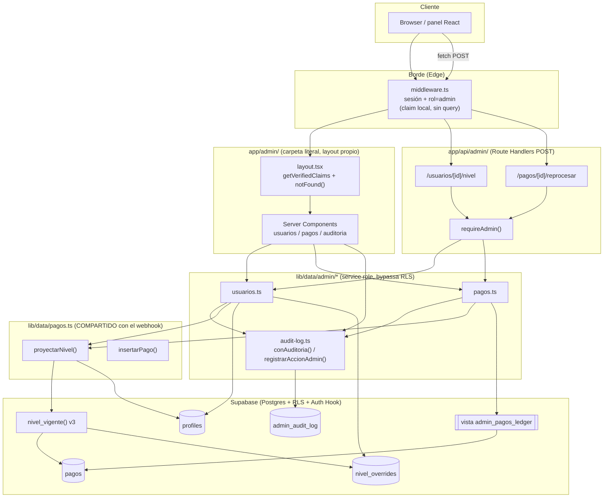
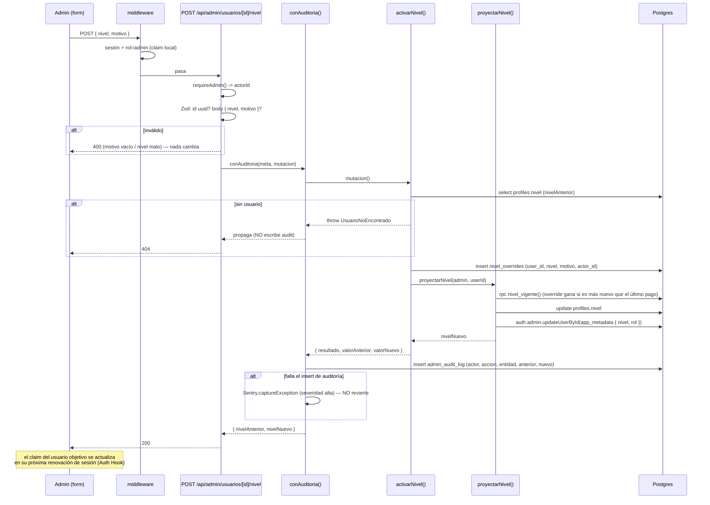

# Design: Bloque 5 — Panel de administración base

**Status:** Approved
**Last updated:** 2026-09-05
**Requirements:** [requirements.md](./requirements.md)

## Overview

El panel vive en `app/admin/` (carpeta literal, **no** route group: `/admin` tiene que ser
un prefijo real para que el middleware lo matchee). Tres capas de defensa verifican
`rol = 'admin'` leyendo el claim `app_metadata.rol` del JWT ya verificado localmente —
cero queries:

1. **`middleware.ts`** — extiende el fail-closed actual: para `/admin` y `/api/admin`, si
   hay sesión pero el claim no es `admin`, corta con `404` (páginas y API). Es el gate
   primario y "gratis" (el middleware ya llama `getClaims()` en cada request).
2. **`app/admin/layout.tsx`** — Server Component que re-chequea con `getVerifiedClaims()` y
   hace `notFound()` si no es admin. Garantiza que ningún hijo del área admin renderice
   para un no-admin (nunca "pantalla parcial") y da el 404 tematizado.
3. **`requireAdmin()`** (`lib/auth/admin.ts`) — guard explícito que **cada** Route Handler
   de `app/api/admin/*` invoca antes de tocar lógica de negocio.

Las lecturas (listados, detalle, auditoría) son **Server Components** que consultan
`lib/data/admin/*` con `createServiceRoleClient()` (bypassa RLS). Las mutaciones son **Route
Handlers** `POST` con contrato HTTP explícito (400/404/409) y body validado con Zod. Toda
mutación pasa por un único wrapper `conAuditoria()` que escribe `admin_audit_log`.

La activación manual de nivel y el reproceso **reutilizan `proyectarNivel()` de
`lib/data/pagos.ts`** sin reimplementar nada. Para poder fijar cualquier nivel del enum
(incluido bajar a `ninguno`) sin un pago de MP asociado, se agrega una tabla append-only
`nivel_overrides` que `nivel_vigente()` pasa a considerar — el webhook no cambia y sigue
llamando a la misma función.

### Mapa de entrega por ticket

| Ticket | Alcance del diseño |
|---|---|
| **VGRP-35** | Middleware (capa de rol), `lib/auth/admin.ts`, `app/admin/layout.tsx` + shell, `lib/data/admin/audit-log.ts` (`registrarAccionAdmin` + `conAuditoria`), `app/admin/auditoria/`, migración de índices en `admin_audit_log`, doc de alta de admin. |
| **VGRP-36** | `lib/data/admin/usuarios.ts`, `app/admin/usuarios/` (listado + detalle), `POST /api/admin/usuarios/[id]/nivel`, tabla `nivel_overrides` + `nivel_vigente()` v3, índices en `profiles`. |
| **VGRP-37** | `lib/data/admin/pagos.ts`, `app/admin/pagos/` (ledger + detalle), `POST /api/admin/pagos/[id]/reprocesar`, vista `admin_pagos_ledger`, `sanitizarPayloadRaw()`, índice `pagos_created_at_idx`. |

VGRP-36 y VGRP-37 se construyen sobre la base mergeada de VGRP-35 (usan `conAuditoria` y el
shell). Entre sí son independientes.

## Architecture



### Estructura de rutas y archivos

`app/admin/` es una **carpeta literal**, hermana de `(app)`, `(auth)`, `(legal)`. No hereda
`app/(app)/layout.tsx` (ese layout es del route group `(app)`); sólo hereda `app/layout.tsx`
(`<html>`/`<body>`/fuentes). Su `layout.tsx` es dinámico a propósito — es la excepción
explícita a la regla "el layout no lee cookies" de `app/(app)/layout.tsx`, porque acá el
gating por rol es parte del contrato de la pantalla.

```
app/admin/
  layout.tsx                     admin.module.css     # VGRP-35  shell + guard
  page.tsx                                            # VGRP-35  índice del panel
  not-found.tsx                                       # VGRP-35  404 tematizado del área
  auditoria/
    page.tsx                     AuditoriaFiltros.tsx  # VGRP-35
  usuarios/
    page.tsx                     UsuariosFiltros.tsx   # VGRP-36
    [id]/
      page.tsx                   CambiarNivelForm.tsx  # VGRP-36  (form = Client Component)
  pagos/
    page.tsx                     PagosFiltros.tsx      # VGRP-37
    [id]/
      page.tsx                   ReprocesarButton.tsx  # VGRP-37

app/api/admin/
  usuarios/[id]/nivel/route.ts        route.test.ts    # VGRP-36
  pagos/[id]/reprocesar/route.ts      route.test.ts    # VGRP-37

lib/auth/admin.ts                                      # VGRP-35
lib/data/admin/
  audit-log.ts    audit-log.test.ts                    # VGRP-35
  usuarios.ts     usuarios.test.ts                      # VGRP-36
  pagos.ts        pagos.test.ts                         # VGRP-37
```

### Dónde vive la verificación de rol (punto de diseño 1)

| Capa | Qué chequea | Respuesta si falla | Por qué acá |
|---|---|---|---|
| `middleware.ts` | sesión (heredado) + `getRol(claims) === 'admin'` para prefijos `/admin` y `/api/admin` | sin sesión → `307 /login?next=…` (págs) / `401` (api) — heredado. Con sesión y `rol != admin` → `404` (págs y api) | Ya corre en todo request y ya tiene los claims verificados: sumar el check de rol es CPU en memoria, cero queries. Es el único punto que cubre una ruta nueva olvidada (mismo espíritu fail-closed que el resto del archivo). |
| `app/admin/layout.tsx` | `getRol(getVerifiedClaims()) === 'admin'` | `notFound()` (404 real, body tematizado); sin sesión → `redirect('/login?next=/admin')` | Garantiza "nunca pantalla parcial": si el guard falla, **ningún** Server Component hijo del área llega a renderizar. Cubre además caminos que el middleware no ve limpio (payloads RSC de navegación cliente, `next dev`). |
| `requireAdmin()` en cada handler | idem, sobre `getVerifiedClaims()` | `Response.json({error:'No encontrado.'}, {status:404})` (o `401` si no hay sesión) — **antes** de cualquier lógica | CLAUDE.md / el comentario de `crearCheckout` son explícitos: un Route Handler se puede invocar directo sin pasar por el render de ninguna página; el chequeo va explícito en el handler, no delegado. Es lo que los tests de integración ejercitan directo. |

**Contra el criterio "404, nunca 403 ni pantalla parcial, sin query":**
- Nunca se responde `403`: en las tres capas, `rol != admin` con sesión válida devuelve
  `404` (o redirect que no revela la ruta). Un `403` confirmaría que `/admin/...` existe.
- "Sin query": las tres capas leen `app_metadata.rol` del JWT ya verificado (ES256 local,
  `getClaims()` / `getVerifiedClaims()`). Ninguna hace `select` a `profiles` ni llama a
  `getUser()`.
- "Nunca pantalla parcial": el guard está en el **layout**, que envuelve todo el subárbol;
  React no renderiza hijos si el layout lanza (`notFound()`).

**Diff conceptual de `middleware.ts`** (se agrega, no se afloja nada existente):

```ts
// nuevo import
import { getRol } from "@/lib/auth/claims";
import type { AppMetadataClaims } from "@/lib/auth/claims";

const ADMIN_PREFIXES = ["/admin", "/api/admin"];

function isAdminArea(pathname: string): boolean {
  return ADMIN_PREFIXES.some((p) => pathname === p || pathname.startsWith(`${p}/`));
}

// ... dentro de middleware(), DESPUÉS del bloque `if (!haySesion) { ... }`
// (o sea: acá ya sabemos que haySesion === true) y ANTES del `return response` final:

if (isAdminArea(pathname)) {
  // `data.claims`: mismo shape que consume getVerifiedClaims() en lib/auth/server.ts
  const claims = (data as { claims?: AppMetadataClaims } | undefined)?.claims ?? null;
  if (getRol(claims) !== "admin") {
    // 404 — nunca 403, nunca revelar que la ruta existe.
    if (pathname.startsWith("/api/")) {
      return withRefreshedCookies(
        NextResponse.json({ error: "No encontrado." }, { status: 404 }),
        response,
      );
    }
    return withRefreshedCookies(new NextResponse("Not Found", { status: 404 }), response);
  }
}

return response;
```

> El `new NextResponse("Not Found", { status: 404 })` para páginas es un 404 "pelado"
> (sin el body tematizado). Es aceptable para el caso (un no-admin sondeando `/admin`), y
> `app/admin/layout.tsx` da el 404 lindo en el camino normal. Durante la implementación
> vale probar `NextResponse.rewrite(new URL("/_not-found", request.url), { status: 404 })`
> para unificar el body; si resulta frágil entre versiones de Next, queda el 404 pelado.

`lib/auth/admin.ts`:

```ts
import "server-only";
import { getRol } from "./claims";
import { getVerifiedClaims } from "./server";

export type AdminGuard =
  | { ok: true; actorId: string }
  | { ok: false; response: Response };

/** Guard para Route Handlers de app/api/admin/*. No hace query: lee el claim
 *  ya verificado localmente. Devuelve el actorId (claim `sub`) o una Response
 *  lista para retornar. */
export async function requireAdmin(): Promise<AdminGuard> {
  const claims = await getVerifiedClaims();
  if (!claims) {
    return { ok: false, response: Response.json({ error: "No autenticado." }, { status: 401 }) };
  }
  const actorId = typeof claims.sub === "string" ? claims.sub : "";
  if (getRol(claims) !== "admin" || !actorId) {
    // 404, mismo criterio que el middleware.
    return { ok: false, response: Response.json({ error: "No encontrado." }, { status: 404 }) };
  }
  return { ok: true, actorId };
}

/** Variante para Server Components / layout: redirige o notFound() en vez de Response. */
export async function requireAdminPage(): Promise<{ actorId: string }> {
  const claims = await getVerifiedClaims();
  if (!claims) redirect("/login?next=/admin");
  const actorId = typeof claims.sub === "string" ? claims.sub : "";
  if (getRol(claims) !== "admin" || !actorId) notFound();
  return { actorId };
}
```

## Data model

### Cambios de esquema (¿hace falta migración? **Sí** — 3 archivos, uno por ticket)

Se aplican con `apply_migration` (MCP de Supabase) **y** se versionan en
`supabase/migrations/` con el formato de timestamp existente. Una migración por ticket para
que cada PR sea mergeable sola:

| Archivo | Ticket | Contenido |
|---|---|---|
| `20260905030000_admin_audit_log_indices.sql` | VGRP-35 | 2 índices en `admin_audit_log` |
| `20260905030100_nivel_overrides.sql` | VGRP-36 | tabla `nivel_overrides` + RLS + grants + `nivel_vigente()` v3 + 1 índice en `profiles` |
| `20260905030200_admin_pagos_ledger.sql` | VGRP-37 | vista `admin_pagos_ledger` + grant + 1 índice en `pagos` |

**Lo que NO cambia:** no se toca ninguna policy existente (`admin_audit_log_select_admin`,
`pagos_select_own`, etc. quedan igual — el panel lee por service role, que las bypassa; ver
"cadena de confianza"). No se agregan grants a `authenticated` (el panel no usa el cliente
anon). `pagos_proveedor_ref_idx` ya existe → la búsqueda por `proveedor_ref` no necesita
índice nuevo.

#### VGRP-35 — índices en `admin_audit_log`

Hoy `admin_audit_log` sólo tiene el índice de PK. La pantalla de auditoría ordena por
`created_at desc` y filtra por `actor_id` + rango de fechas, con paginación keyset:

```sql
create index admin_audit_log_created_at_idx
  on public.admin_audit_log (created_at desc, id desc);

create index admin_audit_log_actor_created_idx
  on public.admin_audit_log (actor_id, created_at desc, id desc);
```

#### VGRP-36 — `nivel_overrides` + `nivel_vigente()` v3

```sql
-- Append-only: una fila por acción de activación manual. "Gana" la más reciente.
-- No se hace UPDATE ni DELETE (mismo criterio que `pagos`). Es, además, un
-- registro de auditoría en sí mismo (redundante con admin_audit_log a propósito:
-- este vive en el dominio de negocio y sobrevive aunque se borre un actor).
create table public.nivel_overrides (
  id uuid primary key default gen_random_uuid(),
  user_id uuid not null references public.profiles (id),
  nivel public.nivel_acceso not null,
  motivo text not null,
  actor_id uuid references public.profiles (id),
  created_at timestamptz not null default now()
);

create index nivel_overrides_user_created_idx
  on public.nivel_overrides (user_id, created_at desc);

comment on table public.nivel_overrides is
  'Activaciones/cambios manuales de nivel desde el panel de admin (VGRP-36). '
  'Append-only. nivel_vigente() considera la fila más reciente por usuario y la '
  'aplica si es posterior al último pago approved no reembolsado — así un pago '
  'real posterior siempre supera un override viejo.';

alter table public.nivel_overrides enable row level security;
-- Sin policies para authenticated -> RLS deniega TODO por default (igual que
-- pagos para insert/update). Sólo service_role (BYPASSRLS) escribe y lee.
revoke all on public.nivel_overrides from anon, authenticated;
grant all on public.nivel_overrides to service_role;
```

`nivel_vigente()` v3 — el webhook la sigue llamando igual; con cero filas en
`nivel_overrides` el resultado es **idéntico** al de la v2 (VGRP-24):

```sql
create or replace function public.nivel_vigente(p_user_id uuid)
returns public.nivel_acceso
language sql
stable
set search_path = ''
as $$
  with ledger as (
    select max(p.nivel_comprado) as nivel, max(p.created_at) as at
    from public.pagos p
    where p.user_id = p_user_id
      and p.estado = 'approved'
      and not exists (
        select 1 from public.pagos r
        where r.proveedor_ref = p.proveedor_ref and r.estado = 'refunded'
      )
  ),
  ovr as (
    select nivel, created_at as at
    from public.nivel_overrides
    where user_id = p_user_id
    order by created_at desc
    limit 1
  )
  select coalesce(
    -- el override gana sólo si es igual o posterior al último pago relevante
    (select o.nivel from ovr o, ledger l
     where o.at >= coalesce(l.at, '-infinity'::timestamptz)),
    (select nivel from ledger),           -- lógica v2 intacta
    'ninguno'::public.nivel_acceso
  );
$$;
```

Índice para el listado de usuarios (`order by created_at desc` + filtro por `nivel`):

```sql
create index profiles_created_at_idx on public.profiles (created_at desc, id desc);
```

> Búsqueda por email (`email ilike '%q%'`): **sin índice trigram por ahora**. A la escala
> declarada en STACK.md (cientos a pocos miles de usuarios) un seq scan sobre `ilike` es
> irrelevante y `pg_trgm` es una extensión más para mantener. Revisar si `profiles` supera
> ~50k filas.

#### VGRP-37 — vista `admin_pagos_ledger`

Resuelve en la base la detección de "pago aprobado sin nivel aplicado" (punto de diseño 6):
un pago está *sin aplicar* si está `approved`, no tiene `refunded` para su `proveedor_ref`, y
lo que compró es **más alto** que el nivel actual del perfil. La comparación por `>` sobre
el enum es lo que hace correcto el caso "compró Principiante y después Avanzado": la fila de
Principiante nunca se marca porque `principiante > avanzado` es falso.

```sql
create view public.admin_pagos_ledger
with (security_invoker = true)
as
select
  p.id, p.user_id, p.proveedor, p.proveedor_ref, p.nivel_comprado,
  p.monto_ars, p.estado, p.created_at,
  pr.email as user_email,
  pr.nivel as user_nivel_actual,
  (
    p.estado = 'approved'
    and not exists (
      select 1 from public.pagos r
      where r.proveedor_ref = p.proveedor_ref and r.estado = 'refunded'
    )
    and p.nivel_comprado > pr.nivel
  ) as sin_aplicar
from public.pagos p
join public.profiles pr on pr.id = p.user_id;

-- El panel la consulta por service role; no se expone a authenticated.
revoke all on public.admin_pagos_ledger from anon, authenticated;
grant select on public.admin_pagos_ledger to service_role;
```

> `payload_raw` **no** está en la vista: sólo se muestra en el detalle de un pago, filtrado
> (ver `sanitizarPayloadRaw`). Mantener la vista liviana también evita traer el JSON crudo
> en cada fila del listado.

Índice para el orden global del ledger (`order by created_at desc`):

```sql
create index pagos_created_at_idx on public.pagos (created_at desc, id desc);
```

### Tipos TS (regenerar `lib/database.types.ts` tras cada migración)

`generate_typescript_types` del MCP. Suma `nivel_overrides` (Row/Insert/Update) y la vista
`admin_pagos_ledger` a `Database["public"]`. `Tables<"nivel_overrides">` y una fila del
ledger:

```ts
type NivelOverride = Tables<"nivel_overrides">;
// { id, user_id, nivel: NivelAcceso, motivo, actor_id: string | null, created_at }

interface PagoLedgerRow {
  id: string; user_id: string; proveedor: string; proveedor_ref: string;
  nivel_comprado: NivelAcceso; monto_ars: number; estado: string; created_at: string;
  user_email: string; user_nivel_actual: NivelAcceso; sin_aplicar: boolean;
}
```

## Interfaces / contracts

### `lib/data/admin/audit-log.ts` (VGRP-35)

#### `registrarAccionAdmin(admin, entrada)`

- **Input:**
  ```ts
  interface EntradaAudit {
    actorId: string;
    accion: "cambiar_nivel" | "reprocesar_pago";  // string; unión para autocompletado
    entidad: "profiles" | "pagos";
    entidadId: string;
    valorAnterior: Json | null;
    valorNuevo: Json | null;
  }
  registrarAccionAdmin(admin: SupabaseClient<Database>, e: EntradaAudit): Promise<void>
  ```
- **Output:** `void`. Inserta una fila en `admin_audit_log`.
- **Errores:** propaga (throw) cualquier error de Postgres. No hay interpretación de negocio.

#### `conAuditoria(admin, meta, mutacion)` — el wrapper obligatorio

```ts
conAuditoria<T>(
  admin: SupabaseClient<Database>,
  meta: { actorId: string; accion: string; entidad: string; entidadId: string },
  mutacion: () => Promise<{ resultado: T; valorAnterior: Json | null; valorNuevo: Json | null }>,
): Promise<T>
```

- **Comportamiento:** corre `mutacion()`. Si **tira**, propaga y **no** escribe audit log
  (criterio US-2: no se auditan intentos fallidos). Si tiene éxito, escribe la fila de
  auditoría con `valorAnterior`/`valorNuevo` que devolvió la mutación, y retorna
  `resultado`.
- **Si la escritura de auditoría falla *después* de una mutación exitosa** (punto de
  diseño 5): **no** se revierte la mutación (imposible — `proyectarNivel` incluye una
  llamada a la Admin API de Auth que no entra en una transacción de Postgres) y **no** se
  le devuelve error al admin (el nivel/pago ya cambió; decir "falló" sería mentir). Se
  reporta a Sentry con **severidad alta** (`captureException`, tag `admin-audit-gap`) —
  un hueco en la auditoría es un incidente, no un error de request. Se documenta en
  `docs/OBSERVABILIDAD.md`.
- **Cómo garantiza que "toda mutación lo use":** sólo existen dos endpoints de mutación y
  ambos están en este diseño; las funciones de `lib/data/admin/*` que mutan
  (`activarNivel`, `reprocesarPago`) **devuelven** `{ valorAnterior, valorNuevo }` y no
  escriben `profiles`/`pagos` fuera del closure que `conAuditoria` ejecuta. No hay forma
  estructural de *forzarlo* en TS sin una transacción real; la red de contención es (a) la
  convención + code-review, (b) un test de integración por endpoint que verifica que se
  escribió la fila de auditoría (plan de tests, más abajo).

#### `listarAuditLog(admin, filtros)` (VGRP-35)

- **Input:**
  ```ts
  interface FiltrosAudit {
    actorId?: string;            // uuid
    desde?: string; hasta?: string;  // ISO date
    limit: number;               // 1..100, default 20
    cursor?: string;             // opaco (base64 de { createdAt, id })
  }
  ```
  Zod: `z.object({ actorId: z.uuid().optional(), desde: z.iso.datetime().optional(),
  hasta: z.iso.datetime().optional(), limit: z.coerce.number().int().min(1).max(100).default(20),
  cursor: z.string().optional() })`.
- **Output:** `{ filas: AuditRow[]; nextCursor: string | null }`. Orden `created_at desc,
  id desc`. Join opcional a `profiles` para mostrar el email del actor.
- **Errores:** cursor mal formado → se ignora (arranca desde el principio) o se rechaza
  desde la página con un mensaje; nunca 500.

### `lib/data/admin/usuarios.ts` (VGRP-36)

#### `listarUsuarios(admin, filtros)`

- **Input:** `{ q?: string (email parcial), nivel?: NivelAcceso, limit, cursor }` — Zod
  análogo al anterior. `q` se aplica como `.ilike("email", \`%${q}%\`)` **en la base**
  (criterio US-3: la búsqueda no filtra en cliente, no expone filas que no matchean).
- **Output:** `{ usuarios: Array<Pick<Profile, "id"|"email"|"nivel"|"created_at">>;
  nextCursor: string | null }`. Orden `created_at desc, id desc`, keyset.
- **Errores:** entrada inválida → la página no consulta y muestra el error (ver nota de
  traceabilidad sobre "400" en Server Components).

#### `obtenerUsuario(admin, id)`

- **Input:** `id: string` (uuid).
- **Output:** `{ perfil: Profile; nivelActivo: NivelAcceso; pagos: PagoRow[];
  overrides: NivelOverride[] } | null`. `pagos` = ledger completo de ese usuario
  (`order by created_at desc`). `nivelActivo` = `nivel_vigente(id)` vía RPC.
- **Errores:** `id` que no matchea → `null` → la página hace `notFound()` (US-3: 404).

#### `activarNivel(admin, params)` — reutiliza `proyectarNivel`

```ts
activarNivel(admin, params: {
  userId: string; nivel: NivelAcceso; motivo: string; actorId: string;
}): Promise<{ resultado: { nivelAnterior: NivelAcceso; nivelNuevo: NivelAcceso };
              valorAnterior: Json; valorNuevo: Json }>
```

- **Flujo:**
  1. Lee `profiles.nivel` actual del `userId` → `nivelAnterior`. Si no hay fila → lanza
     `UsuarioNoEncontrado` (el handler lo mapea a 404).
  2. `insert into nivel_overrides (user_id, nivel, motivo, actor_id)`.
  3. `await proyectarNivel(admin, userId)` → `nivelNuevo` (recalcula desde
     ledger + overrides, escribe `profiles.nivel` y `app_metadata`).
  4. Devuelve `{ resultado: { nivelAnterior, nivelNuevo },
     valorAnterior: { nivel: nivelAnterior },
     valorNuevo: { nivel: nivelNuevo, motivo } }`.
- **Idempotencia (US-4):** fijar el mismo nivel dos veces → dos filas de override con el
  mismo `nivel`, `proyectarNivel` recalcula igual, `nivelAnterior == nivelNuevo`. La fila
  de auditoría se escribe igual con `valor_anterior == valor_nuevo`.
- **Sin pago de MP (US-4):** el flujo nunca mira `pagos`; funciona con el ledger vacío.
- **Bajar a `ninguno` / a un nivel intermedio:** el override es posterior a cualquier pago
  → `nivel_vigente` devuelve el override → `profiles.nivel` baja. (Si después entra un pago
  real de MP, el webhook re-proyecta y el pago —más nuevo— supera al override.)

### `POST /api/admin/usuarios/[id]/nivel` (VGRP-36)

- **Input:** path `id` (uuid). Body JSON `{ nivel, motivo }`.
  ```ts
  const bodySchema = z.object({
    nivel: z.enum(["ninguno", "principiante", "avanzado"]),
    motivo: z.string().trim().min(1, "El motivo es obligatorio."),
  });
  ```
- **Output (200):** `{ nivelAnterior, nivelNuevo }`.
- **Errores:**

  | Caso | Código | Body |
  |---|---|---|
  | Sin sesión | `401` | `{ error: "No autenticado." }` |
  | `rol != admin` | `404` | `{ error: "No encontrado." }` (sin ejecutar lógica) |
  | `id` no es uuid | `404` | `{ error: "No encontrado." }` |
  | Body sin `motivo` / `motivo` en blanco | `400` | `{ error, fieldErrors }` — no cambia nada |
  | `nivel` fuera del enum | `400` | idem |
  | `id` uuid pero sin usuario | `404` | `{ error: "Usuario no encontrado." }` — **sin** audit log |
  | OK | `200` | `{ nivelAnterior, nivelNuevo }` + fila en `admin_audit_log` |

- **Handler (esqueleto):**
  ```ts
  export const runtime = "nodejs";
  export const dynamic = "force-dynamic";

  export async function POST(req: Request, { params }: { params: Promise<{ id: string }> }) {
    const guard = await requireAdmin();
    if (!guard.ok) return guard.response;

    const { id } = await params;
    if (!z.uuid().safeParse(id).success) {
      return Response.json({ error: "No encontrado." }, { status: 404 });
    }
    const parsed = bodySchema.safeParse(await req.json().catch(() => null));
    if (!parsed.success) {
      return Response.json(
        { error: "Datos inválidos.", fieldErrors: z.flattenError(parsed.error).fieldErrors },
        { status: 400 },
      );
    }

    const admin = createServiceRoleClient();
    try {
      const out = await conAuditoria(
        admin,
        { actorId: guard.actorId, accion: "cambiar_nivel", entidad: "profiles", entidadId: id },
        () => activarNivel(admin, { userId: id, actorId: guard.actorId, ...parsed.data }),
      );
      return Response.json(out);
    } catch (e) {
      if (e instanceof UsuarioNoEncontrado) {
        return Response.json({ error: "Usuario no encontrado." }, { status: 404 });
      }
      Sentry.captureException(e, { extra: { detalle: "activarNivel" } });
      return Response.json({ error: "No se pudo aplicar el cambio." }, { status: 500 });
    }
  }
  ```

### `lib/data/admin/pagos.ts` (VGRP-37)

#### `listarPagos(admin, filtros)`

- **Input:** `{ estado?: string, desde?, hasta?, proveedorRef?: string, limit, cursor }`,
  Zod. `proveedorRef` como `.ilike` o `.eq` (búsqueda exacta o parcial — parcial es más
  útil para diagnóstico; usa `pagos_proveedor_ref_idx` sólo si es prefijo, si no seq scan
  acotado por los demás filtros).
- **Output:** `{ pagos: PagoLedgerRow[]; nextCursor: string | null;
  totalSinAplicar: number }`. Consulta la vista `admin_pagos_ledger`. `totalSinAplicar` es
  un `count` aparte (`where sin_aplicar` sin paginar) para el badge del índice — barato,
  la tabla es chica.
- **Errores:** idem.

#### `obtenerPago(admin, id)`

- **Output:** `{ pago: PagoRow; payloadRawSanitizado: Json; sinAplicar: boolean;
  userEmail: string } | null`. `null` → `notFound()` (404).

#### `reprocesarPago(admin, params)` — reutiliza `proyectarNivel` (punto de diseño 7)

```ts
reprocesarPago(admin, params: { pagoId: string; actorId: string }): Promise<{
  resultado: { nivelAnterior: NivelAcceso; nivelNuevo: NivelAcceso };
  valorAnterior: Json; valorNuevo: Json;
}>
```

- **Flujo:**
  1. `select * from pagos where id = pagoId` → si no hay → lanza `PagoNoEncontrado`
     (handler → 404, sin audit).
  2. Si `pago.estado !== 'approved'` → lanza `PagoNoReprocesable` (handler → **409**, sin
     audit, sin cambios).
  3. Lee `profiles.nivel` del `pago.user_id` → `nivelAnterior`.
  4. `await proyectarNivel(admin, pago.user_id)` → `nivelNuevo`. **No** se llama a
     `insertarPago` ni se inserta nada — la fila del pago ya existe; reprocesar es
     *sólo* re-proyectar.
  5. Devuelve `{ resultado, valorAnterior: { nivel: nivelAnterior },
     valorNuevo: { nivel: nivelNuevo } }`.
- **Idempotencia (US-6):** `proyectarNivel` es derivación pura del ledger completo. Correrla
  dos veces sin pagos nuevos → mismo resultado, cero filas nuevas en `pagos`, nivel
  estable. Ya está probado en `test/integration/pagos.test.ts`.

### `POST /api/admin/pagos/[id]/reprocesar` (VGRP-37)

- **Input:** path `id` (uuid). Sin body (o body vacío ignorado).
- **Output (200):** `{ nivelAnterior, nivelNuevo }`.
- **Errores:**

  | Caso | Código |
  |---|---|
  | Sin sesión | `401` |
  | `rol != admin` | `404` (sin lógica) |
  | `id` no uuid | `404` |
  | Pago inexistente | `404` — sin audit |
  | Pago existe, `estado != 'approved'` | `409` `{ error: "Sólo se puede reprocesar un pago aprobado." }` — sin audit, sin cambios |
  | OK | `200` + fila en `admin_audit_log` (`accion='reprocesar_pago'`, `entidad='pagos'`, `entidad_id=<id>`, anterior/nuevo) |

### `sanitizarPayloadRaw(raw): Json` (VGRP-37, punto de diseño 9)

**Allowlist**, no denylist: sólo pasan campos con valor de diagnóstico conocido; cualquier
campo nuevo del lado de MP (que podría traer un dato sensible a futuro) se descarta por no
estar en la lista.

```ts
const CAMPOS_VISIBLES = [
  "id", "status", "status_detail", "date_created", "date_approved",
  "date_last_updated", "payment_method_id", "payment_type_id",
  "transaction_amount", "currency_id", "external_reference", "description",
  "live_mode", "metadata",
] as const;
// payer: sólo un subconjunto
const PAYER_VISIBLE = ["email", "identification"] as const;
```

- Todo lo demás se omite (incluye `card`, `token`, credenciales, cualquier header).
- Segunda pasada defensiva: sobre el objeto ya filtrado, se redacta cualquier clave que
  matchee `/token|secret|password|authorization|signature|api[_-]?key/i` → `"[redactado]"`.
- Los headers de firma (`x-signature`, `x-request-id`) **nunca** se guardaron en
  `payload_raw` (el webhook guarda el objeto `pago` de la API de MP, no los headers del
  request) — se confirma en el diseño y se mantiene así.
- La vista de detalle muestra el JSON filtrado en un `<pre>` con la nota "Vista filtrada
  para diagnóstico — no es el evento completo".

## Key flows

### Activación / cambio manual de nivel (VGRP-36)



### Reproceso de un pago (VGRP-37)

```mermaid
sequenceDiagram
    participant A as Admin
    participant H as POST /api/admin/pagos/[id]/reprocesar
    participant DP as reprocesarPago()
    participant PN as proyectarNivel()
    participant DB as Postgres

    A->>H: POST (id)
    H->>H: requireAdmin(); id uuid?
    H->>DP: conAuditoria(meta, () => reprocesarPago(...))
    DP->>DB: select * from pagos where id = :id
    alt no existe
        DP-->>H: throw PagoNoEncontrado -> 404 (sin audit)
    else estado != 'approved'
        DP-->>H: throw PagoNoReprocesable -> 409 (sin audit, sin cambios)
    end
    DP->>DB: select profiles.nivel (nivelAnterior)
    DP->>PN: proyectarNivel(admin, pago.user_id)
    Note over PN,DB: derivación PURA del ledger — no inserta filas,<br/>idempotente ante repeticiones
    PN->>DB: rpc nivel_vigente(); update profiles; updateUserById
    PN-->>DP: nivelNuevo
    DP-->>H: { valorAnterior:{nivel}, valorNuevo:{nivel} }
    H->>DB: insert admin_audit_log (accion='reprocesar_pago', entidad='pagos')
    H-->>A: 200 { nivelAnterior, nivelNuevo }
```

### Detección de "pago aprobado sin nivel aplicado" (VGRP-37)

No es un flujo asíncrono: es la columna `sin_aplicar` de la vista `admin_pagos_ledger`.
`/admin/pagos` muestra la columna como badge en cada fila (resaltada) **y**
`/admin` (índice) muestra `totalSinAplicar` como número destacado. El admin no filtra para
encontrarlos — los ve de una. Caso "Principiante y después Avanzado": la fila de
Principiante tiene `nivel_comprado ('principiante') > user_nivel_actual ('avanzado')` = falso
→ no se marca. Sólo se marca lo genuinamente no aplicado.

## Paginación (punto de diseño 8)

**Keyset (cursor) en las tres pantallas** — usuarios, pagos y auditoría.

| | Clave de orden | Cursor |
|---|---|---|
| usuarios | `(created_at desc, id desc)` | base64 de `{ createdAt, id }` |
| pagos | `(created_at desc, id desc)` | idem |
| auditoría | `(created_at desc, id desc)` | idem |

Por qué keyset y no limit/offset:
- `admin_audit_log` y `pagos` son append-heavy; con offset, filas nuevas insertadas entre
  página y página desplazan el resultado y el admin ve duplicados o se saltea filas.
- Offset grande hace un scan de todo lo salteado; keyset con el índice
  `(created_at desc, id desc)` es O(limit) siempre.
- El panel sólo necesita "cargar más" (no "saltar a la página 7"), que es exactamente lo
  que keyset resuelve bien. `limit` default 20, máx 100 (Zod `.int().min(1).max(100)`).

Trade-off aceptado: no hay conteo total ni "página N de M". El índice muestra
`totalSinAplicar` (un `count` filtrado puntual) porque ese número sí importa; los totales
generales no.

## Sanitización de acceso admin en la capa de datos (punto de diseño 10)

**`lib/data/admin/*` usan `createServiceRoleClient()` → bypassan RLS por completo.** La
barrera de autorización es **100%** el check de rol de la capa de ruta. Cadena de confianza,
en orden:

1. **`middleware.ts`** — `/admin` y `/api/admin` exigen sesión (heredado) + `rol=admin`
   (claim ES256 verificado localmente, fail-closed). Corta antes de que se ejecute
   cualquier handler/página.
2. **`app/admin/layout.tsx`** — `requireAdminPage()` → `notFound()`. Ningún Server Component
   del área renderiza si el guard falla.
3. **`requireAdmin()`** en cada Route Handler — explícito, `404` antes de instanciar
   `createServiceRoleClient()` o llamar a `lib/data/admin/*`.
4. Recién superadas las 3, se crea el cliente service role y se consulta/mutan las tablas.

**Por qué es aceptable:** es la misma decisión ya tomada para el webhook de MP
(`lib/supabase/service-role.ts`): el panel necesita leer y escribir `profiles`/`pagos`/
`nivel_overrides`/`admin_audit_log` de **cualquier** usuario, algo que ninguna policy de
RLS para `authenticated` otorga por diseño. RLS no puede ser el mecanismo primario acá. La
mitigación es la redundancia (3 checkpoints independientes) + que el claim es
criptográficamente verificable + fail-closed.

**RLS igual se mantiene y se testea:** `admin_audit_log_select_admin` protege el *otro*
camino — un usuario `authenticated` que le pegue directo a `admin_audit_log` con su token
anon vía `supabase-js`. Ese camino tiene que seguir cerrado. El test que pide el requisito
("CI en rojo si se desactiva la policy") vive en `test/integration/rls.test.ts` (ya hay un
`describe` de `admin_audit_log_select_admin`; este bloque le agrega la variante
`withPolicyDisabled`). `nivel_overrides` queda sin policies para `authenticated` (default
deny) — se agrega un test de que un usuario común no lee ni escribe esa tabla.

## UI (punto de diseño 12)

Sistema visual de `DESIGN.md` (NEXOVA dark cinematic): tokens en `:root`, tres superficies,
acento ámbar único, CSS Modules, sin Tailwind. Mobile-first (audiencia real del panel:
1–3 personas, muchas veces desde el celular). No hace falta mockup pixel-perfect.

### Pantallas nuevas

| Ruta | Ticket | Contenido | Primitivas |
|---|---|---|---|
| `app/admin/layout.tsx` | 35 | Shell: barra superior mínima ("Panel · OG Circle"), nav (Usuarios / Pagos / Auditoría), link de logout, indicador "modo admin" atenuado. Sin el footer legal de `(app)`. | `TextLink` |
| `app/admin/page.tsx` | 35 | Índice: 3 cards a las secciones + callout con `totalSinAplicar` (número ámbar destacado) que linkea al ledger filtrado. | `TextLink`, `Button` |
| `app/admin/auditoria/page.tsx` | 35 | Lista (fecha, actor email, acción, entidad, `anterior → nuevo`). Filtro por actor (search de email) + rango de fechas. "Cargar más" (keyset). Sólo lectura. | `TextField`, `Button` |
| `app/admin/usuarios/page.tsx` | 36 | Search por email + `<select>` de nivel + lista (email, nivel, alta). "Cargar más". Mobile: cards, no tabla. | `TextField`, `Button` |
| `app/admin/usuarios/[id]/page.tsx` | 36 | Datos, nivel activo, `progreso` (JSON formateado), historial de pagos (mini-ledger), historial de overrides, y `CambiarNivelForm` (Client Component: `<select>` nivel + `<textarea>` motivo + submit → `fetch` POST → refrescar). | `Button`, `FormError`, `TextField` |
| `app/admin/pagos/page.tsx` | 37 | Filtros (`<select>` estado, rango de fechas, search `proveedor_ref`) + ledger con badge `sin_aplicar` resaltado. "Cargar más". | `TextField`, `Button` |
| `app/admin/pagos/[id]/page.tsx` | 37 | Detalle del pago + `payload_raw` filtrado en `<pre>` + `ReprocesarButton` (Client Component, sólo visible si `estado === 'approved'`). | `Button`, `FormError` |
| `app/admin/not-found.tsx` | 35 | 404 del área, tematizado. | — |

### Componentes / primitivas

- **Se reutilizan de `components/ui`:** `Button`, `TextField`, `FormError`, `TextLink`.
- **Faltantes:** hoy no hay `Select` ni `Textarea` compartidos. **Recomendación:** para
  este bloque usar `<select>`/`<textarea>` nativos estilados en un CSS Module local del
  panel (`admin.module.css`) — el panel es herramienta interna y evita el scope-creep de
  tocar `components/ui`. Si el equipo prefiere primitivas compartidas, `Select` + `Textarea`
  en `components/ui` es la jugada limpia y **dispara `/design-system`**. Queda como decisión
  para `/design-critique`.
- Badges de estado (`sin_aplicar`, estado del pago) y contenedores de lista/tabla:
  locales (`admin.module.css`), no primitivas compartidas.
- **`/design-critique` es obligatorio** sobre las pantallas nuevas antes de darlas por
  terminadas (CLAUDE.md item 2). `/design-system` sólo si se termina agregando `Select`/
  `Textarea` a `components/ui` (item 3).

## Plan de tests (punto de diseño 11)

Todo test de integración corre contra el proyecto real (no hay base separada, `docs/TESTING.md`),
con usuarios `@test.og-circle.invalid` y limpieza automática. `vitest run` + `biome ci` +
`build` + Playwright en verde antes de cada PR. `/simplify` antes de cada PR.

**Usuario admin para tests:** ya existe. `SEED_ADMIN_USER` (`admin@test.og-circle.invalid`,
`rol='admin'`) en `test/helpers/seed-users.ts`, sembrado por `supabase/seed/seed-test-users.ts`
vía `applyNivelRol(..., 'avanzado', 'admin')` (que setea `app_metadata.rol`). Para usuarios
ad hoc, `createAuthenticatedUser(nivel, 'admin')` ya acepta el `rol`. **No hace falta tocar
el seed.**

**Cambio requerido en `test/helpers/cleanup.ts`:** `nivel_overrides.user_id` y
`nivel_overrides.actor_id` son FKs a `profiles` sin `ON DELETE CASCADE` (igual que `pagos` y
`admin_audit_log`). `deleteFkDependents()` y `cleanupAllTestArtifacts()` tienen que borrar
también `nivel_overrides` (por `user_id` y por `actor_id`) antes de borrar el usuario. Es
parte de la PR de VGRP-36.

### VGRP-35

- **`middleware.test.ts`** (extiende el existente; mockea `getClaims`):
  - sesión + `app_metadata.rol='user'` → `GET /admin` responde `404` (no 307, no 200).
  - sesión + `rol='user'` → `GET /api/admin/x` → `404` JSON.
  - sesión + `rol='admin'` → `/admin` y `/api/admin/x` pasan (200).
  - sin sesión → `/admin` → `307 /login?next=/admin`; `/api/admin/x` → `401`.
  - una ruta `/admin/inventada` (no existe en el árbol) para un no-admin igual da `404`
    (fail-closed: el prefijo alcanza, nadie la agregó a ninguna lista).
- **`lib/data/admin/audit-log.test.ts`** (integración):
  - `registrarAccionAdmin` inserta una fila con todos los campos y tipos correctos.
  - `conAuditoria`: con `mutacion` OK → escribe la fila y devuelve el resultado.
  - con `mutacion` que lanza → **no** escribe fila, propaga el error.
  - `listarAuditLog`: filtro por `actorId`, por rango de fechas, y keyset (dos páginas
    disjuntas, no trae todo).
- **`test/integration/rls.test.ts`** (agrega al `describe` existente de
  `admin_audit_log_select_admin`):
  - variante `withPolicyDisabled(admin,"public","admin_audit_log","admin_audit_log_select_admin", …)`
    que confirma que el test real depende de la policy (con la policy desactivada, y siendo
    la única de SELECT, ni el admin la lee → 0 filas; con la policy activa, el hermano
    espera ≥1). **Este es el test que pone CI en rojo si alguien desactiva la policy.**
  - `nivel_overrides` (nuevo `describe`, entra con VGRP-36 pero se enuncia acá): un
    `authenticated` común no puede `select` ni `insert` sobre `nivel_overrides`.
- **e2e `e2e/admin-acceso.spec.ts`** (VGRP-45 lo dejó listo el runner):
  - login como `principiante@test…` → navegar `/admin` → ve el 404, no el panel.
  - login como `admin@test…` → `/admin` → ve el shell y la nav.

### VGRP-36

- **`lib/data/admin/usuarios.test.ts`** (integración):
  - `listarUsuarios({ q })` — coincidencia parcial de email; sólo devuelve los que matchean
    (crea 2 usuarios, busca por un fragmento de uno, espera 1).
  - filtro por `nivel`; keyset (2 páginas disjuntas).
  - `obtenerUsuario(id)` → perfil + pagos + progreso + overrides; `id` inexistente → `null`.
  - `activarNivel`:
    - fija `profiles.nivel` y `app_metadata` al nivel pedido; devuelve `nivelAnterior`/`nivelNuevo`.
    - funciona **sin ningún pago** (caso transferencia/USDT).
    - idempotente: mismo nivel dos veces → sin error, `anterior == nuevo`.
    - **baja** a `ninguno` funciona; **baja** a `principiante` con un pago `approved` de
      `avanzado` → queda en `principiante` (el override, más nuevo, gana).
    - un pago `approved` de MP posterior al override lo supera (re-proyección deja el nivel
      del pago).
- **`app/api/admin/usuarios/[id]/nivel/route.test.ts`** (unit, mockea `lib/data/admin/*` +
  `requireAdmin` + `createServiceRoleClient`, estilo `route.test.ts` del webhook):
  - sin sesión → `401`; `rol='user'` → `404` y **no** llama a `activarNivel`.
  - body sin `motivo` → `400`; `motivo` en blanco → `400`; `nivel` inválido → `400`; en
    los tres, `activarNivel` no se llama.
  - `id` no-uuid → `404`.
  - usuario inexistente (`activarNivel` lanza `UsuarioNoEncontrado`) → `404`, sin audit.
  - happy path → `200` y `conAuditoria` se invocó con `accion='cambiar_nivel'`,
    `entidad='profiles'`, `valorAnterior`/`valorNuevo` esperados.
- **e2e `e2e/admin-activar-nivel.spec.ts`**: admin busca un usuario por email, abre el
  detalle, cambia el nivel con un motivo, ve la confirmación y el nivel nuevo.

### VGRP-37

- **`lib/data/admin/pagos.test.ts`** (integración):
  - `listarPagos` — filtro por `estado`, por rango de fechas, por `proveedor_ref`; keyset.
  - `sin_aplicar`: `true` para un pago `approved` cuyo `nivel_comprado` supera
    `profiles.nivel`; `false` cuando el perfil ya está en un nivel ≥ (caso
    Principiante-después-Avanzado); `false` para un `approved` con `refunded` del mismo
    `proveedor_ref`.
  - `totalSinAplicar` cuenta bien.
  - `reprocesarPago`:
    - pago `approved` no aplicado → re-proyecta, `profiles.nivel` sube; **cero** filas
      nuevas en `pagos` (se cuenta antes/después).
    - pago ya aplicado → idempotente, nivel no cambia, sin error.
    - `estado != 'approved'` → lanza `PagoNoReprocesable`.
    - `id` inexistente → `null` / lanza `PagoNoEncontrado`.
- **`lib/data/admin/pagos.test.ts` (o archivo aparte) — `sanitizarPayloadRaw`** (unit puro):
  - conserva los campos de la allowlist; descarta claves desconocidas; descarta
    `card`/`token`; redacta claves tipo `*_secret`/`authorization`; filtra `payer` al
    subconjunto.
- **`app/api/admin/pagos/[id]/reprocesar/route.test.ts`** (unit, mocks):
  - sin sesión → `401`; `rol='user'` → `404` sin lógica.
  - `id` no-uuid → `404`; pago inexistente → `404` sin audit.
  - `estado != 'approved'` → `409` sin audit, sin cambios.
  - happy path → `200` + `conAuditoria` con `accion='reprocesar_pago'`, `entidad='pagos'`,
    `entidad_id=<id>`.
- **e2e `e2e/admin-reprocesar-pago.spec.ts`**: se siembra un pago `approved` con el nivel
  sin aplicar (insert directo por service role, sin proyectar); admin abre `/admin/pagos`,
  ve el badge `sin_aplicar`, entra al detalle, reprocesa, y el badge desaparece.

## Trade-offs and alternatives considered

| Decisión | Elegida | Alternativa descartada | Motivo |
|---|---|---|---|
| Verificación de rol | Middleware + layout `notFound()` + `requireAdmin()` en handlers | Sólo middleware | El equipo ya decidió (comentario de `crearCheckout`) que un handler chequea explícito, no delegado. Y el middleware no renderiza un 404 tematizado limpio. La redundancia es barata (claim local). |
| Estructura de rutas | Carpeta literal `app/admin/` | Route group `(admin)` | Un route group no deja prefijo en la URL — el middleware no podría matchear `/admin` (es exactamente el problema que llevó a `middleware.ts` a fail-closed). |
| Lecturas (listados/detalle) | Server Components → `lib/data/admin/*` | Route Handlers `GET /api/admin/*` + fetch cliente | SSR directo: menos código, sin estados de carga, sin hop HTTP interno. El PRD enumera `GET /admin/...` como contrato conceptual, no obliga a un endpoint. (Costo: "400 por filtro inválido" pasa a ser "la página muestra el error" — ver traceabilidad.) |
| Mutaciones | Route Handlers `POST` + Zod | Server Actions | Los AC son de forma HTTP (`400`/`404`/`409`); Route Handlers dan ese contrato natural. El webhook ya usa este patrón. |
| Fijar nivel manual | Tabla `nivel_overrides` + `nivel_vigente()` v3, luego `proyectarNivel` | (a) `UPDATE profiles.nivel` directo | Reimplementaría la lógica (viola la constraint de reutilización) y saltearía la sync de `app_metadata`. |
| | | (b) insertar fila sintética en `pagos` (`proveedor='manual'`, `approved`) | No permite **bajar** el nivel (US-4 exige poder setear cualquier valor, incluso `ninguno`) porque `nivel_vigente` toma el MÁXIMO del ledger; y ensucia la semántica del ledger de pagos. |
| Detección "sin aplicar" | Vista `admin_pagos_ledger` con columna calculada | RPC `admin_listar_pagos(...)` | La vista compone con los filtros/keyset de `supabase-js` (`.eq().ilike().order().limit()`); la RPC encapsularía toda la paginación a mano. (RPC queda como alternativa si la vista da problemas de plan.) |
| | | Traer `pagos` + `profiles` y calcular en JS | Rompe la paginación (el flag y su filtro necesitan el join en la base). |
| Paginación | Keyset (cursor) en las 3 pantallas | limit/offset | `pagos`/`audit_log` son append-heavy: offset duplica/saltea filas bajo inserciones concurrentes y escanea lo salteado. El panel sólo necesita "cargar más". |
| `payload_raw` | Allowlist de campos + redacción defensiva | Denylist (borrar claves conocidas sensibles) | Un campo nuevo de MP con un dato sensible pasaría una denylist; con allowlist, lo nuevo no se muestra hasta que alguien lo agregue a propósito. |
| Fila de auditoría que falla post-mutación | Best-effort + Sentry severidad alta, 200 al admin | Fallar la request (500) | La mutación ya ocurrió (`proyectarNivel` incluye una llamada a la Admin API de Auth, no reversible en una transacción PG). Decir "falló" sería incorrecto. Un hueco de auditoría es un incidente alertado, no un error de request. |
| Migración | 3 archivos (uno por ticket) | 1 archivo combinado | Entrega es una PR por ticket, en orden 35→36→37; cada migración tiene que poder mergear sola. |
| `Select`/`Textarea` | Nativos estilados localmente | Primitivas en `components/ui` | Evita tocar componentes compartidos (dispararía `/design-system`) por una herramienta interna. Reversible si el equipo los quiere compartidos. |

## Requirement traceability

| AC (resumen) | Dónde se resuelve |
|---|---|
| **US-1** verificar `rol=admin` del claim, sin query | Middleware (diff), `requireAdmin`/`requireAdminPage` (`lib/auth/admin.ts`), layout — todos vía `getRol(getVerifiedClaims())`, ES256 local. |
| US-1 sin sesión → `/login?next` (págs) / `401` (api) | Heredado del `middleware.ts` fail-closed actual; no se afloja. `requireAdmin` también devuelve `401` sin sesión. |
| US-1 página con sesión y `rol!=admin` → `404`, nunca `403` ni parcial | Middleware `404` + layout `notFound()` (ningún hijo renderiza). |
| US-1 endpoint con sesión y `rol!=admin` → `404`/genérico, sin lógica | `requireAdmin()` devuelve `404` **antes** de instanciar el cliente o llamar a `lib/data/admin/*`; middleware corta antes incluso. |
| US-1 layout propio, separado de `(app)` | `app/admin/` es carpeta literal fuera de `(app)`; `app/admin/layout.tsx` propio. |
| US-1 rol cambia en base → claim en la próxima renovación | Heredado del Auth Hook (`custom_access_token_hook` lee `profiles.rol` fresco en cada emisión). El panel no depende de otra cosa: `requireAdmin` lee el claim, que el hook mantiene. Doc de alta de admin lo aclara. |
| US-1 sin ruta/endpoint/acción para crear/promover admins | El diseño no incluye ninguna; alta = SQL manual (sección "Alta de admin"). Test: no existe `app/api/admin/**` fuera de `nivel` y `reprocesar`. |
| **US-2** mutación OK → fila en `admin_audit_log` (actor, acción, entidad, entidad_id, anterior, nuevo) | `conAuditoria()` envuelve las dos mutaciones; `registrarAccionAdmin` escribe la fila. |
| US-2 un único helper de escritura, no ad-hoc | `registrarAccionAdmin` / `conAuditoria` en `lib/data/admin/audit-log.ts`; los handlers no escriben `admin_audit_log` directo. |
| US-2 sólo service role escribe; sin endpoint de escritura/borrado | Escrito vía `createServiceRoleClient()`; no hay Route Handler de escritura/borrado de auditoría en el diseño. Grants existentes de la tabla no cambian. |
| US-2 mutación falla → no se escribe audit | `conAuditoria` corre `mutacion()` primero; si lanza, propaga sin escribir. Test explícito. |
| US-2 pantalla de auditoría: orden desc, filtro actor + fechas, paginación que no trae todo | `app/admin/auditoria/page.tsx` + `listarAuditLog` (keyset, `created_at desc`, índices nuevos). |
| US-2 auditoría sólo lectura | La pantalla no ofrece editar/borrar; no hay endpoint. |
| **US-3** `/admin/usuarios`: search email parcial, filtro nivel, paginación | `app/admin/usuarios/page.tsx` + `listarUsuarios` (`ilike` en base, filtro `nivel`, keyset). |
| US-3 paginación del lado de la base | Keyset con `profiles_created_at_idx`; nunca `select *` completo. |
| US-3 `/admin/usuarios/:id`: datos, nivel activo, historial de pagos, progreso | `app/admin/usuarios/[id]/page.tsx` + `obtenerUsuario` (perfil + `nivel_vigente` + `pagos[]` + `progreso` + `overrides[]`). |
| US-3 `:id` inexistente → `404` | `obtenerUsuario` → `null` → `notFound()`. |
| US-3 Zod en search/filtro/paginación, `400` si inválido | Zod en la página; ver nota abajo sobre "400" en Server Components. |
| US-3 la búsqueda no devuelve datos de otros usuarios | `ilike` se aplica en la query; no hay filtrado en cliente. Test explícito. |
| **US-4** `POST /admin/usuarios/:id/nivel` `{nivel,motivo}` → fija nivel reutilizando la proyección; se refleja en `profiles.nivel` y `app_metadata` | `activarNivel` inserta `nivel_overrides` y llama `proyectarNivel` (que escribe ambos). |
| US-4 sin `motivo` (o vacío/espacios) → `400`, no cambia nada | `bodySchema.motivo = z.string().trim().min(1)`; handler devuelve `400` antes de `activarNivel`. |
| US-4 `nivel` fuera del enum → `400` | `z.enum([...])`. |
| US-4 cambio aplicado → fila de audit con anterior, nuevo y motivo | `conAuditoria` con `valorNuevo = { nivel, motivo }`. |
| US-4 `:id` inexistente → `404`, sin audit | `activarNivel` lanza `UsuarioNoEncontrado` dentro del closure de `conAuditoria` → propaga sin escribir. |
| US-4 permite activar sin pago de MP asociado | `activarNivel` nunca consulta `pagos`; `nivel_overrides` no asume un pago. Test explícito. |
| US-4 fijar el mismo valor → idempotente, audit con anterior==nuevo | Nueva fila de override, `proyectarNivel` recalcula igual; `conAuditoria` escribe igual. Test. |
| US-4 todo el body con Zod | `bodySchema`. |
| **US-5** `/admin/pagos`: filtro estado + fechas, búsqueda `proveedor_ref` | `app/admin/pagos/page.tsx` + `listarPagos` sobre `admin_pagos_ledger`. |
| US-5 resaltar `approved` con `nivel_comprado` no reflejado, sin filtrar | Columna `sin_aplicar` de la vista (badge por fila + `totalSinAplicar` en el índice). Lógica `nivel_comprado > user_nivel_actual` cubre Principiante→Avanzado. |
| US-5 detalle muestra `payload_raw` sin secretos | `sanitizarPayloadRaw` (allowlist + redacción); headers de firma nunca se guardaron. |
| US-5 ledger sólo lectura | No hay endpoint de edición/borrado de `pagos` en el diseño. |
| US-5 Zod en filtros y paginación | Zod en la página / `listarPagos`. |
| **US-6** `POST /admin/pagos/:id/reprocesar` → re-ejecuta la proyección con la misma función del webhook | `reprocesarPago` → `proyectarNivel(admin, pago.user_id)`. |
| US-6 pago ya aplicado → sin duplicar `pagos`, sin romper, sin cambiar el nivel (idempotente) | `reprocesarPago` no llama a `insertarPago`; `proyectarNivel` es derivación pura. Test cuenta filas antes/después. |
| US-6 reproceso → fila de audit (`accion='reprocesar_pago'`, `entidad='pagos'`, `entidad_id`, nivel antes/después) | `conAuditoria` con esa `meta`. |
| US-6 `:id` inexistente → `404`, sin audit | `PagoNoEncontrado` propagado sin escribir. |
| US-6 pago existe pero `estado != 'approved'` → `409` (o equiv.), sin cambios | `PagoNoReprocesable` → handler `409`. |
| Constraint: gating por claim, no `getUser()` | Todo vía `getClaims`/`getVerifiedClaims`. |
| Constraint: reutilizar `proyectarNivel`/`insertarPago` | `activarNivel` y `reprocesarPago` llaman `proyectarNivel`; ninguna reimplementa la proyección. `insertarPago` no se usa en este bloque (el reproceso no inserta). |
| Constraint: escrituras por `createServiceRoleClient()` | `lib/data/admin/*` y los handlers. |
| Constraint: RLS no se debilita; test que rompe CI si se desactiva la policy del audit log | Ninguna policy cambia; test `withPolicyDisabled` en `rls.test.ts`. |
| Constraint: migraciones por MCP + versionadas | 3 archivos en `supabase/migrations/`, aplicados con `apply_migration`. |
| Constraint: una PR por ticket, orden 35→36→37 | Mapa de entrega + 1 migración por ticket + dependencias explícitas. |

### Notas de traceabilidad (desviaciones menores, justificadas)

- **"`400` por filtro/paginación inválidos" en las pantallas de lectura (US-3, US-5):** las
  lecturas son Server Components, no Route Handlers, así que no devuelven un `400` HTTP. La
  protección que el AC busca (no consultar la base con entrada inválida, validar con Zod)
  se mantiene: la página valida `searchParams` con Zod y, si falla, no ejecuta la query y
  muestra un mensaje de "filtro inválido" (o `notFound()` para un `:id` no-uuid). Las
  mutaciones (`POST`), que es donde un `400` real importa, sí lo devuelven. Si el
  coordinador considera que el AC exige el `400` literal, la alternativa es implementar los
  `GET` como Route Handlers — ver trade-offs.

## Alta de admin (VGRP-35 — procedimiento documentado)

Los admins se dan de alta **a mano en la base**, con SQL directo sobre `profiles.rol`. No
hay pantalla, endpoint ni seed.

**Sentencia:**

```sql
-- Ojo: el trigger `profiles_guard_nivel_rol_trigger` (init_plataforma.sql §5) aborta
-- cualquier UPDATE de `nivel`/`rol` salvo que `auth.role() = 'service_role'`. Desde el
-- SQL editor del dashboard (que corre como `postgres`, no como `service_role`) hay que
-- simular ese claim en la misma transacción:
begin;
select set_config('request.jwt.claims', '{"role":"service_role"}', true);
update public.profiles
   set rol = 'admin'
 where email = 'persona@ogcircle.example';   -- email exacto de la cuenta ya registrada
commit;
```

- **Quién la puede correr:** alguien con acceso al proyecto Supabase — el SQL editor del
  dashboard, o el MCP de Supabase autorizado (`execute_sql`). Nadie más; no viaja en el
  repo.
- **Prerequisito:** la persona ya tiene que estar **registrada** (existe su fila en
  `profiles`). Esto sólo cambia el `rol`.
- **Propagación al claim:** no hace falta tocar `app_metadata` a mano — el Auth Hook
  (`custom_access_token_hook`) lee `profiles.rol` fresco en cada emisión de token. El nuevo
  admin ve el acceso tras **renovar la sesión** (relogin, o esperar a que expire el access
  token, ~1 h).
- **Verificación pendiente (no se puede correr desde acá):** confirmar que el
  `set_config`/`request.jwt.claims` efectivamente satisface `auth.role()` en el SQL editor
  de este proyecto. Alternativa si no: `alter table public.profiles disable trigger
  profiles_guard_nivel_rol_trigger;` → `update` → `enable trigger` (requiere rol `postgres`,
  lo tiene el SQL editor). Documentar la que funcione en `docs/SUPABASE-SETUP.md` al
  implementar VGRP-35.

## Open questions / risks

1. **`nivel_vigente()` v3 toca una función compartida con el webhook.** El diseño mantiene
   el comportamiento idéntico con cero overrides (los tests actuales de `pagos.test.ts`
   deben seguir verdes sin cambios), pero es un cambio de lógica de negocio en el camino
   caliente. Riesgo acotado: `nivel_overrides` arranca vacío en producción. **Confirmar con
   el coordinador** que se acepta esta ruta vs. la alternativa (fila sintética en `pagos`,
   que no permite bajar el nivel — conflicto directo con US-4 "setear cualquier nivel,
   incluido `ninguno`").
2. **Semántica del override vs. un pago posterior.** La regla elegida: el override gana si
   es igual o más nuevo que el último pago `approved` no reembolsado. Consecuencia: si un
   admin baja a alguien a `ninguno` y esa persona después paga por MP, el pago (más nuevo)
   restaura el acceso automáticamente. Es el comportamiento deseable, pero conviene que
   Jota lo confirme.
3. **`admin_pagos_ledger` como vista `security_invoker`.** `get_advisors` de Supabase
   podría marcar la vista; se consulta por service role así que no hay fuga, pero hay que
   verificar que no dispare un advisor bloqueante y documentarlo.
4. **404 desde el middleware para páginas.** El `NextResponse` pelado con `status: 404`
   funciona pero no da el body tematizado; el layout `notFound()` cubre el camino normal.
   Validar durante la implementación si `NextResponse.rewrite(..., { status: 404 })` a
   `/_not-found` es estable en Next 15.5.x; si no, queda el 404 pelado (aceptable por AC).
5. **`set_config('request.jwt.claims', …)` para el alta de admin** — sin poder ejecutarlo
   desde acá, queda como verificación de la fase de implementación (ver "Alta de admin").
6. **Refunds (PRD §8, hereda de requirements).** Los `refunded` sólo se listan; `sin_aplicar`
   es `false` para ellos. Si Jota define la política antes de implementar VGRP-37, US-5
   podría querer además un flag "refunded con nivel todavía activo". No bloquea empezar.
7. **Autorización del MCP de Supabase.** Aplicar las 3 migraciones necesita el MCP
   autorizado y apuntando al proyecto `sa-east-1`. Si no lo está al llegar a tasks, se cae
   a "SQL a mano sin ejecutar" como los bloques previos (las migraciones quedan escritas y
   revisadas, sin aplicar).
8. **`test/helpers/cleanup.ts` necesita aprender `nivel_overrides`** (FK sin cascade). Es
   un cambio chico pero obligatorio en la PR de VGRP-36, o la limpieza de tests se rompe.
9. **`Select`/`Textarea`:** si `/design-critique` pide primitivas compartidas en vez de
   nativos locales, se agrega alcance (nuevo componente en `components/ui` + `/design-system`).
