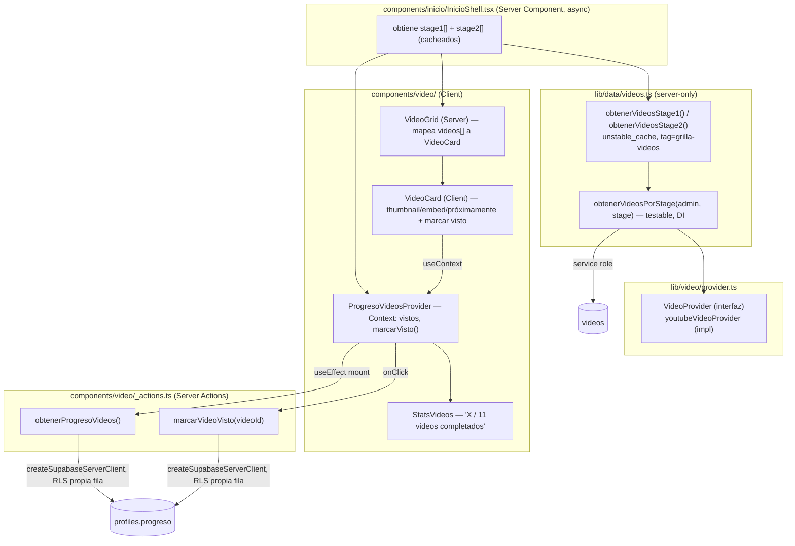

# Design: VGRP-29 — VideoProvider y grillas de Stage 1 y Stage 2

**Status:** Draft
**Last updated:** 2026-09-09
**Requirements:** [requirements-vgrp29.md](./requirements-vgrp29.md)

## Overview

Dos piezas independientes que se juntan en `InicioShell`:

1. **Lectura estática** — `lib/data/videos.ts` (`server-only`) lee `videos` con
   `createServiceRoleClient()` (bypasa RLS a propósito: no hay gating de nivel que
   respetar, ver requirements.md Non-goals) envuelto en `unstable_cache` con el tag
   `TAG_POR_ENTIDAD.videos` de VGRP-38. Se llama desde `InicioShell` (Server Component
   async) — mismo criterio de "estático pese a leer de base" que ya probó VGRP-27 para
   `/dashboard/[variante]`.
2. **Progreso por usuario** — un Client Component (`ProgresoVideosProvider`) resuelve,
   después de hidratar, qué videos ya vio el usuario real de la sesión (Server Action
   `obtenerProgresoVideos`) y expone `marcarVisto(id)` (Server Action
   `marcarVideoVisto`) vía Context — mismo patrón "shell estático + sliver dinámico" que
   `UserFooter`/`AgentesDemo` (VGRP-27/30), pero con Context en vez de fetch aislado
   porque el contador de stats del header y las dos grillas necesitan el mismo estado.

`VideoProvider` es una interfaz sin estado (construcción de URLs) — no toca la base ni
`server-only` por sí sola; lo sensible es la fila de `videos` (`provider_ref`), no la
interfaz que la resuelve a una URL.

## Arquitectura



## `VideoProvider` (`lib/video/provider.ts`)

```ts
// Interfaz sin estado: construye URLs a partir de provider_ref. No toca la base ni
// secretos por sí misma — lo sensible es la fila de `videos`, resuelta en
// lib/data/videos.ts (server-only), no acá. Migrar a Mux (Fase 4) es escribir un
// segundo objeto que cumpla esta interfaz, no tocar ningún componente de UI.
export interface VideoProvider {
  urlEmbed(providerRef: string): string;
  urlThumbnail(providerRef: string): string;
}

export const youtubeVideoProvider: VideoProvider = {
  urlEmbed: (ref) => `https://www.youtube.com/embed/${ref}`,
  urlThumbnail: (ref) => `https://i.ytimg.com/vi/${ref}/hqdefault.jpg`,
};

// Punto único de selección de proveedor — cambiar esta línea (y no cada import) el día
// de Mux.
export const videoProvider: VideoProvider = youtubeVideoProvider;
```

## `lib/data/videos.ts` — lectura + gating por publicación

```ts
import "server-only";

import { unstable_cache } from "next/cache";
import type { SupabaseClient } from "@supabase/supabase-js";
import type { Database } from "../database.types";
import { createServiceRoleClient } from "../supabase/service-role";
import { TAG_POR_ENTIDAD } from "./admin/contenido";
import { videoProvider } from "../video/provider";

type AdminClient = SupabaseClient<Database>;

export const CANTIDAD_STAGE = { 1: 8, 2: 3 } as const;
export const TOTAL_VIDEOS = CANTIDAD_STAGE[1] + CANTIDAD_STAGE[2]; // 11 — MODULOS.md §2

export interface VideoGridItem {
  id: string | null; // null = tile sintético de relleno, nunca marcable
  titulo: string;
  descripcion: string | null;
  estado: "disponible" | "proximamente";
  embedUrl: string | null;
  thumbnailUrl: string | null;
}

/**
 * Núcleo testable (DI del cliente, mismo patrón que lib/data/admin/contenido.ts).
 * `provider_ref` sólo se resuelve a URL cuando la fila está publicada Y tiene
 * `provider_ref` — la fila completa (incluido el campo crudo) nunca sale de esta
 * función hacia el caller cuando no está disponible.
 */
export async function obtenerVideosPorStage(
  admin: AdminClient,
  stage: 1 | 2,
): Promise<VideoGridItem[]> {
  const { data, error } = await admin
    .from("videos")
    .select("id, titulo, descripcion, provider_ref, publicado, orden")
    .eq("stage", stage)
    .order("orden", { ascending: true });
  if (error) throw error;

  const cantidad = CANTIDAD_STAGE[stage];
  const filas = (data ?? []).slice(0, cantidad).map((fila): VideoGridItem => {
    const disponible = fila.publicado && Boolean(fila.provider_ref);
    return {
      id: fila.id,
      titulo: fila.titulo,
      descripcion: fila.descripcion,
      estado: disponible ? "disponible" : "proximamente",
      embedUrl: disponible ? videoProvider.urlEmbed(fila.provider_ref as string) : null,
      thumbnailUrl: disponible ? videoProvider.urlThumbnail(fila.provider_ref as string) : null,
    };
  });

  // Relleno sintético: la grilla siempre tiene `cantidad` tiles, cargados o no
  // (requirements.md, Decisiones asumidas — "grilla nunca se ve incompleta").
  while (filas.length < cantidad) {
    filas.push({
      id: null,
      titulo: "Próximamente",
      descripcion: null,
      estado: "proximamente",
      embedUrl: null,
      thumbnailUrl: null,
    });
  }
  return filas;
}

const obtenerVideosPorStageCached = unstable_cache(
  (stage: 1 | 2) => obtenerVideosPorStage(createServiceRoleClient(), stage),
  ["videos-por-stage"],
  { tags: [TAG_POR_ENTIDAD.videos] },
);

export const obtenerVideosStage1 = () => obtenerVideosPorStageCached(1);
export const obtenerVideosStage2 = () => obtenerVideosPorStageCached(2);
```

**Por qué service role y no un cliente con RLS:** requirements.md (Non-goals) ya fija que
este ticket no gatea por nivel — el propio ticket lo pide explícito. Una lectura con RLS
seguiría filtrando por `nivel_requerido` (policy de VGRP-38 sigue activa como red de
seguridad para consultas directas), lo cual no es el comportamiento que este ticket
implementa. `unstable_cache` tampoco puede recibir un cliente con cookies de request
(no serializable, y rompería el cacheo compartido entre usuarios) — coherente con que la
grilla es la misma para todos.

## `components/video/_actions.ts` — Server Actions de progreso

```ts
"use server";

import { getVerifiedClaims } from "@/lib/auth/server";
import { createSupabaseServerClient } from "@/lib/auth/server";

interface Progreso {
  videosVistos: string[];
}

function leerVideosVistos(progreso: unknown): string[] {
  if (progreso && typeof progreso === "object" && Array.isArray((progreso as Progreso).videosVistos)) {
    return (progreso as Progreso).videosVistos.filter((v): v is string => typeof v === "string");
  }
  return [];
}

export async function obtenerProgresoVideos(): Promise<{ videosVistos: string[] }> {
  const claims = await getVerifiedClaims();
  if (!claims || typeof claims.sub !== "string") return { videosVistos: [] };

  const supabase = await createSupabaseServerClient();
  const { data } = await supabase
    .from("profiles")
    .select("progreso")
    .eq("id", claims.sub)
    .maybeSingle();

  return { videosVistos: leerVideosVistos(data?.progreso) };
}

export type MarcarVideoVistoResult = { ok: true; videosVistos: string[] } | { ok: false; error: string };

export async function marcarVideoVisto(videoId: string): Promise<MarcarVideoVistoResult> {
  const claims = await getVerifiedClaims();
  if (!claims || typeof claims.sub !== "string") {
    return { ok: false, error: "Tenés que iniciar sesión." };
  }

  const supabase = await createSupabaseServerClient();
  const { data: perfil, error: errorLectura } = await supabase
    .from("profiles")
    .select("progreso")
    .eq("id", claims.sub)
    .maybeSingle();
  if (errorLectura) return { ok: false, error: "No pudimos leer tu progreso." };

  const actuales = leerVideosVistos(perfil?.progreso);
  if (actuales.includes(videoId)) return { ok: true, videosVistos: actuales }; // idempotente

  const nuevo = [...actuales, videoId];
  const progresoExistente =
    perfil?.progreso && typeof perfil.progreso === "object" ? perfil.progreso : {};
  const { error: errorUpdate } = await supabase
    .from("profiles")
    .update({ progreso: { ...progresoExistente, videosVistos: nuevo } })
    .eq("id", claims.sub);
  if (errorUpdate) return { ok: false, error: "No pudimos guardar tu progreso." };

  return { ok: true, videosVistos: nuevo };
}
```

`createSupabaseServerClient()` es el cliente cookie-based con RLS (no service role): la
policy `profiles_update_own` (`init_plataforma.sql`) ya restringe el UPDATE a
`id = auth.uid()`, así que el `.eq("id", claims.sub)` es defensa en profundidad explícita
(mismo criterio que `crearCheckout` en `app/(app)/comprar/_actions.ts`), no el único
candado.

**Sobre la carrera de doble click:** el patrón lectura→merge→escritura no es atómico a
nivel Postgres. Con un solo usuario escribiendo su propia fila (nunca concurrencia entre
usuarios distintos sobre la misma fila) el peor caso de dos clics casi simultáneos
converge al mismo resultado (el id termina una sola vez en el array) — no se agrega un
`UPDATE ... SET progreso = jsonb_set(...)` atómico para este alcance; documentado acá por
si un futuro ticket necesita mergear otras claves de `progreso` con más escritores.

## `components/video/ProgresoVideosProvider.tsx` — Context

```tsx
"use client";

import { createContext, useContext, useEffect, useState, type ReactNode } from "react";
import { marcarVideoVisto, obtenerProgresoVideos } from "./_actions";

interface ProgresoContexto {
  vistos: Set<string>;
  totalVideos: number;
  marcarVisto: (videoId: string) => void;
}

const Contexto = createContext<ProgresoContexto | null>(null);

export function ProgresoVideosProvider({
  totalVideos,
  children,
}: {
  totalVideos: number;
  children: ReactNode;
}) {
  const [vistos, setVistos] = useState<Set<string>>(new Set());

  useEffect(() => {
    let cancelado = false;
    obtenerProgresoVideos().then(({ videosVistos }) => {
      if (!cancelado) setVistos(new Set(videosVistos));
    });
    return () => {
      cancelado = true;
    };
  }, []);

  function marcarVisto(videoId: string) {
    setVistos((prev) => new Set(prev).add(videoId)); // optimista
    marcarVideoVisto(videoId).then((res) => {
      if (res.ok) setVistos(new Set(res.videosVistos)); // converge al estado real del server
    });
  }

  return (
    <Contexto.Provider value={{ vistos, totalVideos, marcarVisto }}>{children}</Contexto.Provider>
  );
}

export function useProgresoVideos() {
  const ctx = useContext(Contexto);
  if (!ctx) throw new Error("useProgresoVideos() sin <ProgresoVideosProvider>");
  return ctx;
}
```

Sin manejo de error visible en el `catch` de `marcarVideoVisto`: si falla, el estado
optimista queda "visto" en pantalla pero no persistido — mismo criterio de "no bloquear
lo importante" que otros fire-and-forget del repo (`track()` en `_actions.ts` de
Mercado Pago); el próximo `obtenerProgresoVideos()` (recarga de página) corrige la vista.
Aceptable para un contador informativo, no para un candado de seguridad.

## `components/video/VideoCard.tsx` / `VideoGrid.tsx`

- `VideoGrid` — Server Component, recibe `videos: VideoGridItem[]` ya resueltos, sólo
  mapea a `<VideoCard>`. Sin lógica propia.
- `VideoCard` — Client Component (necesita `useState` para expandir/colapsar el embed y
  `useContext` para "visto"):
  - `estado="proximamente"` → tile con thumbnail gris + texto "Próximamente", sin
    interacción.
  - `estado="disponible"` → thumbnail real (`` con `thumbnailUrl`), click expande un
    `<iframe src={embedUrl}>` in-place (no modal — más simple, funciona igual en mobile) +
    botón "Marcar como visto" (disabled/checked si `vistos.has(id)`).

## `StatsVideos.tsx`

```tsx
"use client";
import { useProgresoVideos } from "./ProgresoVideosProvider";

export function StatsVideos() {
  const { vistos, totalVideos } = useProgresoVideos();
  return <p>{vistos.size} / {totalVideos} videos completados</p>;
}
```

## Cambios en `InicioShell.tsx`

`InicioShell` pasa de sync a async (sigue sin `cookies()`/claims — sólo `await` sobre
lecturas cacheadas, lo que NO fuerza rendering dinámico en Next):

```tsx
export async function InicioShell({ variante }: InicioShellProps) {
  const [stage1, stage2] = await Promise.all([obtenerVideosStage1(), obtenerVideosStage2()]);

  return (
    <ProgresoVideosProvider totalVideos={TOTAL_VIDEOS}>
      <div className={styles.shell}>
        <header className={styles.saludo}>
          <p className={styles.eyebrowNivel}>Tu cuenta</p>
          <h1 className={styles.tituloPrincipal}>Nivel {variante}</h1>
          <StatsVideos />
        </header>

        <SeccionSlot eyebrow="Stage 1" titulo="Formación: importaciones" descripcion="...">
          <VideoGrid videos={stage1} />
        </SeccionSlot>

        {/* ...banner calculadora sin cambios... */}

        <SeccionSlot eyebrow="Stage 2" titulo="Formación: armá tu tienda" descripcion="...">
          <VideoGrid videos={stage2} />
        </SeccionSlot>

        {/* ...resto de slots sin cambios... */}
      </div>
    </ProgresoVideosProvider>
  );
}
```

`itemsFantasma={8}` / `itemsFantasma={3}` se eliminan de esos dos `<SeccionSlot>` (ya no
hacen falta — `VideoGrid` siempre entrega el tamaño fijo, real o de relleno).

## Estructura de archivos

```
lib/video/
  provider.ts                 # VideoProvider (interfaz) + youtubeVideoProvider

lib/data/
  videos.ts                   # server-only — lectura cacheada + gating publicado/provider_ref
  videos.test.ts

components/video/
  _actions.ts                 # "use server" — obtenerProgresoVideos, marcarVideoVisto
  ProgresoVideosProvider.tsx  # "use client" — Context de vistos/marcarVisto
  StatsVideos.tsx             # "use client" — contador del header
  VideoGrid.tsx                # Server Component — mapea videos[] a VideoCard
  VideoCard.tsx                # "use client" — thumbnail/embed/próximamente/marcar visto
  video.module.css

components/inicio/
  InicioShell.tsx              # MODIFICADO — async, wrap en ProgresoVideosProvider, VideoGrid en los 2 slots
```

## Verificación planeada

- **Unit/integración:** `lib/data/videos.test.ts` contra la base real (mismo criterio que
  `contenido.test.ts`) — casos: fila publicada+provider_ref → disponible con URLs
  correctas; publicada sin provider_ref → próximamente, URLs null; no publicada CON
  provider_ref → próximamente, URLs null (el test de seguridad central de US-3); menos
  filas que el tamaño del stage → se completa con sintéticos; exactamente 8/3 filas → sin
  sintéticos.
- **`pnpm build`** — confirmar que `/dashboard/[variante]` sigue en la lista de rutas
  estáticas (mismo chequeo que VGRP-27 ya hizo).
- **Browser real:** crear 1-2 videos de test reales vía el CRUD de VGRP-38 (`publicado`
  con un `provider_ref` de YouTube real), confirmar thumbnail/embed/marcar visto/contador
  en el dashboard, luego despublicar/borrar esas filas de test (mismo criterio de
  limpieza que VGRP-38 con `admin_audit_log`) para no dejar contenido de prueba en la
  tabla al cerrar el ticket.
- **Mobile:** `resize_window` a preset mobile sobre la grilla.

## Open questions / risks

1. **`ProgresoVideosProvider` envuelve TODO `InicioShell`, no sólo Stage 1/2.** Alternativa
   descartada: dos providers separados (uno por stage) — se prefiere uno solo porque el
   contador del header necesita ver el total de ambos stages a la vez, y duplicar el
   `useEffect` de fetch inicial en dos providers pediría la misma llamada dos veces sin
   necesidad.
2. **Sin lightbox/modal para el embed** (se expande in-place) — más simple y evita traer
   una librería de modal sólo para esto; revisar si el diseño visual (`/design-critique`,
   hoy no disponible en esta sesión) pide otra cosa más adelante.
