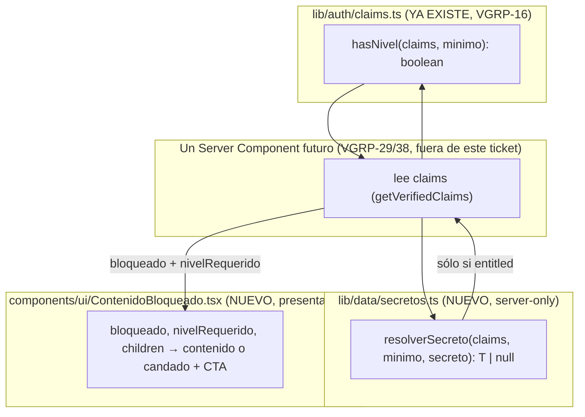

# Design: VGRP-30 — Gating de contenido por nivel

**Status:** Draft
**Last updated:** 2026-09-09
**Requirements:** [requirements-vgrp30.md](./requirements-vgrp30.md)

## Overview

Tres piezas, ninguna nueva de fondo — el ticket es sobre todo **conectar y documentar**
lo que ya existe con lo que falta:

1. **El cálculo de entitlement ya existe**: `hasNivel(claims, minimo)` en
   `lib/auth/claims.ts` (VGRP-16) — comparación de orden `ninguno < principiante <
   avanzado`, cero queries. VGRP-30 no lo reimplementa, lo consume.
2. **Lo que falta es el componente visual** (`components/ui/ContenidoBloqueado.tsx`):
   100% presentacional, recibe `bloqueado` ya calculado por el caller (con `hasNivel`) —
   no lee claims él mismo, para poder usarse tanto en Server como en Client Components
   sin duplicar el cálculo.
3. **Lo que falta es el helper de servidor para secretos**
   (`lib/data/secretos.ts` o similar, `server-only`): dado un claim y un nivel mínimo,
   devuelve el secreto sólo si corresponde — el patrón que VGRP-38/VGRP-29 van a usar
   para no serializar nunca un secreto al que no da el nivel.

## Architecture



### Estructura de archivos

```
lib/
  data/
    secretos.ts             # nuevo — resolverSecreto(), server-only
    secretos.test.ts         # nuevo — Vitest

components/
  ui/
    ContenidoBloqueado.tsx   # nuevo — presentacional
    ContenidoBloqueado.module.css

content/                     # nuevo — SÓLO si se confirma el open question de
  agentes-demo.ts            # requirements-vgrp30.md (demo temporal, reemplazado
                              # enteramente por VGRP-38)
```

## Interfaces / contracts

### `lib/data/secretos.ts`

```ts
import "server-only";
import type { AppMetadataClaims, NivelAcceso } from "@/lib/auth/claims";
import { hasNivel } from "@/lib/auth/claims";

/**
 * Devuelve `secreto` sólo si `claims` tiene al menos `nivelMinimo`; si no,
 * `null`. Es la ÚNICA forma correcta de exponer un secreto (contacto de
 * agente, provider_ref de video, dato SWIFT) a lo que sea que renderice
 * después — nunca "leer y esconder con CSS/JS".
 *
 * `server-only`: si algo importa este archivo desde un Client Component, el
 * build falla — es la red de contención contra un `'use client'` mal puesto.
 */
export function resolverSecreto<T>(
  claims: AppMetadataClaims | null,
  nivelMinimo: NivelAcceso,
  secreto: T,
): T | null {
  return hasNivel(claims, nivelMinimo) ? secreto : null;
}
```

Nota: recibe el secreto ya obtenido (no hace el fetch) — quien llama decide CUÁNDO vale
la pena pagar la query real (por ejemplo, no traer `contacto` de la base en absoluto si
ya se sabe por el nivel que no va a poder mostrarse; `resolverSecreto` es la última
barrera, no la única optimización).

### `components/ui/ContenidoBloqueado.tsx`

```ts
export interface ContenidoBloqueadoProps {
  bloqueado: boolean;
  nivelRequerido: NivelAcceso;
  /** 'ninguno' → CTA de compra; otro → CTA de upgrade (misma diferencia que dashboard/page.tsx). */
  nivelActual: NivelAcceso;
  children: ReactNode;
}
```

- Si `!bloqueado`: renderiza `children` tal cual.
- Si `bloqueado`: renderiza un estado con candado, texto "Disponible desde nivel
  {nivelRequerido}", y un `<NextLink>` a `/comprar` (si `nivelActual === 'ninguno'`) o a
  un futuro flujo de upgrade (si no) — reutilizando las clases de `Button` como ya hace
  `app/(app)/dashboard/page.tsx` (VGRP-22, mismo criterio: nunca anidar un `<button>`
  dentro del `<a>` de `next/link`).
- Sin `"use client"`: puramente presentacional, `bloqueado` ya viene calculado.

### Tests de entitlement (US-2)

`lib/auth/claims.test.ts` ya existe (VGRP-16) — este ticket AGREGA los casos que falten
de la matriz nivel-usuario × nivel-requerido si no están cubiertos (revisar antes de
duplicar). `lib/data/secretos.test.ts` (nuevo) cubre específicamente `resolverSecreto()`:
devuelve el secreto con nivel suficiente, `null` con nivel insuficiente, `null` con
`claims = null`.

## Decisión confirmada: sí se construye contenido de demostración

Se agrega `content/agentes-demo.ts` (2 agentes de mentira, reemplazado enteramente por
VGRP-38) para probar el mecanismo de punta a punta dentro del slot "Agentes de compra en
China" de `InicioShell`.

**Restricción de seguridad que esto agrega al diseño** (encontrada al conectar esto con
VGRP-27): las dos variantes de `app/(app)/dashboard/[variante]/` son **estáticas** —
`/dashboard/avanzado` sirve el mismo HTML a cualquiera que lo pida, sin verificar sesión
real en ese momento (design.md de VGRP-27, "Open questions/risks" #1, ya lo advertía).
Por lo tanto **ningún `secret` puede embeberse directo en `InicioShell`** — un usuario
Principiante escribiendo `/dashboard/avanzado` a mano vería el HTML pre-generado para
Avanzado, secreto incluido, si estuviera ahí.

**Solución:** el secreto se resuelve en un Route Handler dinámico
(`GET /api/demo/agentes`), que SÍ lee la sesión real con `getVerifiedClaims()` en cada
request (nunca confía en el segmento de URL `[variante]`). Un Client Component chico
(`AgentesDemo.tsx`, montado dentro de `InicioShell`) le hace `fetch()` después de
hidratar — mismo patrón ya usado para el nombre del pie del drawer (VGRP-27).

```
content/agentes-demo.ts              # server-only — publicMeta + secret de 2 agentes
app/api/demo/agentes/route.ts        # GET — getVerifiedClaims() real + resolverSecreto()
components/inicio/AgentesDemo.tsx    # Client Component — fetch + <ContenidoBloqueado>
```

`publicMeta` (nombre, especialidad) viaja siempre en la respuesta; `secret.contacto`
viaja sólo si `resolverSecreto()` lo permite para el nivel REAL del usuario que hizo el
request — nunca según qué variante de `/dashboard/*` esté mirando.

## Open questions / risks

1. **Revisión de 2 personas** — el propio brief del bloque pide esto para este ticket
   puntual (es la pieza que protege el producto). Recomendado: no mergear sin ese
   segundo par de ojos, especialmente sobre `resolverSecreto()` y el uso de
   `server-only`.
3. **RLS de las tablas de contenido** — no existen todavía (VGRP-38). Este ticket sólo
   puede dejar la REGLA documentada (US-4); no hay policy que escribir hoy.
