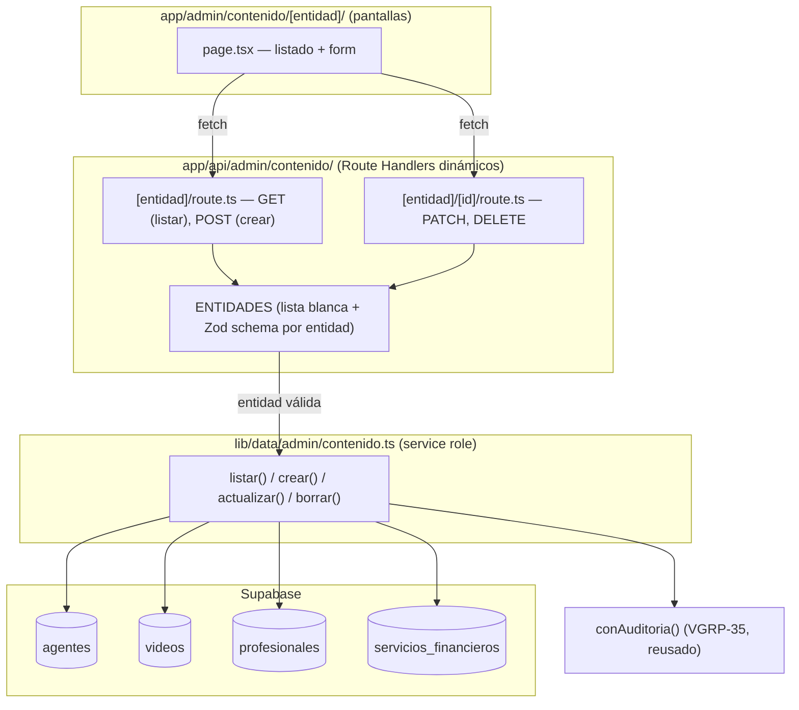

# Design: VGRP-38 — Panel admin: gestión de contenido

**Status:** Draft
**Last updated:** 2026-09-09
**Requirements:** [requirements-vgrp38.md](./requirements-vgrp38.md)

## Overview

Mismo patrón de 3 capas que ya usa el panel de admin (VGRP-35/36/37): migración con RLS
→ `lib/data/admin/contenido.ts` (service role) → Route Handler con `requireAdmin()` +
`conAuditoria()`. La única pieza nueva de fondo es la **lista blanca de entidades**: en
vez de 4 archivos de ruta casi idénticos, un único par de rutas dinámicas
(`[entidad]` / `[entidad]/[id]`) que resuelven la tabla y el schema de Zod a partir de un
mapa fijo — así `:entidad` fuera de la lista nunca llega a tocar Postgres.

## Migración

```sql
-- supabase/migrations/<timestamp>_contenido_agentes_videos_profesionales_servicios.sql

create table public.agentes (
  id uuid primary key default gen_random_uuid(),
  nombre text not null,
  especialidad text not null,
  nivel_requerido nivel_acceso not null default 'principiante',
  contacto text,                    -- SENSIBLE — nunca al cliente sin nivel (VGRP-30)
  orden integer not null default 0,
  activo boolean not null default true,
  created_at timestamptz not null default now(),
  updated_at timestamptz not null default now()
);
comment on table public.agentes is
  'Directorio de agentes de compra en China. contacto es el dato que se vende — '
  'nunca se lee fuera de service_role o de resolverSecreto() (VGRP-30).';
comment on column public.agentes.contacto is
  'SENSIBLE. Nunca seleccionar esta columna en una query que pueda llegar a un '
  'usuario sin el nivel_requerido de la fila.';

create table public.videos (
  id uuid primary key default gen_random_uuid(),
  stage smallint not null check (stage in (1, 2)),
  titulo text not null,
  descripcion text,
  provider_ref text,                -- SENSIBLE — id de YouTube, nunca al cliente si no publicado
  nivel_requerido nivel_acceso not null default 'principiante',
  orden integer not null default 0,
  publicado boolean not null default false,
  created_at timestamptz not null default now(),
  updated_at timestamptz not null default now()
);
comment on column public.videos.nivel_requerido is
  'Existe en el schema por paridad con agentes/servicios, pero VGRP-29 documenta '
  'que la formación NO se gatea por nivel (PRD §1.1: ambos niveles ven todo el '
  'contenido educativo). En la práctica queda siempre en "principiante" — no '
  'construir un selector de nivel en la pantalla de carga de video sin releer '
  'esa decisión primero.';
comment on column public.videos.provider_ref is
  'SENSIBLE. No sale al cliente si publicado=false, sea cual sea el nivel.';

create table public.profesionales (
  id uuid primary key default gen_random_uuid(),
  nombre text not null,
  rubro text not null,
  descripcion text,
  contacto text,
  orden integer not null default 0,
  activo boolean not null default true,
  created_at timestamptz not null default now(),
  updated_at timestamptz not null default now()
);
comment on table public.profesionales is
  'Sin nivel_requerido a propósito (decisión confirmada 2026-09-09): igual para '
  'Principiante y Avanzado, mismo criterio que los videos.';

create table public.servicios_financieros (
  id uuid primary key default gen_random_uuid(),
  titulo text not null,
  descripcion text,
  nivel_requerido nivel_acceso not null default 'principiante',
  orden integer not null default 0,
  activo boolean not null default true,
  created_at timestamptz not null default now(),
  updated_at timestamptz not null default now()
);

-- Grants: mismo criterio que profiles/pagos/admin_audit_log en init_plataforma.sql.
revoke all on public.agentes, public.videos, public.profesionales,
  public.servicios_financieros from anon, authenticated;
grant select on public.agentes, public.videos, public.profesionales,
  public.servicios_financieros to authenticated;
grant all on public.agentes, public.videos, public.profesionales,
  public.servicios_financieros to service_role;

alter table public.agentes enable row level security;
alter table public.videos enable row level security;
alter table public.profesionales enable row level security;
alter table public.servicios_financieros enable row level security;

-- agentes / videos / servicios_financieros: SELECT sólo de filas activas/publicadas
-- cuyo nivel_requerido alcance el nivel del claim. Fila entera oculta si no —
-- red de seguridad (VGRP-30 US-4), la UX fina (publicMeta visible igual) la
-- resuelve la app con service_role + resolverSecreto(), no esta policy.
create policy "agentes_select_por_nivel"
on public.agentes
for select
to authenticated
using (
  activo
  and nivel_requerido <= (((select auth.jwt()) -> 'app_metadata' ->> 'nivel')::nivel_acceso)
);

create policy "videos_select_por_nivel"
on public.videos
for select
to authenticated
using (
  publicado
  and nivel_requerido <= (((select auth.jwt()) -> 'app_metadata' ->> 'nivel')::nivel_acceso)
);

create policy "servicios_financieros_select_por_nivel"
on public.servicios_financieros
for select
to authenticated
using (
  activo
  and nivel_requerido <= (((select auth.jwt()) -> 'app_metadata' ->> 'nivel')::nivel_acceso)
);

-- profesionales: sin nivel_requerido — cualquier autenticado con fila activa.
create policy "profesionales_select_activos"
on public.profesionales
for select
to authenticated
using ( activo );
```

**Nota sobre el cast `::nivel_acceso`:** el enum `nivel_acceso` ya existe
(`ninguno < principiante < avanzado`, declarado en ese orden en
`init_plataforma.sql`) — Postgres compara enums por orden de declaración, así que
`<=` funciona directo, sin un `CASE` a mano.

## Arquitectura



### Estructura de archivos

```
supabase/migrations/
  <timestamp>_contenido_agentes_videos_profesionales_servicios.sql

lib/data/admin/
  contenido.ts               # listar/crear/actualizar/borrar genéricos por entidad
  contenido.test.ts

app/api/admin/contenido/
  [entidad]/
    route.ts                 # GET (list), POST (create)
    [id]/
      route.ts                # PATCH, DELETE

app/admin/contenido/
  [entidad]/
    page.tsx                  # listado + link a editar
    ContenidoForm.tsx          # Client Component — crear/editar (campos según entidad)
  contenido.module.css
```

## Interfaces / contracts

### Lista blanca de entidades (`lib/data/admin/contenido.ts`)

```ts
import "server-only";

export const ENTIDADES = ["agentes", "videos", "profesionales", "servicios_financieros"] as const;
export type Entidad = (typeof ENTIDADES)[number];

export function esEntidadValida(valor: string): valor is Entidad {
  return (ENTIDADES as readonly string[]).includes(valor);
}

// Un schema de Zod por entidad (campos distintos entre agentes/videos/etc.) — se
// arma en este archivo, no en cada route handler, para no duplicarlo entre
// POST (crear) y PATCH (actualizar, con .partial()).
export const SCHEMAS: Record<Entidad, z.ZodType> = {
  agentes: agenteSchema,
  videos: videoSchema,
  profesionales: profesionalSchema,
  servicios_financieros: servicioFinancieroSchema,
};

// Tag de revalidación por entidad — VGRP-29 los consume desde sus grillas con
// `fetch(..., { next: { tags: [TAG_POR_ENTIDAD[entidad]] } })` o `unstable_cache`.
export const TAG_POR_ENTIDAD: Record<Entidad, string> = {
  agentes: "grilla-agentes",
  videos: "grilla-videos",
  profesionales: "grilla-profesionales",
  servicios_financieros: "grilla-servicios",
};
```

### `app/api/admin/contenido/[entidad]/route.ts` — contrato HTTP

```
GET  /admin/contenido/:entidad          -> 400 si :entidad no está en ENTIDADES
                                            401 sin sesión, 404 sin rol admin
                                            200 [...filas] ordenadas por `orden`
POST /admin/contenido/:entidad          -> mismas guardas + 400 si el body no matchea
                                            el schema de esa entidad
                                            200 { fila creada } + audit log
                                            (conAuditoria, accion="crear_contenido")
```

### `app/api/admin/contenido/[entidad]/[id]/route.ts`

```
PATCH  /admin/contenido/:entidad/:id    -> 404 si :id no existe en esa tabla
                                            200 { fila actualizada } + audit log
                                            (accion="editar_contenido") + revalidateTag
DELETE /admin/contenido/:entidad/:id    -> videos: SIEMPRE soft-delete (activo/publicado
                                            = false), nunca DELETE real (US-5).
                                            Otras entidades: DELETE real permitido (no
                                            tienen referencias conocidas desde otro lado).
                                            200 {} + audit log (accion="borrar_contenido")
                                            + revalidateTag
```

## Open questions / risks

1. **Nombre exacto de los tags de `revalidateTag`** — definidos acá
   (`TAG_POR_ENTIDAD`) como propuesta; VGRP-29 es quien realmente los consume, así que
   quedan sujetos a ajustarse cuando ese ticket se escriba, sin que eso rompa este.
2. **`videos.nivel_requerido` sin uso real** — la columna existe por paridad de schema
   (PRD §4.5) pero VGRP-29 documenta que no se aplica gating a la formación. La pantalla
   de carga de video en este ticket **igual muestra el selector** (la columna existe y
   el CRUD es genérico por entidad) — se documenta con un comentario en el form, no se
   esconde el campo, para no hacer un caso especial de una sola entidad en un CRUD que
   por lo demás es genérico.
