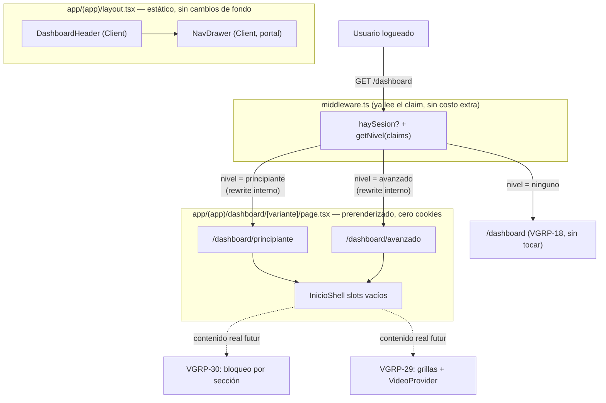

# Design: VGRP-27 — Shell del dashboard y navegación por drawer

**Status:** Draft
**Last updated:** 2026-09-08
**Requirements:** [requirements.md](./requirements.md)

## Overview

Hoy `app/(app)/dashboard/page.tsx` (VGRP-18) llama `getVerifiedClaims()` directo en el
Server Component de la página. Eso **no** pega a la base (es verificación local de JWT),
pero sí usa `cookies()` — y eso alcanza para que Next.js saque la ruta del prerender y la
sirva dinámica en cada request. El PRD (§3.5) pide lo contrario: *"shell prerenderizado
según nivel, stats del usuario dentro de `<Suspense>` con una sola query"*. VGRP-27 es el
ticket que cierra esa brecha.

**Mecanismo:** el nivel `ninguno` sigue como está (pantalla ya construida en VGRP-18, sin
tocar). Para `principiante` y `avanzado`, se agrega una ruta hermana con un segmento
dinámico `app/(app)/dashboard/[variante]/page.tsx`, con `generateStaticParams()` que
devuelve exactamente `["principiante", "avanzado"]` y `dynamicParams = false`. Esas dos
páginas se prerenderizan 100% en build (cero cookies, cero claims adentro) y salen del
CDN. `middleware.ts` — que **ya** lee el claim con `getClaims()` en cada request, sin
costo extra — decide a cuál de las dos reescribir un pedido a `/dashboard` cuando hay
sesión y el nivel es `principiante` o `avanzado`. La URL que ve el usuario sigue siendo
`/dashboard` (rewrite, no redirect).

**Importante — esto NO es el mecanismo de seguridad.** El folder `[variante]` es una
optimización de rendering (evitar recalcular en cada visita algo que no depende de datos
frescos). La garantía real de "un Principiante no ve contenido de Avanzado" la construye
VGRP-30 dentro de cada sección (componente de bloqueo + entitlement + `server-only` +
RLS), sin importar qué variante de shell se haya servido. Ver "Open questions / risks".

El header y el drawer de navegación son iguales para los 5 niveles/estados — no dependen
de `nivel` — así que viven en `app/(app)/layout.tsx` (que ya es y sigue siendo estático)
como Client Components sin fetching de datos propio.

### Mapa de entrega

Ticket único (VGRP-27). Alcance: header + drawer + shell de Inicio con slots vacíos. Deja
preparado (pero no implementa) el punto donde VGRP-30 va a envolver cada slot con su
componente de bloqueo.

## Architecture



### Estructura de rutas y archivos

```
app/(app)/
  layout.tsx                       # SIN CAMBIOS de fondo — sólo monta <DashboardHeader>
  dashboard/
    page.tsx                       # nivel = 'ninguno' — VGRP-18, sin tocar
    dashboard.module.css           # existente, sin tocar
    [variante]/
      page.tsx                     # nuevo — generateStaticParams + dynamicParams=false
      inicio.module.css            # nuevo

components/
  nav/
    DashboardHeader.tsx            # nuevo — Client Component, botón hamburguesa
    NavDrawer.tsx                  # nuevo — Client Component, createPortal + focus trap
    destinos.ts                    # nuevo — los 5 destinos (fuente única, sin duplicar)
    nav.module.css                 # nuevo
  inicio/
    InicioShell.tsx                # nuevo — arma los slots en el orden de MODULOS.md §2
    SeccionSlot.tsx                 # nuevo — un slot individual con su placeholder
    inicio.module.css               # nuevo (o el mismo de arriba, a definir al codear)

middleware.ts                      # modificar — rewrite condicional para /dashboard
middleware.test.ts                 # modificar
e2e/dashboard-shell.spec.ts        # nuevo
```

## Interfaces / contracts

### `components/nav/destinos.ts`

```ts
export interface DestinoNav {
  href: string;
  label: string;
  proximamente?: true;
}

export const DESTINOS_NAV: readonly DestinoNav[] = [
  { href: "/dashboard", label: "Inicio" },
  { href: "https://vegroup.vercel.app/calculadora", label: "Calculadora" },
  { href: "/comunidad", label: "Comunidad", proximamente: true },
  { href: "/tracking", label: "Tracking", proximamente: true },
  { href: "/perfil", label: "Perfil" },
] as const;
```

Fuente única para el drawer (y para cualquier otro lugar que necesite la lista, p. ej. un
footer o breadcrumb futuro). `proximamente: true` es lo que hace que el destino se
renderice sin `href` navegable real — un `<span>`/`<button disabled>` con badge, no un
`<a>` a una ruta que 404.

### `middleware.ts` — diff conceptual

```ts
// Después del bloque de rol de VGRP-35 (isAdminArea), antes del `return response` final:

if (pathname === "/dashboard" && haySesion) {
  const claims = (data as { claims?: AppMetadataClaims } | undefined)?.claims ?? null;
  const nivel = getNivel(claims); // 'ninguno' | 'principiante' | 'avanzado'

  if (nivel === "principiante" || nivel === "avanzado") {
    const url = request.nextUrl.clone();
    url.pathname = `/dashboard/${nivel}`;
    return withRefreshedCookies(NextResponse.rewrite(url), response);
  }
  // nivel === 'ninguno': sigue de largo a /dashboard (VGRP-18), sin rewrite.
}
```

Mismo criterio que la capa de rol ya existente: usa el `data.claims` que `getClaims()` ya
resolvió en esta misma invocación (no una segunda llamada), y pasa por
`withRefreshedCookies` como todo camino que no es el `response` por defecto.

### `app/(app)/dashboard/[variante]/page.tsx`

```ts
export function generateStaticParams() {
  return [{ variante: "principiante" }, { variante: "avanzado" }];
}
export const dynamicParams = false; // cualquier otro valor -> 404, no un render sorpresa

export default function InicioPage({ params }: { params: { variante: "principiante" | "avanzado" } }) {
  return <InicioShell variante={params.variante} />;
}
```

Cero `cookies()`, cero `getVerifiedClaims()` acá adentro — el `variante` llega por el
`param` de la URL interna, no por sesión. Es lo que lo mantiene 100% prerenderizable.

### `InicioShell` — slots en el orden de MODULOS.md §2

Orden fijo (no cambia entre variantes — la diferencia entre Principiante y Avanzado la
pinta VGRP-30 más adelante, sección por sección, no el orden):

1. Stage 1 (grid de 8 videos)
2. Banner de calculadora
3. Stage 2 (grid de 3 videos)
4. Directorio de agentes de compra
5. Banner de comunidad
6. Profesionales al servicio
7. Servicios financieros

Cada uno se renderiza hoy como `<SeccionSlot titulo="..." />` — un placeholder visual con
el tokens de `app/tokens.css` (superficie `--surface-1`, borde `--glass-border`), sin
datos reales. El punto exacto donde VGRP-30 va a envolver cada slot con el componente de
bloqueo queda marcado con un comentario en el código (mismo estilo que el comentario ya
existente en `app/(app)/layout.tsx` para VGRP-27/30).

### `NavDrawer` — contrato de accesibilidad

No hay componente existente en este repo para copiar (ver requirements.md — `DemoModal`
es de la landing, otro repo). Contrato mínimo, sin librería nueva:

- `createPortal` al `<body>`.
- `role="dialog"` + `aria-modal="true"` + `aria-label="Navegación"` en el contenedor.
- Foco al primer link al abrir; `Tab`/`Shift+Tab` atrapados dentro del drawer mientras
  está abierto (loop manual sobre los elementos focuseables del drawer, sin librería).
- `Escape` cierra y devuelve el foco al botón hamburguesa (se guarda la referencia del
  botón activo antes de abrir).
- Click en el overlay (fuera del panel) cierra.
- Bloqueo de scroll del body mientras está abierto (`overflow: hidden`, restaurado al
  cerrar).

## Open questions / risks

1. **El folder `[variante]` no es un gate de seguridad — dejarlo explícito para VGRP-30.**
   Nada impide que alguien navegue a mano a `/dashboard/avanzado` sin serlo. Hoy no importa
   (las dos variantes son visualmente idénticas, sólo placeholders). Cuando VGRP-30 agregue
   contenido real, la seguridad tiene que vivir en cada sección (entitlement + server-only +
   RLS), nunca asumiendo que "llegar a la variante avanzada" ya implica tener ese nivel.
2. **Ruta real de "Inicio":** este diseño asume que `/dashboard` sigue siendo la URL
   pública (no se renombra a `/inicio`). Si el equipo prefiere renombrar, es un cambio
   mecánico de carpeta — no afecta la arquitectura de arriba.
3. **Contenido idéntico entre variantes, por ahora:** vale la pena decirlo en la PR para
   que el reviewer no busque una diferencia visual que todavía no existe — la vas a ver
   recién cuando se implemente VGRP-30.
4. **Ticker de MODULOS.md §2:** no forma parte de los slots de `InicioShell` (ver
   requirements.md, Open questions) — pendiente de confirmación de Jero, no bloquea.
