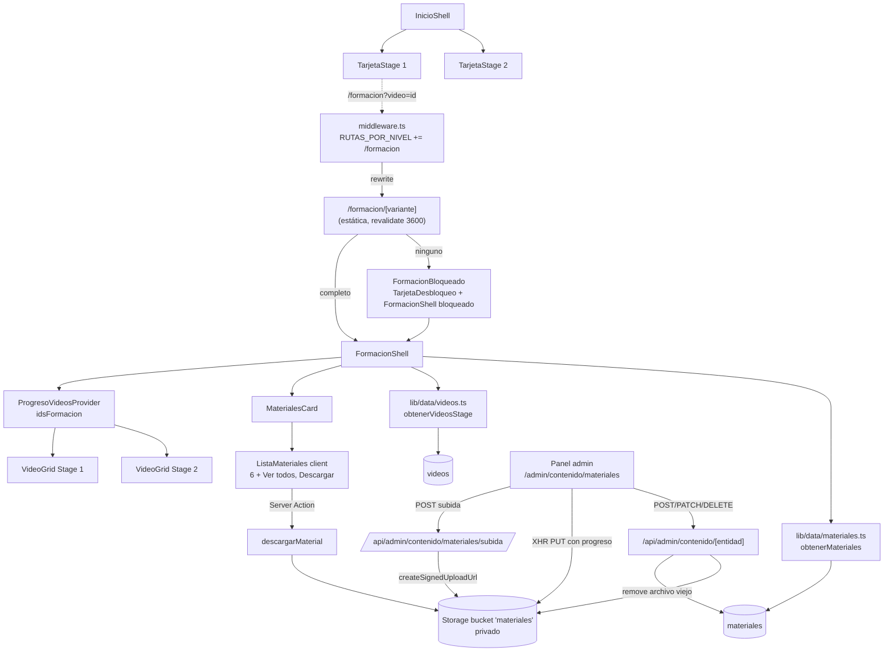
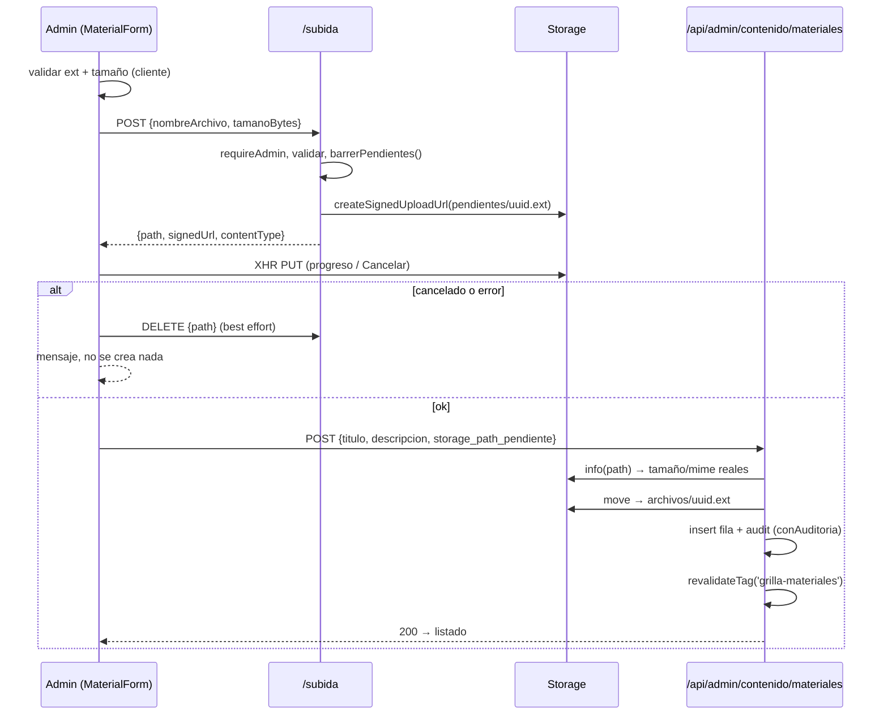
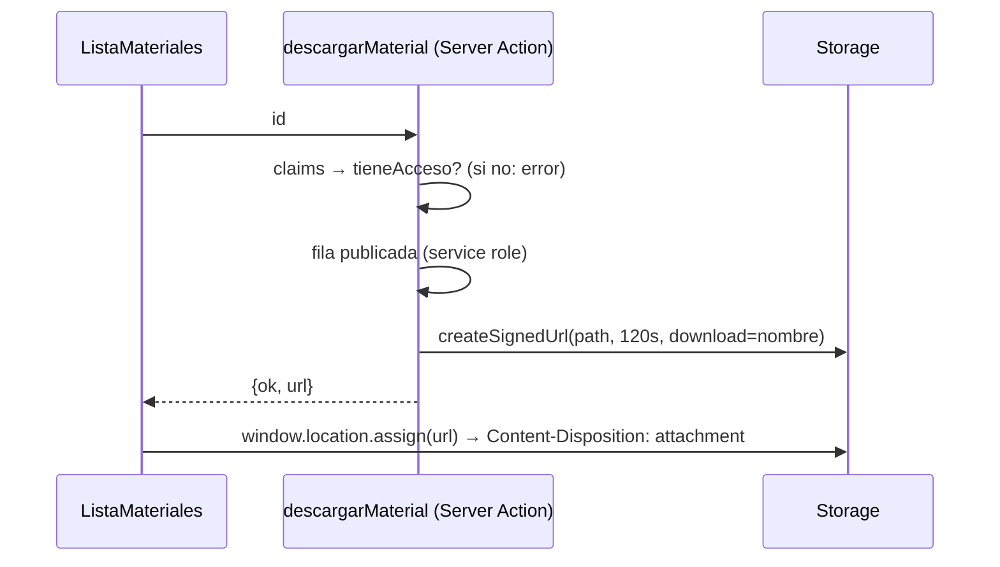

# Design: Página de Formación + Materiales adicionales

**Status:** Approved (2026-10-09)
**Last updated:** 2026-10-09
**Requirements:** [requirements.md](./requirements.md)

## Overview

`/formacion` es una ruta nueva **por nivel**, con el mismo mecanismo que `/dashboard` y `/calculadora`: `middleware.ts` la reescribe a `/formacion/completo` o `/formacion/ninguno`. Las dos variantes son estáticas y se cachean por tag. La página tiene un `FormacionShell` (Server Component) que arma Stage 1 y Stage 2 con el `VideoGrid` de hoy, y abajo la card de Materiales. Sin plan, el mismo shell va envuelto en `TarjetaDesbloqueo`, igual que `InicioBloqueado`.

Inicio deja de renderizar las grillas de Stage 1/2 y en su lugar muestra dos `TarjetaStage` (client). Cada una calcula el progreso y el próximo video con el Context de progreso que ya existe.

Los materiales son una tabla nueva, `materiales`, más un bucket **privado** de Supabase Storage. En el panel admin, `materiales` entra como una quinta entidad del CRUD de Contenido, que ya maneja la lista blanca, la auditoría y la revalidación por tag. Las únicas operaciones nuevas son las que tocan el archivo:

- **Subida:** va directo del navegador a Storage con una URL firmada de subida, por XHR para tener progreso y poder cancelar.
- **Descarga:** una Server Action verifica el plan y devuelve una URL firmada de corta duración.

El contador de progreso pasa a calcularse sobre los ids de videos publicados que manda el servidor, en vez de la constante `TOTAL_VIDEOS`.

## Architecture



### Archivos nuevos y cambios

| Área | Archivo | Qué |
|---|---|---|
| Ruta | `app/(app)/formacion/[variante]/page.tsx` | Estática por nivel (`generateStaticParams` sobre `NIVELES`, `dynamicParams = false`, `revalidate = 3600`). |
| Ruta | `app/(app)/formacion/page.tsx` | Red de contención sin rewrite (mismo criterio que `dashboard/page.tsx`). |
| Ruta | `app/(app)/formacion/_actions.ts` | `descargarMaterial(id)`. |
| Middleware | `middleware.ts` | `RUTAS_POR_NIVEL = ["/dashboard", "/calculadora", "/formacion"]`. |
| UI | `components/formacion/FormacionShell.tsx` | Server Component: stages y materiales. |
| UI | `components/formacion/FormacionBloqueado.tsx` | `TarjetaDesbloqueo` alrededor del shell bloqueado. |
| UI | `components/formacion/MaterialesCard.tsx` | Server: `SeccionSlot` con la lista o el estado vacío. |
| UI | `components/formacion/ListaMateriales.tsx` | Client: los primeros 6 con "Ver todos/Ver menos" y el botón Descargar con estado por fila. |
| UI | `components/inicio/TarjetaStage.tsx` | Client: progreso, próximo video y Continuar / Completado / Próximamente. |
| UI | `components/inicio/InicioShell.tsx` | Saca las dos grillas y pone las dos `TarjetaStage` y el link "Ver toda la formación". |
| UI | `components/video/ProgresoVideosProvider.tsx` | `totalVideos` → `idsFormacion`, y lee `?video=` al montar. |
| UI | `components/video/VideoCard.tsx` | Se despliega solo si es el `videoInicial`. |
| UI | `components/video/StatsVideos.tsx` | Usa `vistosFormacion` / `idsFormacion.length`. |
| UI | `components/nav/destinos.ts` | Entrada "Formación" después de Inicio, con ícono nuevo. |
| UI | `components/ui/Icon.tsx` | Íconos `formacion` y `descargar`. |
| UI | `components/ui/TarjetaDesbloqueo.tsx` | "11 videos, paso a paso" → "Formación en video, paso a paso" (sin número fijo). |
| Datos | `lib/data/videos.ts` | Solo publicados con ref válido, sin tope ni relleno. Se borran `CANTIDAD_STAGE` y `TOTAL_VIDEOS`. |
| Datos | `lib/data/materiales.ts` | `obtenerMateriales()`, cacheado con el tag `grilla-materiales` y fail-open. |
| Datos | `lib/materiales/tipos.ts` | Lista blanca de extensiones/MIME → `tipo`, `MAX_BYTES`, `nombreDescarga()`, `formatearTamano()`. Sin `server-only`: lo usa también el cliente del admin. |
| Datos | `lib/materiales/storage.ts` | `server-only`: `crearSubidaFirmada`, `verificarObjeto`, `borrarObjeto`, `urlDescarga`, `barrerPendientes`. |
| Admin | `lib/data/admin/contenido.ts` | `materiales` en `ENTIDADES`, schema, ramas en crear/actualizar/borrar y `reordenarVideos` → `reordenarContenido(entidad)`. |
| Admin | `app/api/admin/contenido/materiales/subida/route.ts` | `POST` (URL de subida firmada) y `DELETE` (descartar pendiente). |
| Admin | `app/api/admin/contenido/materiales/orden/route.ts` | `PUT` reorden (comparte el handler con `videos/orden`). |
| Admin | `app/admin/contenido/[entidad]/VideosReordenables.tsx` | Se generaliza a `ListadoReordenable` (endpoint y render de la fila por props). |
| Admin | `app/admin/contenido/[entidad]/SubidorArchivo.tsx` | Client: input, validación, XHR con progreso y Cancelar. |
| Admin | `app/admin/contenido/[entidad]/MaterialForm.tsx` | Alta (archivo, título, descripción) y edición (texto, publicado, reemplazar archivo). |
| DB | `supabase/migrations/<ts>_materiales.sql` | Tabla, RLS y bucket. |
| Docs | `CONTEXT.md`, `MODULOS.md` | Stage 2 con ~15 videos, `/formacion`, contador vistos / publicados. |

## Data model

### Migración `<timestamp>_materiales.sql`

```sql
create table public.materiales (
  id            uuid primary key default gen_random_uuid(),
  titulo        text not null check (length(btrim(titulo)) > 0),
  descripcion   text,
  -- Path dentro del bucket 'materiales'. Nunca sale al cliente.
  storage_path  text not null unique,
  tipo          text not null check (tipo in ('pdf', 'powerpoint', 'excel', 'word')),
  extension     text not null check (extension in ('pdf','ppt','pptx','xls','xlsx','csv','doc','docx')),
  tamano_bytes  bigint not null check (tamano_bytes > 0 and tamano_bytes <= 52428800),
  orden         integer not null default 0,
  publicado     boolean not null default true,
  created_at    timestamptz not null default now(),
  updated_at    timestamptz not null default now()
);

create index materiales_publicado_orden_idx on public.materiales (orden) where publicado;

-- RLS prendido y SIN policies: solo service_role lee y escribe, igual que el
-- acceso del resto del contenido desde lib/data. La lectura pública pasa por
-- lib/data/materiales.ts (service role, sin storage_path en la salida).
alter table public.materiales enable row level security;

insert into storage.buckets (id, name, public, file_size_limit, allowed_mime_types)
values ('materiales', 'materiales', false, 52428800, array[
  'application/pdf',
  'application/vnd.ms-powerpoint',
  'application/vnd.openxmlformats-officedocument.presentationml.presentation',
  'application/vnd.ms-excel',
  'application/vnd.openxmlformats-officedocument.spreadsheetml.sheet',
  'text/csv',
  'application/msword',
  'application/vnd.openxmlformats-officedocument.wordprocessingml.document'
]);
-- Sin policies sobre storage.objects para anon/authenticated: subir, firmar
-- y borrar lo hace solo el servidor con service_role. El navegador del admin
-- sube con una URL de subida firmada (el token ya autoriza ese path puntual).
```

**Sin trigger de `updated_at`** (decidido en T0): no hay ninguna función de ese tipo en el repo y las otras tablas de contenido tampoco la usan; la columna queda con su `default now()`. Si se quiere que se actualice sola, es un cambio transversal que no corresponde a este bloque. La migración se escribe a mano y `lib/database.types.ts` se editó a mano; hay que regenerarlo al aplicarla.

### Paths en Storage

- `pendientes/<uuid>.<ext>`: donde cae la subida mientras el material todavía no está guardado.
- `archivos/<uuid>.<ext>`: el archivo de un material ya guardado. Al crear o reemplazar, el servidor hace `move` de `pendientes/` a `archivos/`.

Con esto, todo lo que quede en `pendientes/` y tenga más de 24 h es huérfano por definición, y se puede barrer sin consultar la tabla.

### `videos`: sin cambio de schema

Cambia solo la lectura (§Interfaces).

### Tipos de lectura

```ts
// lib/data/videos.ts
export interface VideoGridItem {
  id: string;                 // ya no hay tiles de relleno: siempre es una fila real
  titulo: string;
  descripcion: string | null;
  estado: "disponible";       // se conserva el campo para no tocar VideoCard; ver Trade-offs
  embedUrl: string | null;    // null sin plan (sinEmbed)
  thumbnailUrl: string | null;
}

// lib/data/materiales.ts
export interface MaterialItem {
  id: string;
  titulo: string;
  descripcion: string | null;
  tipo: "pdf" | "powerpoint" | "excel" | "word";
  extension: string;
  tamanoBytes: number;
}
```

### `lib/materiales/tipos.ts`

```ts
export const MAX_BYTES = 50 * 1024 * 1024;

// Fuente única extensión → tipo + MIME aceptados. El MIME del navegador no es
// confiable (un .csv llega como text/csv o application/vnd.ms-excel según el SO),
// así que la extensión manda y el MIME solo se usa para el Content-Type de la subida.
export const EXTENSIONES = {
  pdf:  { tipo: "pdf",        mime: "application/pdf" },
  ppt:  { tipo: "powerpoint", mime: "application/vnd.ms-powerpoint" },
  pptx: { tipo: "powerpoint", mime: "application/vnd.openxmlformats-officedocument.presentationml.presentation" },
  xls:  { tipo: "excel",      mime: "application/vnd.ms-excel" },
  xlsx: { tipo: "excel",      mime: "application/vnd.openxmlformats-officedocument.spreadsheetml.sheet" },
  csv:  { tipo: "excel",      mime: "text/csv" },
  doc:  { tipo: "word",       mime: "application/msword" },
  docx: { tipo: "word",       mime: "application/vnd.openxmlformats-officedocument.wordprocessingml.document" },
} as const;

export function extensionDe(nombreArchivo: string): keyof typeof EXTENSIONES | null;
export function nombreDescarga(titulo: string, extension: string): string;
//   saca / \ : * ? " < > | y caracteres de control, colapsa espacios,
//   recorta a 120 chars y agrega ".ext". Conserva tildes y ñ.
export function formatearTamano(bytes: number): string; // "2,3 MB", "850 KB" (es-AR)
```

## Interfaces / contracts

### Lectura de videos: `lib/data/videos.ts`

- `obtenerVideosPorStage(admin, stage)` agrega `.eq("publicado", true)` y `.not("provider_ref", "is", null)`, descarta las filas cuyo `parsearRef` falla y **no** corta ni rellena. Agrega `.limit(200)`, por la regla 7 de RENDIMIENTO.
- Si la base falla, `obtenerVideosStageConFallback` devuelve `[]`. El UI lo muestra como estado vacío "en camino", que es el mismo resultado visible que la grilla de relleno de hoy, y Sentry sigue avisando.
- Stage 3 queda igual: también pasa a "solo publicados". Si no hay video, `InicioShell` no renderiza el `VideoGrid` de agentes.
- Se borran `CANTIDAD_STAGE`, `TOTAL_VIDEOS` y `tileRelleno`.

### `lib/data/materiales.ts` (`server-only`)

```ts
export async function obtenerMateriales(): Promise<MaterialItem[]>
// unstable_cache(['materiales-publicados'], tag TAG_POR_ENTIDAD.materiales = 'grilla-materiales')
// select id,titulo,descripcion,tipo,extension,tamano_bytes where publicado order by orden limit 200
// Fail-open: si falla → [] + Sentry (mismo motivo que videos: no voltear el build).
```

### Progreso: `ProgresoVideosProvider`

```ts
<ProgresoVideosProvider idsFormacion={string[] /* ids de Stage 1 + Stage 2 publicados */}>

interface ProgresoContexto {
  vistos: Set<string>;            // sin cambios (incluye ids viejos o despublicados)
  idsFormacion: string[];
  vistosFormacion: number;        // |vistos ∩ idsFormacion|. Es lo que muestra StatsVideos (US-3)
  cargando: boolean;
  esAdmin: boolean;
  videoInicial: string | null;    // ?video= de la URL, solo si ∈ idsFormacion
  marcarVisto(videoId: string): void;
}
```

- `videoInicial` se lee en un `useEffect` desde `window.location.search`, y **no** con `useSearchParams`. En una ruta estática, `useSearchParams` sin `Suspense` manda a render de cliente todo el árbol hasta el boundary. Leído el valor, se limpia con `history.replaceState` para que un refresh no vuelva a desplegar el video.
- `VideoCard`: si `video.id === videoInicial` y tiene `embedUrl`, arranca desplegado y hace `scrollIntoView({ block: "center" })`. Sin `embedUrl` (usuario sin plan) no hace nada, que es lo que pide US-4.

### `TarjetaStage` (client)

```ts
<TarjetaStage
  stage={1 | 2}
  eyebrow="Stage 1" titulo="Formación: importaciones"
  videos={{ id: string; titulo: string; thumbnailUrl: string | null }[]}  // sin embedUrl: no hace falta
/>
```

| Estado | Condición | Render |
|---|---|---|
| Cargando | `cargando` | Skeleton del mismo alto (sin CLS) |
| Próximamente | `videos.length === 0` | "Próximamente", sin botón |
| En curso | hay un `videos.find(v => !vistos.has(v.id))` | Barra `vistos/total` y miniatura y título del próximo video. Botón **Continuar** → `/formacion?video=<id>` |
| Completado | todos vistos | Badge "Completado" y link **Ver de nuevo** → `/formacion` |

El "próximo video" es el **primero** no visto en el orden (US-4).

### `descargarMaterial`: Server Action en `app/(app)/formacion/_actions.ts`

```ts
export async function descargarMaterial(id: string):
  Promise<{ ok: true; url: string } | { ok: false; error: string }>
```

1. `getVerifiedClaims()`. Sin sesión devuelve `{ ok: false, "Tenés que iniciar sesión." }`, y con `!tieneAcceso` devuelve `{ ok: false, "Necesitás el plan para descargar." }` (US-6).
2. `z.uuid().parse(id)`.
3. Service role: `select storage_path, titulo, extension where id and publicado`. Si no existe, `{ ok: false, "Este material ya no está disponible." }`.
4. `storage.from('materiales').createSignedUrl(path, 120, { download: nombreDescarga(titulo, extension) })`.
5. Devuelve la `url`. El cliente navega con `window.location.assign(url)`: el header `Content-Disposition: attachment` hace que el navegador descargue sin salir de la página.

Errores de Storage van a Sentry y se devuelven como `{ ok: false, "No pudimos generar la descarga. Probá de nuevo." }`, y la fila muestra ese mensaje (US-5).

### Admin: entidad `materiales` en `lib/data/admin/contenido.ts`

```ts
ENTIDADES = ["agentes", "videos", "profesionales", "servicios_financieros", "materiales"]
TAG_POR_ENTIDAD.materiales = "grilla-materiales"
campoVigencia("materiales") === "publicado"

const materialSchema = z.object({
  titulo: z.string().trim().min(1).max(200),
  descripcion: z.string().trim().max(500).nullable().optional(),
  publicado: z.boolean().optional(),          // default de la tabla: true
  orden: z.number().int().optional(),         // al crear: al final (proximoOrden genérico)
  // Solo en create y en replace. Es el path PENDIENTE que devolvió /subida.
  storage_path_pendiente: z.string().regex(/^pendientes\/[0-9a-f-]{36}\.(pdf|pptx?|xlsx?|csv|docx?)$/).optional(),
});
```

Ramas específicas, en el mismo estilo que las ramas de `videos` que ya existen:

- **`crearContenido("materiales")`:** exige `storage_path_pendiente`. `verificarObjeto(path)` lee la metadata real del objeto (tamaño y mimetype) y rechaza si no existe o si pasa de `MAX_BYTES`. Después hace `move` → `archivos/<uuid>.<ext>` e inserta la fila con `tipo`, `extension` y `tamano_bytes` **derivados en el servidor**, nunca del body. Si el insert falla, devuelve el archivo a `pendientes/` (o lo borra) antes de re-lanzar el error.
- **`actualizarContenido("materiales")`:** con `storage_path_pendiente` es un reemplazo: verifica, mueve a un path nuevo en `archivos/`, actualiza la fila (path, tipo, extensión, tamaño) y **recién después** borra el objeto viejo. Si falla el borrado del viejo, queda un huérfano en `archivos/`: se registra en Sentry y no se revierte el cambio. Sin `storage_path_pendiente` es una edición de texto o de publicado común.
- **`borrarContenido("materiales")`:** hard delete (nada referencia la fila). Primero borra la fila y después el objeto. Si falla el objeto, va a Sentry.
- **`reordenarVideos(admin, ids)` → `reordenarContenido(admin, entidad: "videos" | "materiales", ids)`:** la misma lógica de `asignarOrden`, con la tabla como parámetro.

Todo pasa por `conAuditoria`, igual que hoy, con `accion` `crear_contenido`, `actualizar_contenido` (incluye el reemplazo, porque el diff de `storage_path` queda en el `valor_anterior/nuevo`), `borrar_contenido` y `reordenar_contenido` (US-7).

### `POST /api/admin/contenido/materiales/subida`

```
body: { nombreArchivo: string, tamanoBytes: number }
  sin sesión 401 · no admin 404 · extensión fuera de la lista o tamaño > MAX_BYTES 400
  ok 200 { path: "pendientes/<uuid>.<ext>", signedUrl: string, contentType: string }
```

Antes de firmar llama a `barrerPendientes()` (best effort, sin bloquear la respuesta si falla), que borra lo que haya en `pendientes/` con más de 24 h. Ruta estática: gana sobre `[entidad]/[id]`, igual que `videos/orden`.

### `DELETE /api/admin/contenido/materiales/subida`

```
body: { path: "pendientes/..." }   // solo acepta paths bajo pendientes/
  ok 204 — idempotente
```

El cliente la llama cuando se cancela o falla un alta o un reemplazo después de que el archivo ya subió.

### `PUT /api/admin/contenido/materiales/orden`

El mismo contrato que `videos/orden`. El handler se extrae a una función compartida que recibe la entidad.

### `SubidorArchivo` (client, admin)

```ts
<SubidorArchivo onSubido={(path: string) => void} onDescartado={() => void} />
```

1. Al elegir el archivo valida la extensión con `extensionDe` y el tamaño con `MAX_BYTES` **antes** de pedir nada al servidor. Si no pasa, muestra el error en línea.
2. `POST /subida` devuelve `{ path, signedUrl, contentType }`.
3. `XMLHttpRequest` `PUT signedUrl`, con el header `Content-Type: contentType` y el cuerpo `file`. `xhr.upload.onprogress` alimenta la barra (`<progress>` con `aria-valuenow`) y **Cancelar** llama a `xhr.abort()`.
4. `onload` con 2xx llama a `onSubido(path)`. Con `onerror`, `onabort` o un no-2xx, muestra un mensaje y, si el objeto llegó a crearse, llama a `DELETE /subida` con best effort.

Se usa XHR porque `fetch` no expone progreso de subida y `supabase-js` `uploadToSignedUrl` tampoco. No agrega dependencias, así que no impacta en el bundle.

### Admin UI

- **Índice de Contenido:** suma la tarjeta "Materiales adicionales: PDF, PowerPoint, Excel y Word descargables desde Formación."
- **Listado `/admin/contenido/materiales`:** `ListadoReordenable` con filas que muestran ícono y tipo, título, tamaño, "Oculto" si `!publicado` y el link Editar.
- **Indicador de espacio:** arriba del listado, `Espacio usado: X de 1 GB` = `Σ tamano_bytes` de las filas que ya trae `listarContenido` (sin query extra). Desde el 80 % se ve como advertencia. `LIMITE_STORAGE_BYTES = 1 GiB` vive en `lib/materiales/tipos.ts`, con un comentario de que es el límite del plan Free de **todo** el proyecto: otros buckets, como `fotos-directorio`, también cuentan, así que es una cota optimista.
- **Nuevo:** `MaterialForm` con `SubidorArchivo`, título y descripción. **Guardar** queda deshabilitado hasta que `onSubido` haya corrido y mientras sube. Al guardar, `POST /api/admin/contenido/materiales` con `storage_path_pendiente`. Si el admin sale del form con un archivo subido y sin guardar, queda en `pendientes/` hasta el próximo barrido.
- **Editar:** título, descripción, el toggle publicado y "Reemplazar archivo" (`SubidorArchivo` y después `PATCH` con `storage_path_pendiente`). Borrar abre una confirmación nativa, igual que el borrado de las otras entidades.

### `/formacion`: `FormacionShell`

```tsx
export async function FormacionShell({ bloqueado = false }) {
  const [stage1, stage2, materiales] = await Promise.all([
    obtenerVideosStage1(), obtenerVideosStage2(), obtenerMateriales(),
  ]);
  const [s1, s2] = bloqueado ? [sinEmbed(stage1), sinEmbed(stage2)] : [stage1, stage2];
  return (
    <ProgresoVideosProvider idsFormacion={[...stage1, ...stage2].map(v => v.id)}>
      <header>…"Formación" + <StatsVideos/></header>
      <SeccionSlot id="stage-1" eyebrow="Stage 1" titulo="Formación: importaciones" ancho="amplio">
        {s1.length ? <VideoGrid videos={s1} reordenable={!bloqueado}/> : <EstadoVacio/>}
      </SeccionSlot>
      <SeccionSlot id="stage-2" …>…</SeccionSlot>
      <MaterialesCard materiales={materiales} bloqueado={bloqueado}/>
    </ProgresoVideosProvider>
  );
}
```

`sinEmbed` se mueve de `InicioShell` a `lib/data/videos.ts` para compartirlo. Con `bloqueado`, `ListaMateriales` renderiza las filas sin handler (el botón queda `disabled`), y aunque alguien lo habilite a mano, la Server Action lo rechaza.

### Inicio: layout nuevo de `InicioShell`

El bloque `bentoPrincipal` pasa a ser `TarjetaStage 1 | TarjetaStage 2 | Calculadora` en desktop (3 columnas de la grilla de 12) y apilado en mobile. El link "Ver toda la formación" va en el header de la sección. `InicioShell` sigue leyendo Stage 1/2 (para armar las tarjetas y los `idsFormacion` del contador), así que el total de queries no cambia.

## Key flows

### Alta de material (admin)



### Reemplazo de archivo

Es igual hasta el `PUT`. Después: `PATCH` con `storage_path_pendiente` → verifica → `move` a un path nuevo → `update` de la fila → `remove` del path viejo → audit y revalidate. Si el `update` falla, el archivo nuevo se borra y la fila sigue apuntando al archivo viejo, intacto.

### Descarga (usuario)



### Continuar desde Inicio

`TarjetaStage` → `<NextLink href="/formacion?video=<id>">` → el middleware hace rewrite a `/formacion/completo` y conserva la query → la página estática sale del CDN → `ProgresoVideosProvider` lee `?video`, lo valida contra `idsFormacion` y limpia la URL → `VideoCard` con ese id se despliega y hace scroll.

## Trade-offs and alternatives considered

| Decisión | Opción elegida | Alternativa | Por qué |
|---|---|---|---|
| Ruta | Estática por nivel vía `RUTAS_POR_NIVEL` | Dinámica leyendo claims | Es el patrón ya medido de `/dashboard` y `/calculadora`: sale del CDN y el bloqueo es el mismo. Agregar la ruta es una línea en el middleware. |
| Subida | URL de subida firmada + XHR directo a Storage | Server Action o route handler que recibe el archivo | El body de una Server Action está limitado a ~1 MB y un route handler en Vercel corta en ~4,5 MB, así que 50 MB no pasa. Además, el progreso real solo existe con XHR. |
| Subida | XHR PUT simple | TUS resumible (`tus-js-client`) | TUS suma una dependencia y está pensado para más de 6 MB con reintentos. Resumir subidas no es requisito (non-goal: más de 50 MB y subida resumible). |
| Huérfanos | Prefijo `pendientes/`, `DELETE` best effort y barrido perezoso de más de 24 h al pedir una subida nueva | `pg_cron` que borre `storage.objects` | Supabase no permite borrar archivos borrando filas de `storage.objects` (el objeto queda en S3), y un cron que llame a la API de Storage necesita una Edge Function. Para un admin que sube pocas veces, el barrido perezoso alcanza. |
| Bucket | Privado + URL firmada de 120 s | Público (como `fotos-directorio`) | El contenido es pago, y un link público se comparte sin plan (US-5 y US-6). |
| Descarga | Server Action que devuelve la URL | Route handler `GET /api/materiales/[id]` que hace redirect 302 | Las dos funcionan. La Server Action permite mostrar el error en la fila sin navegar y sigue el patrón de `marcarVideoVisto`. El redirect se prefetchearía o abriría pestañas de error. |
| Admin | `materiales` como 5.ª entidad del CRUD genérico, con ramas | Módulo y rutas propias | Reusa la lista blanca, la auditoría, la revalidación, el listado y el toggle publicado. Las ramas son tres `if`, igual que las de `videos`. |
| Reorden | `reordenarContenido(entidad)` y `ListadoReordenable` genéricos | Copiar el código de videos | Es una sola lógica de `asignarOrden` probada, y evita dos componentes dnd iguales. |
| `?video=` | `window.location.search` en `useEffect` | `useSearchParams` | `useSearchParams` en una página estática sin `Suspense` manda el árbol a render de cliente, y con `Suspense` el camino de videos parpadea. |
| `VideoGridItem.estado` | Se conserva el campo (siempre `"disponible"`) | Sacarlo y simplificar `VideoCard` | Achica el diff sobre un componente que se pidió no tocar. Limpiarlo queda para `/simplify`. |
| Contador | `vistos ∩ idsFormacion` en el cliente | Calcularlo en el servidor | El progreso ya se lee en el cliente (Inicio es estático). La intersección además corrige un desvío que existe hoy: los ids de videos despublicados o de stage 3 inflan el contador. |

## Requirement traceability

| Requisito | Dónde |
|---|---|
| US-1: ruta, orden de secciones, mismo camino, orden por `orden`, solo publicados, estado vacío, `marcarVideoVisto`, reorden admin | `FormacionShell`, `lib/data/videos.ts`, `VideoGrid` / `ReordenAdmin` sin cambios, `RUTAS_POR_NIVEL` |
| US-2: sin tope, publicar sin redeploy | `lib/data/videos.ts` (sin slice ni relleno), tag `grilla-videos` existente |
| US-3: contador global, vistos/publicados, stage 3 afuera, revalidación | `ProgresoVideosProvider.idsFormacion`, `vistosFormacion`, `StatsVideos` |
| US-4: tarjetas, primer no visto, Continuar con video, Completado, Próximamente, link, `?video` inválido | `TarjetaStage`, `InicioShell`, `videoInicial` en el provider y `VideoCard` |
| US-5: card, fila, 6 + Ver todos, descarga con nombre del título, sin URL permanente, vacío, error por fila | `MaterialesCard`, `ListaMateriales`, `descargarMaterial`, `nombreDescarga`, bucket privado |
| US-6: blur + TarjetaDesbloqueo, sin embed ni URL de descarga, rechazo en servidor | `FormacionBloqueado`, `sinEmbed`, botón `disabled`, `tieneAcceso` en la action |
| US-7: entidad, alta publicada, validación de tipo y tamaño (cliente, servidor y bucket), edición, reemplazo, publicar, reorden por arrastre, borrar con confirmación, auditoría, 404 para no-admin, progreso y cancelar, sin huérfanos | `contenido.ts` (schema y ramas), `/subida`, `SubidorArchivo`, `MaterialForm`, `ListadoReordenable`, `conAuditoria`, `requireAdmin`, `pendientes/` y barrido |
| US-8: entrada después de Inicio, activa, visible sin plan | `destinos.ts` (`esActual` ya marca la activa) |
| Constraints: Liquid Glass, RENDIMIENTO (estática, `.limit`, sin dependencias nuevas, `server-only`), tests y docs | Sección Architecture; detalle en tasks |

## Open questions / risks

- **Huérfanos (aceptado 2026-10-09):** el diseño garantiza "sin huérfanos permanentes", no "sin huérfanos". Si el admin cierra la pestaña a mitad de camino, el archivo queda en `pendientes/` hasta el próximo barrido (próxima subida y más de 24 h). Un borrado fallido del archivo viejo en un reemplazo o borrado deja un huérfano en `archivos/` que solo se ve en Sentry. El usuario lo confirmó como suficiente.
- **Nombre de descarga con tildes:** `createSignedUrl({ download })` arma el `Content-Disposition`. Hay que verificar en la implementación que "Guía de importación.pdf" llegue bien en Chrome, Safari iOS y Firefox. Si falla, el fallback es transliterar a ASCII en `nombreDescarga`.
- **iOS Safari:** con PDF y PPT puede abrir la vista previa en vez de guardar el archivo, aunque el header pida `attachment`. Es comportamiento del sistema y desde ahí el usuario lo guarda. No se trata de forzar.
- **Plan de Supabase: Free (confirmado).** 1 GB de Storage en total, unas 25 piezas de 30 a 50 MB. Lo mitiga el indicador de espacio del admin. Si se llena, la subida falla con el error de Storage y el admin ve "No se pudo subir".
- **Spec en curso `foto-perfil-agentes-profesionales`:** también introduce Storage (bucket público `fotos-directorio`, `lib/fotos/storage.ts`). Si se implementan en paralelo, los dos sumarán a `next.config.ts` y las dos migraciones tocan `storage.buckets`. No chocan, pero conviene que un solo ticket defina el patrón de helper de Storage.
- **Reorden en `/formacion`:** con 15 videos, el arrastre en el camino funciona igual que hoy. No hay riesgo nuevo, solo más largo.
- **Presupuesto de First Load JS:** `/formacion` carga lo mismo que Inicio hoy, más `ListaMateriales`, que es chica. **`/admin/contenido/[entidad]` ya está en 211 kB, por arriba del presupuesto de 200 kB** (anotado en `tasks-vgrp61.md` como algo que viene de `main`). Para no empeorarlo, `SubidorArchivo` y `MaterialForm` se cargan con `lazy()` solo cuando `entidad === "materiales"`, y el ticket mide antes y después.
