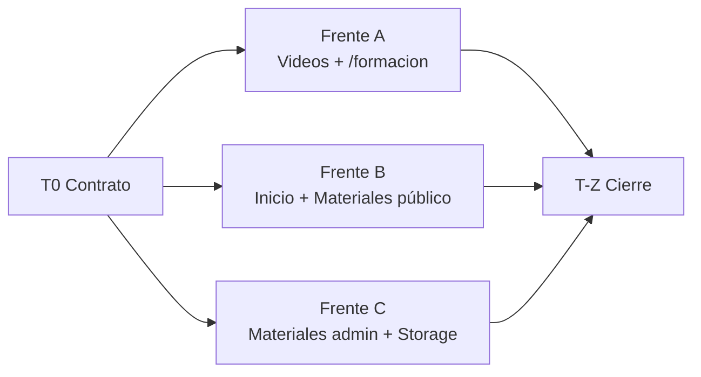

# Tasks: Página de Formación + Materiales adicionales

**Status:** Approved (2026-10-09)
**Last updated:** 2026-10-09
**Design:** [design.md](./design.md) · **Requirements:** [requirements.md](./requirements.md)
**Plane:** VGRP-88 (un solo ticket para todo el bloque, asignado a Máximo)

## Cómo se reparte

Primero va **T0 (contrato)**. Después, tres frentes **en paralelo**, uno por dev. Cada archivo tiene **un solo dueño**: si otro frente lo necesita, lo consume con la firma que fijó T0 y lo mockea en sus tests.

| Frente | Dueño de |
|---|---|
| T0 | migración, `database.types.ts`, `lib/materiales/tipos.ts`, `ProgresoVideosProvider.tsx`, stubs |
| A | `lib/data/videos.ts`, `VideoCard.tsx`, `app/(app)/formacion/**` (menos `_actions.ts`), `components/formacion/FormacionShell.tsx` y `FormacionBloqueado.tsx`, `middleware.ts`, `components/nav/destinos.ts`, `SeccionSlot.tsx`, ícono `formacion` |
| B | `components/inicio/InicioShell.tsx`, `TarjetaStage.tsx`, `StatsVideos.tsx`, `TarjetaDesbloqueo.tsx`, `lib/data/materiales.ts`, `components/formacion/MaterialesCard.tsx` y `ListaMateriales.tsx`, `app/(app)/formacion/_actions.ts`, ícono `descargar`, CONTEXT.md, MODULOS.md |
| C | `lib/materiales/storage.ts`, `lib/data/admin/contenido.ts`, `app/api/admin/contenido/materiales/**` y `videos/orden`, `app/admin/contenido/**` |

`components/ui/Icon.tsx` lo tocan A y B, pero cada uno agrega **una** entrada al final del mapa, así que el conflicto es trivial. Si molesta, T0 agrega los dos íconos.

---

## T0 — Contrato (PR 0, bloquea al resto)

- [x] **T0.1 — Migración `materiales` y bucket.**
  `supabase/migrations/<ts>_materiales.sql` según design §Data model: tabla, índice parcial, trigger `updated_at` (confirmar el nombre de la función en las migraciones existentes), RLS sin policies y bucket privado `materiales` con `file_size_limit` y `allowed_mime_types`. Aplicar en local y regenerar `lib/database.types.ts`.
  Satisfies: US-5, US-7
  Hecho (2026-10-09): `supabase/migrations/20261009120000_materiales.sql`. **Sin trigger de `updated_at`**: no existe esa función en el repo y ninguna otra tabla la usa (se maneja desde la app). **NO está aplicada a la base** (ver Z3) y `lib/database.types.ts` se editó a mano, igual que el resto de la migración: hay que regenerarlo cuando se aplique.

- [x] **T0.2 — `lib/materiales/tipos.ts` completo, con tests.**
  `EXTENSIONES`, `MAX_BYTES`, `LIMITE_STORAGE_BYTES`, `extensionDe`, `nombreDescarga`, `formatearTamano` y el tipo `MaterialItem`. Es puro, sin `server-only`.
  Tests unit: mayúsculas (`.PDF`), doble extensión (`a.tar.pdf`), sin extensión, caracteres inválidos en el título, conservación de tildes, recorte a 120 caracteres, `formatearTamano` en es-AR (`2,3 MB`, `850 KB`, `0 B` no aplica porque el tamaño es > 0).
  Satisfies: US-5, US-7

- [x] **T0.3 — `ProgresoVideosProvider` con el contrato nuevo.**
  - Prop `totalVideos` → `idsFormacion: string[]`.
  - El contexto suma `idsFormacion`, `vistosFormacion` (intersección) y `videoInicial`: lee `?video=` en un `useEffect` desde `window.location.search`, lo valida contra `idsFormacion` y limpia la URL con `history.replaceState`.
  - `InicioShell` pasa `idsFormacion={[...stage1, ...stage2].map(v => v.id)}`. Es el único cambio de T0 en ese archivo.
  - `StatsVideos` pasa a leer `vistosFormacion` / `idsFormacion.length`. Es un cambio de una línea y después el dueño es B.
  - Tests: la intersección ignora ids de stage 3 y despublicados, un `?video` inválido da `videoInicial === null` y la URL queda limpia.
  Satisfies: US-3, US-4

- [x] **T0.4 — Stubs con firma final.**
  - `lib/data/materiales.ts`: `obtenerMateriales(): Promise<MaterialItem[]>` que devuelve `[]`.
  - `lib/materiales/storage.ts`: las cinco funciones de design §Interfaces, que tiran `Error("no implementado")`.
  - `components/formacion/MaterialesCard.tsx`: `({ materiales, bloqueado }) => null`.
  - `lib/data/videos.ts`: exporta `sinEmbed()`, que se mueve desde `InicioShell`.
  - `lib/data/admin/contenido.ts`: `"materiales"` en `ENTIDADES` y `TAG_POR_ENTIDAD.materiales = "grilla-materiales"`, con `materialSchema` según el design. Las ramas de archivo quedan como `throw` hasta C.
  Satisfies: contrato para A, B y C
  Hecho (2026-10-09): además de los stubs, la lógica pura del progreso quedó en `components/video/progreso.ts` (testeable sin React) y `contenido.ts` tiene `PATH_PENDIENTE_REGEX` exportada y un guard `materialesPendienteFrenteC()` que hace fallar crear/actualizar/borrar materiales hasta que C1/C2 implemente las ramas reales. **C: al implementar C2, borrá ese guard y su test en `contenido-materiales.unit.test.ts`.** A y B: `VideoGridItem.id` sigue siendo `string | null` hasta A1.

---

## Frente A — Videos y página `/formacion` (Dev 1)

- [ ] **A1 — Lectura de videos: solo publicados y sin tope.**
  `lib/data/videos.ts`:
  - `.eq("publicado", true)`, `.not("provider_ref", "is", null)` y `.limit(200)`, sin `slice` ni relleno.
  - El fallback devuelve `[]`.
  - Se borran `CANTIDAD_STAGE`, `TOTAL_VIDEOS` y `tileRelleno`, y `VideoGridItem.id` pasa a `string`.

  Actualizar `videos.test.ts`, `videos-fallback.test.ts` y `videos-fallback.unit.test.ts`. Casos:
  - Un no publicado no aparece.
  - Un ref inválido no aparece.
  - Con 16 filas devuelve 16.
  - Cuando la base falla devuelve `[]`.
  - Stage 3 vacío.

  `InicioShell` no renderiza el `VideoGrid` de agentes si stage 3 viene vacío. Ese cambio lo coordina con B: como es una línea en un archivo de B, lo hace B en B1.
  Satisfies: US-1, US-2, US-3

- [ ] **A2 — Ruta `/formacion` por nivel.**
  - `middleware.ts`: `"/formacion"` en `RUTAS_POR_NIVEL`.
  - `app/(app)/formacion/[variante]/page.tsx`, con `generateStaticParams` sobre **todos** los `NIVELES` (RENDIMIENTO, regla 3), `dynamicParams = false` y `revalidate = 3600`.
  - `app/(app)/formacion/page.tsx` como red de contención.
  - `loading.tsx`, si el segmento no hereda el de `(app)`.

  Tests del middleware:
  - `/formacion` se reescribe a `completo` o a `ninguno` según el nivel.
  - `/formacion/completo` pedido a mano sin plan redirige.
  - La query `?video=` sobrevive al rewrite.
  Satisfies: US-1, US-6

- [ ] **A3 — `FormacionShell` y `FormacionBloqueado`.**
  - Header con el título "Formación" y `StatsVideos`.
  - `SeccionSlot` de Stage 1 y de Stage 2, con `id="stage-1"`/`"stage-2"` (se agrega la prop `id` a `SeccionSlot`).
  - `VideoGrid` con `reordenable={!bloqueado}`, y si el stage viene vacío, un estado vacío ("Los videos de este stage están en camino").
  - Abajo, `<MaterialesCard>` (el stub de T0).
  - `FormacionBloqueado` = `TarjetaDesbloqueo` + `ComprarButton` + el shell con `bloqueado`, que usa `sinEmbed`.
  - Estilos con primitivas Liquid Glass y `composes`, sin redeclarar.
  Satisfies: US-1, US-6

- [ ] **A4 — Deep link `?video=` en `VideoCard`.**
  Si `video.id === videoInicial` y hay `embedUrl`, arranca desplegado y hace `scrollIntoView({ block: "center" })` una sola vez. Sin `embedUrl` (usuario sin plan), no hace nada.
  Test de componente: se despliega solo el que coincide y no hace nada sin embed.
  Satisfies: US-4

- [ ] **A5 — Navegación.**
  `components/nav/destinos.ts`: `{ href: "/formacion", label: "Formación", icono: "formacion" }` después de Inicio, más el ícono `formacion` en `Icon.tsx`. Revisar que `MenuToggle` lo prefetchee (es destino interno).
  Satisfies: US-8

- [ ] **A6 — E2E de videos.**
  - Reescribir `e2e/camino-aprendizaje.spec.ts` y `e2e/admin-edita-video-revalida.spec.ts` para `/formacion`, sin tiles de relleno ni tope.
  - Caso nuevo: 15 videos publicados en Stage 2 se ven todos y en orden.
  - Caso nuevo: el admin reordena arrastrando en `/formacion` y el orden persiste.
  - Caso nuevo: sin plan, `/formacion` se ve borrosa con `TarjetaDesbloqueo` y sin iframes en el HTML.
  Satisfies: US-1, US-2, US-6

---

## Frente B — Inicio y Materiales del lado usuario (Dev 2)

- [ ] **B1 — `TarjetaStage` y el nuevo `InicioShell`.**
  `components/inicio/TarjetaStage.tsx` con los cuatro estados de design §Interfaces: cargando (skeleton sin CLS), próximamente, en curso (Continuar → `/formacion?video=<id>`) y completado (Ver de nuevo).

  `InicioShell`:
  - Saca las dos `VideoGrid` de Stage 1/2.
  - Arma el bento `TarjetaStage 1 | TarjetaStage 2 | Calculadora`.
  - Suma el link "Ver toda la formación".
  - No renderiza el video de agentes si stage 3 viene vacío (de A1).

  Tests de componente:
  - El primer no visto: con vistos {1, 2, 5} propone el 3.
  - Completado.
  - Vacío.
  - El `href` de Continuar.
  Satisfies: US-4

- [ ] **B2 — `StatsVideos` y textos fijos.**
  Revisar `StatsVideos` después de T0: el texto "X / N videos completados" y el anillo con `idsFormacion.length === 0` (sin dividir por 0). `TarjetaDesbloqueo`: "11 videos, paso a paso" → "Formación en video, paso a paso".
  Satisfies: US-3

- [ ] **B3 — `obtenerMateriales()` real.**
  `lib/data/materiales.ts`:
  - `server-only`, con service role.
  - Trae solo los publicados, ordenados por `orden`, con `.limit(200)` y **sin `storage_path`**.
  - Usa `unstable_cache` con el tag `grilla-materiales` y es fail-open (devuelve `[]` y avisa a Sentry).

  Tests de integración:
  - Un material oculto no sale.
  - El orden se respeta.
  - La salida no tiene `storage_path`.
  - Si la base falla, devuelve `[]`.
  Satisfies: US-5

- [ ] **B4 — `descargarMaterial` (Server Action).**
  `app/(app)/formacion/_actions.ts` según design §Interfaces: claims, `tieneAcceso`, uuid, fila publicada, `createSignedUrl(path, 120, { download: nombreDescarga(...) })`. Llama directo al cliente de Storage o, si C ya mergeó, a `urlDescarga()`. Si no, mockea `lib/materiales/storage.ts`.
  Tests:
  - Sin sesión.
  - Sin plan → error y **no** se llama a Storage.
  - Id inexistente u oculto.
  - Ok → url.
  - Storage falla → error amigable y aviso a Sentry.
  Satisfies: US-5, US-6

- [ ] **B5 — `MaterialesCard` y `ListaMateriales`.**
  - `MaterialesCard` es un Server Component: `SeccionSlot` "Materiales adicionales" a ancho completo, o el estado vacío "Todavía no hay materiales cargados".
  - `ListaMateriales` es client: cada fila lleva ícono `documento`, una pastilla de tipo, título, descripción, "PDF · 2,3 MB" y el botón Descargar (ícono `descargar`, nuevo).
  - Muestra los primeros 6, con "Ver todos (N)" y "Ver menos".
  - Estado por fila: idle, cargando o error en línea.
  - Con `bloqueado`, los botones quedan `disabled`.
  - Liquid Glass sin redeclarar.

  Tests de componente:
  - Con 6 materiales no hay botón "Ver todos".
  - Con 7 materiales el botón dice "Ver todos (7)".
  - Si la descarga falla, el error aparece en la fila.
  - Con `bloqueado`, la acción no se llama.
  Satisfies: US-5, US-6

- [ ] **B6 — E2E usuario.**
  - Inicio muestra las dos tarjetas.
  - Continuar abre `/formacion` con el video desplegado.
  - Un stage completo muestra "Completado".
  - Descargar un material sembrado inicia la descarga (`page.waitForEvent("download")`) y el nombre del archivo es el título.
  - Sin plan, la acción de descarga devuelve error.
  - Ajustar los specs que lean "/ 11" (`pago-aprobado-acceso`, `recuperar-password`, `dashboard-shell` y los que encuentre `grep`).
  Satisfies: US-3, US-4, US-5, US-6

- [ ] **B7 — Docs de producto.**
  CONTEXT.md y MODULOS.md:
  - Stage 2 con ~15 videos.
  - La página `/formacion` con Materiales adicionales.
  - El contador vistos / publicados.
  - Inicio con tarjetas resumen.
  - El menú con Formación.
  Satisfies: Constraints

---

## Frente C — Materiales admin y Storage (Dev 3)

- [ ] **C1 — `lib/materiales/storage.ts`.**
  `server-only`, con service role:
  - `crearSubidaFirmada(ext)` devuelve `{ path: "pendientes/<uuid>.<ext>", signedUrl }`.
  - `verificarObjeto(path)` devuelve `{ tamanoBytes, mime }` o `null`.
  - `moverAArchivos(path)` devuelve `"archivos/<uuid>.<ext>"`.
  - `borrarObjeto(path)` es idempotente.
  - `urlDescarga(path, nombre)`.
  - `barrerPendientes()` lista `pendientes/` y borra lo que tenga más de 24 h.

  Tests de integración contra el Storage local:
  - Una subida firmada funciona y otro path con el mismo token se rechaza.
  - El barrido borra solo lo viejo.
  - Borrar dos veces no tira error.
  Satisfies: US-7

- [ ] **C2 — Ramas de `materiales` en `contenido.ts`.**
  - `crearContenido`: verifica, mueve, deriva tipo, extensión y tamaño en el servidor e inserta. Si falla el insert, limpia el objeto.
  - `actualizarContenido`: si viene `storage_path_pendiente` es un reemplazo (verifica, mueve, update y recién después borra el viejo). Si falla el update, borra el nuevo.
  - `borrarContenido`: hard delete de la fila y después del objeto.
  - `reordenarVideos` → `reordenarContenido(admin, entidad, ids)`, con el call site de `videos/orden` actualizado.

  Tests:
  - Un path fuera de `pendientes/` se rechaza.
  - Un objeto inexistente se rechaza.
  - Más de 50 MB reales se rechazan aunque el cliente mienta.
  - Un reemplazo conserva título, orden y publicado.
  - Un borrado elimina el objeto.
  - Los tests de `contenido-orden` siguen pasando.
  Satisfies: US-7

- [ ] **C3 — Rutas de API.**
  - `POST` y `DELETE /api/admin/contenido/materiales/subida`.
  - `PUT /api/admin/contenido/materiales/orden`, con el handler compartido con `videos/orden`.
  - Revisar que `[entidad]` y `[entidad]/[id]` acepten `materiales` sin cambios.
  - Tests de route con la tabla de códigos de design §Interfaces: 401, 404 para no-admin, 400 por extensión o tamaño y 200. `DELETE` solo acepta `pendientes/`.
  Satisfies: US-7

- [ ] **C4 — `ListadoReordenable` genérico.**
  Generalizar `VideosReordenables.tsx` (endpoint, render de la fila y `aria-label` por props) y usarlo para videos y materiales. En el listado de materiales: tipo, tamaño, la etiqueta "Oculto", el indicador de espacio usado sobre 1 GB y la advertencia desde el 80 %.
  Tests de componente: el reorden falla y vuelve atrás (lo que ya existía, ahora para las dos entidades), y el indicador muestra el número correcto y pasa a advertencia al 80 %.
  Satisfies: US-7

- [ ] **C5 — `SubidorArchivo` y `MaterialForm`.**
  `SubidorArchivo`:
  - Validación previa de tipo y tamaño.
  - `POST /subida` y después XHR `PUT` con `<progress>`.
  - Botón Cancelar con `abort()`.
  - Con error o cancelación, `DELETE /subida`.

  `MaterialForm`:
  - Alta: Guardar deshabilitado hasta tener el archivo subido.
  - Edición: título, descripción, el toggle publicado y "Reemplazar archivo".
  - Borrar con confirmación.

  Los dos se cargan con `lazy()` solo para `entidad === "materiales"` (presupuesto de bundle). En el índice de Contenido, la tarjeta "Materiales adicionales".
  Tests de componente con XHR mockeado:
  - El progreso avanza.
  - Cancelar llama a `abort()` y al `DELETE`.
  - Un archivo `.exe` o uno de 51 MB se rechazan sin llamar al servidor.
  Satisfies: US-7

- [ ] **C6 — E2E admin.**
  - Subir un PDF chico, que aparece publicado en `/formacion` sin redeploy.
  - Editar el título.
  - Reemplazar por un DOCX: cambia el tipo y el archivo viejo ya no está en Storage.
  - Ocultarlo, que desaparece de `/formacion`.
  - Reordenar.
  - Borrarlo, que se va la fila y el objeto.
  - Cada acción deja su entrada en `/admin/auditoria`.
  - Un no-admin recibe 404 en las rutas.
  Satisfies: US-7

---

## T-Z — Cierre (después de A, B y C)

- [ ] **Z1 — Verificación integral.**
  `tsc --noEmit`, `biome check .`, `vitest run`, e2e y `next build` + `check-bundle-budget`:
  - `/formacion` ≤ 200 kB.
  - `/admin/contenido/[entidad]` no empeora respecto de `main`. Hoy está en 211 kB.
  Probar a mano la descarga con tildes en Chrome, Firefox y Safari iOS (riesgo del design).
  Satisfies: todos

- [ ] **Z2 — Checklist del CLAUDE.md.**
  `/design-critique` sobre `/formacion`, Inicio (tarjetas) y el admin de materiales. `/design-system`, porque `SeccionSlot` ganó la prop `id` e `Icon` ganó íconos. `/simplify` sobre el diff, que incluye limpiar `VideoGridItem.estado`, que quedó siempre en `"disponible"`.
  Satisfies: Constraints

- [ ] **Z3 — Producción.**
  Aplicar la migración en el proyecto real y anotarla en la tabla "Migraciones de este bloque" de `docs/RENDIMIENTO.md`. Cargar los videos de Stage 2 y verificar que el contador refleje vistos / publicados.
