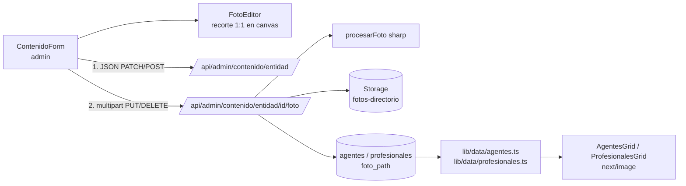
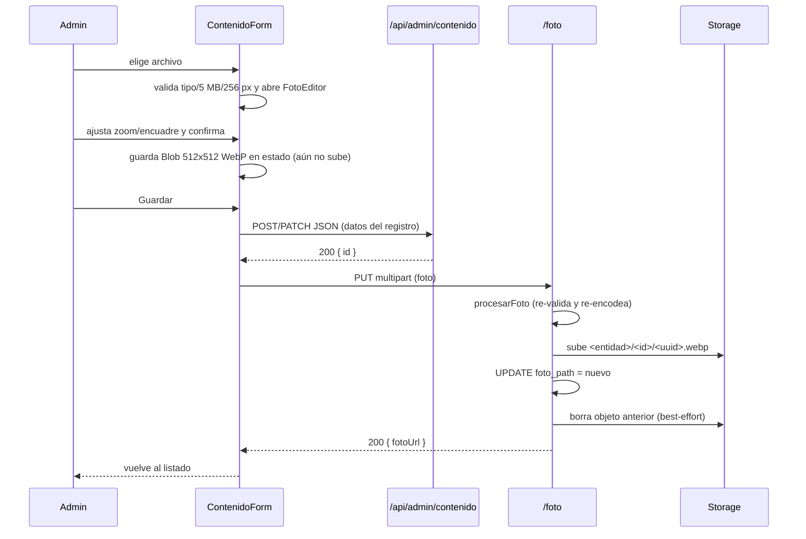

# Design: Foto de perfil para agentes de compra y profesionales

**Status:** Approved (2026-10-09) — con bucket público y tope de 2 MB en el servidor (riesgos 1 y 2 aceptados). Ajustes de implementación en [tasks.md](./tasks.md) §Desvíos.
**Last updated:** 2026-10-08
**Requirements:** [requirements.md](./requirements.md)

## Overview

La foto se guarda en un bucket de Supabase Storage y la fila (`agentes` / `profesionales`) guarda solo su ruta (`foto_path`). El recorte 1:1 se hace en el navegador del admin (canvas) y se sube en un segundo paso, por un endpoint propio, **después** de guardar el registro. El servidor nunca confía en el cliente: re-decodifica, valida y re-encodea la imagen con `sharp` antes de escribirla. Las tarjetas del directorio reciben una `fotoUrl` pública dentro de `publicMeta` y la muestran con `next/image`; sin foto (o si falla) siguen mostrando las iniciales.

Se apoya en lo que ya existe: `requireAdmin()`, `conAuditoria()`, el cliente `service_role`, los `revalidateTag` por entidad y la lista blanca `ENTIDADES`.

## Architecture



Piezas nuevas:

| Pieza | Archivo | Responsabilidad |
|---|---|---|
| Migración | `supabase/migrations/<ts>_foto_directorio.sql` | Columna `foto_path` en las 2 tablas + bucket `fotos-directorio` |
| Procesado | `lib/fotos/procesar.ts` | Valida tipo real, tamaño, dimensiones y re-encodea a WebP 512×512 (sharp) |
| Storage | `lib/fotos/storage.ts` | `subirFoto`, `borrarFoto`, `urlPublicaFoto(path)` |
| Endpoint | `app/api/admin/contenido/[entidad]/[id]/foto/route.ts` | `PUT` (subir/reemplazar) y `DELETE` (quitar) |
| Editor | `components/admin/FotoEditor.tsx` (client, carga diferida) | Elegir archivo, recortar con zoom/arrastre, vista previa circular |
| Recorte | `lib/fotos/recortar-cliente.ts` | Canvas → Blob WebP 512×512 |
| Lectura | `lib/data/agentes.ts`, `lib/data/profesionales.ts` | Agregan `foto_path` al select y `fotoUrl` a `publicMeta` |
| UI pública | `AgentesGrid.tsx`, `ProfesionalesGrid.tsx` | `<Avatar>` con foto o iniciales |

## Data model

```sql
alter table public.agentes       add column foto_path text;
alter table public.profesionales add column foto_path text;

comment on column public.agentes.foto_path is
  'Ruta del objeto en el bucket fotos-directorio. null = sin foto. Sólo la escribe el endpoint /foto.';

insert into storage.buckets (id, name, public, file_size_limit, allowed_mime_types)
values ('fotos-directorio', 'fotos-directorio', true, 2097152, array['image/webp']);
-- Sin policies sobre storage.objects para anon/authenticated: escribe sólo service_role.
```

- Ruta del objeto: `<entidad>/<id>/<uuid>.webp`. El uuid cambia en cada subida, así la URL es **inmutable** (caché larga en CDN y en `next/image`) y no hay que invalidar nada al reemplazar.
- `foto_path` **no** entra en los schemas Zod de `contenido.ts`: Zod descarta claves desconocidas, así el `PATCH` genérico no puede escribirlo. La única vía de escritura es el endpoint `/foto`.
- Se regeneran los tipos (`lib/database.types.ts`).
- Sin cambios de RLS: las tablas ya leen solo `service_role`/`authenticated` con las policies actuales, y la columna no es sensible.

## Interfaces / contracts

### `PUT /api/admin/contenido/[entidad]/[id]/foto`

- **Auth:** `requireAdmin()` primero (sin sesión 401, no admin 404, igual que el resto).
- **Ruta:** `entidad` solo `agentes` o `profesionales` (otra → 400); `id` uuid (si no, 404).
- **Input:** `multipart/form-data` con el campo `foto` (Blob ya recortado). Tope del request: 2 MB.
- **Proceso** (`procesarFoto`): detecta el formato real con `sharp(...).metadata()` (no mira extensión ni `Content-Type`) y exige jpeg/png/webp; exige ≥256×256; recorta a cuadrado centrado por si llega otra proporción; `resize(512,512)`; `rotate()` por EXIF y luego salida **WebP sin metadatos**.
- **Output:** `200 { fotoUrl }`.
- **Errores:** 400 `{ error }` (archivo faltante, >2 MB, formato inválido, imagen ilegible, <256 px); 404 (id sin fila); 500 (Storage/DB, a Sentry).
- **Efectos:** audit log (`accion: "cambiar_foto_contenido"`, valor anterior/nuevo = `foto_path`) y `revalidateTag(TAG_POR_ENTIDAD[entidad])`.

### `DELETE /api/admin/contenido/[entidad]/[id]/foto`

- Mismo guard y validación de ruta. Pone `foto_path = null`, borra el objeto. `200 {}`; sin foto previa es idempotente (200). Audit `quitar_foto_contenido`.

### Cambios a funciones existentes

- `borrarContenido(agentes|profesionales)`: tras el `DELETE` de la fila, borra el objeto (`foto_path` leído en `anterior`). Si el borrado del objeto falla, **no** revierte la fila: va a Sentry como huérfano.
- `obtenerAgentes` / `obtenerProfesionales`: `publicMeta.fotoUrl: string | null`. La URL se arma con `NEXT_PUBLIC_SUPABASE_URL` (`/storage/v1/object/public/fotos-directorio/<path>`). Va **dentro** del `unstable_cache` de filas (es un dato no sensible, igual que `nombre`).
- `describir.ts` (auditoría): dos acciones nuevas con su texto legible.

## Key flows

### Alta o edición con foto



Orden clave para no perder la foto anterior (US-3): **1)** subir el objeto nuevo, **2)** actualizar `foto_path`, **3)** borrar el viejo. Si falla el 1 o el 2, la fila sigue apuntando a la foto anterior; si falla el 3, queda un objeto huérfano (a Sentry), no un registro roto.

### Casos de error del flujo en dos pasos

- Falla el guardado del registro → no se sube nada; el formulario conserva el recorte para reintentar.
- El registro se guarda pero falla la subida → en alta, el formulario pasa a modo edición del registro recién creado (con su id) y muestra "El ítem se guardó pero la foto no se pudo subir. Reintentá." con el recorte todavía en memoria. En edición, igual mensaje; la foto anterior sigue vigente.
- Quitar la foto → `DELETE /foto` tras guardar (o al confirmar, si el registro no tiene otros cambios).
- Cancelar el editor o salir sin guardar → el Blob solo vive en memoria del navegador; no hay nada que limpiar en el servidor (US-1).

### Editor de recorte

`FotoEditor` se carga con `next/dynamic` solo en las pantallas de admin (no suma al bundle del usuario). Usa `react-easy-crop` (zoom por slider/rueda/pinch, arrastre, `aspect=1`, `cropShape="round"` para la vista previa circular). Al confirmar, `recortar-cliente.ts` dibuja el área elegida en un `<canvas>` 512×512 y exporta `image/webp` (calidad 0.85) — el re-dibujado en canvas ya descarta EXIF. El `File` original se revoca (`URL.revokeObjectURL`) al cerrar.

### Vista pública

`<Avatar nombre fotoUrl size>` (nuevo, en `components/ui/`) renderiza `next/image` (`width/height` declarados, `loading="lazy"`, `sizes` fijo) dentro del mismo círculo de 40 px que hoy usa `.iniciales`; `onError` conmuta al estado de iniciales. `next.config.ts` suma el host de Supabase a `images.remotePatterns` restringido al path `/storage/v1/object/public/fotos-directorio/**`.

## Trade-offs and alternatives considered

| Decisión | Opción elegida | Alternativa | Por qué |
|---|---|---|---|
| Visibilidad del bucket | **Público** (rutas con uuid) | Privado + URLs firmadas | Las fotos no son datos sensibles (el contacto sí, y sigue gateado). Las URLs firmadas vencen y rompen la caché de `unstable_cache` y de `next/image`. Costo: quien tenga la URL exacta la ve sin sesión. |
| Subida | **Segundo request** `PUT /foto` tras guardar el registro | Multipart único con los datos + foto; o subir directo a Storage con URL firmada | Mantiene intacto el CRUD JSON genérico, el audit log y los tests actuales; en alta ya existe el `id` para la ruta. Costo: dos requests y un estado intermedio (registro sin foto) que el form sabe reintentar. |
| Dónde se recorta | **Cliente (canvas)** | Cliente manda original + coordenadas y recorta `sharp` | Menos bytes (≤200 KB vs hasta 5 MB; Vercel limita el body a 4,5 MB) y WYSIWYG. El servidor igual re-valida y re-encodea. |
| Re-procesado en servidor | **`sharp`** (dependencia explícita) | Confiar en el Blob del cliente | Detecta el tipo real, bloquea archivos no-imagen aunque el cliente esté manipulado y quita metadatos. `sharp` ya viene en el árbol de Next; se fija en `package.json` para el runtime `nodejs`. |
| Librería de recorte | **`react-easy-crop`** (~8 KB gz, carga diferida) | Cropper propio con canvas | Resuelve pinch/teclado/accesibilidad que costaría más probar que lo que pesa. Si el bundle de admin molesta, se mide según `docs/RENDIMIENTO.md` y se reemplaza. |
| Nombre del objeto | **uuid por subida** | Ruta fija `<entidad>/<id>.webp` | URL inmutable = caché larga y reemplazo sin invalidar CDN. Costo: hay que borrar el objeto viejo. |
| Tamaño guardado | **512×512 WebP** | 256 o 1024 | Sobra para tarjetas de 40–80 px en pantallas 2×–3× y pesa ~30–60 KB. |

## Requirement traceability

| Requisito | Dónde se resuelve |
|---|---|
| US-1 (editor, confirmar sin guardar, cancelar, guardar el recorte, abandonar) | `FotoEditor` + Blob solo en memoria + flujo en dos pasos |
| US-2 (tipos, 5 MB, tipo real, decodificable/256 px, doble validación, 512 WebP sin EXIF) | Validación cliente sobre el original + `procesarFoto` en servidor (ver riesgo 1) |
| US-3 (reemplazar, quitar, borrar registro, falla a mitad de camino) | Orden subir → UPDATE → borrar viejo; `DELETE /foto`; `borrarContenido` |
| US-4 (foto en tarjeta, iniciales, gating intacto, `onError`, rendimiento) | `Avatar`, `fotoUrl` en `publicMeta`, `next/image` con dimensiones y lazy |
| US-5 (solo admin, bucket sin escritura pública, audit log) | `requireAdmin()`, bucket sin policies para `anon`/`authenticated`, acciones de auditoría nuevas |

## Open questions / risks

1. **Ajuste a US-2 que necesita tu OK:** el original de hasta 5 MB **nunca viaja al servidor** (se valida y recorta en el navegador). El servidor valida lo que recibe: tipo real, ≤2 MB (el recorte pesa ~50–200 KB), ≥256 px. Cumple la intención (nadie sube un archivo de 5 MB+) y evita el límite de 4,5 MB de Vercel; pero la regla "5 MB" se aplica solo en el cliente. Si preferís subir el original para que el servidor aplique los 5 MB literales, hay que cambiar el diseño (recorte por coordenadas en `sharp`).
2. **Bucket público:** confirmar que no hay problema en que las fotos sean accesibles por URL directa.
3. **Registro sin foto tras un fallo del segundo paso:** es un estado válido (la foto es opcional), pero hay que cubrirlo en tests y mensajes.
4. **Objetos huérfanos:** si falla el borrado de un objeto viejo queda basura en Storage. Se reporta a Sentry; un script de limpieza queda fuera de alcance salvo que lo pidas.
5. **Peso del bundle de admin:** `react-easy-crop` se carga con `next/dynamic` y solo en `/admin/contenido/{agentes,profesionales}`; hay que confirmar con el análisis de bundle que `docs/RENDIMIENTO.md` no se rompe.
6. **Tipos de Supabase:** aplicar la migración al proyecto (MCP de Supabase, hoy `needs_auth`) y regenerar `database.types.ts` es un paso previo a implementar.
